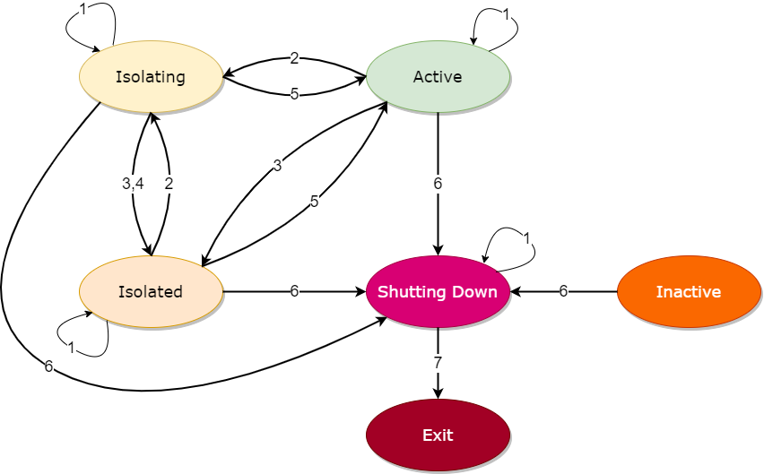

# Horizontal Scaling

## Use cases

### Auto or manual scaling

Nodes can be added to or removed from openLooKeng clusters dynamically, to support scaling scenarios. While it's the responsibility of the _Resource Provider_ to determine when to scale and, in the case of scaling-in, which nodes to remove, openLooKeng ensures that these changes function properly. In particular, during a scale-in, removal of a node will _not_ impact workloads on that node.

For auto-scaling scenarios, the resource provider may want to base the decision on:
- System metrics, e.g. CPU, memory, and I/O, or
- Node workload status (see status API below)

As an example, openLooKeng can be deployed in a Kubernetes environment, and use `HorizontalPodAutoscaler` to auto-scale the cluster size. You can find some sample deployment data under `Kubernetes` of the `hetu-samples` module.

### Node maintenance

If a node needs to be separated from an openLooKeng cluster temporarily, for example to perform some maintenance tasks, it can be _isolated_ first, then added back to the cluster afterwards.

## Node status API

Workload information about a particular node can be obtained by invoking its status API. It includes CPU and memory allocation and usage information. For details about structure of the returned value, please refer to the `io.prestosql.server.NodeStatus` class.

For example, with `curl` and assuming the node address `1.2.3.4:8080`

```sh
$ curl http://1.2.3.4:8080/v1/status | jq

{
  "nodeId": "...",
  ...
  "memoryInfo": {
    "availableProcessors": ...,
    "totalNodeMemory": "...",
    ...
  },
  "processors": ...,
  "processCpuLoad": ...,
  "systemCpuLoad": ...,
  "heapUsed": ...,
  "heapAvailable": ...,
  "nonHeapUsed": ...
}

```

## Node state management API

Scaling and isolation can be achieved through the node state management API.

### Shutdown a node

If a cluster does not need a node anymore (e.g. as part of a scaling down operation), the node can be shutdown.

Such process is _graceful_, in that
- the cluster does not assign new workload to this node, and
- the node attempts to finish all existing workloads before shutting down its main process.

The shutdown process is _irreversible_. It can be initiated through the REST API, by putting the `SHUTTING_DOWN` state to the `info/state` endpoint of the node. For example:

```sh
$ curl -X PUT -H "Content-Type: application/json" http://1.2.3.4:8080/v1/info/state \
    -d '"SHUTTING_DOWN"'
```

### Isolate a node

_Isolation_ takes a node off of the cluster _temporarily_.

- Isolation can be graceful in a way similar to shutdown: wait for workloads to finish first. Nodes in this waiting period are in the `isolating` state.
- It can also be non-graceful, to enter the `isolated` directly.
- `Isolating` and `isolated` nodes are not assigned new workloads.

Nodes' isolation status are changed via the REST API, with different target states. For example:

```sh
# To gracefully isolate a node
$ curl -X PUT -H "Content-Type: application/json" http://1.2.3.4:8080/v1/info/state \
    -d '"ISOLATING"'

# To isolate a node immediately
$ curl -X PUT -H "Content-Type: application/json" http://1.2.3.4:8080/v1/info/state \
    -d '"ISOLATED"'

# To make the node available again
$ curl -X PUT -H "Content-Type: application/json" http://1.2.3.4:8080/v1/info/state \
    -d '"ACTIVE"'
```

### Node state transitions

An openLooKeng node (coordinator or worker) can be in one of 5 states:
- Inactive
- Active
- Isolating
- Isolated
- Shutting down

Shutdown and isolation operations move nodes among these states.



1. Other than `INACTIVE`, transitions to current state are allowed, but have no effect
1. Request to isolate the node, by not assigning new workload on it, and waiting for existing workloads to finish
1. Immediately isolate the node, by not assigning new workload. If there are existing workloads, they are deemed unimportant and may not finish
1. Automatic transition when a node is `ISOLATING` and active workloads finish
1. Restore the node back to normal operation
1. Request to shut down the node, by not assigning new workload on it, and waiting for existing workloads to finish
1. Automatic transition when a node is `SHUTTING_DOWN` and active workloads finish
