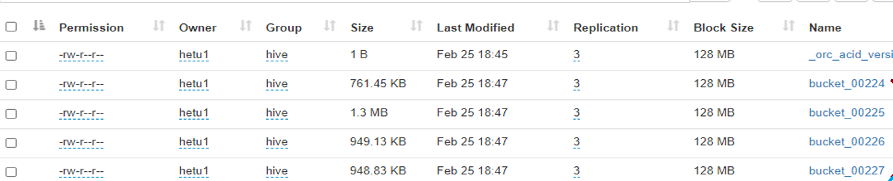

Hive Connector
==============

## Overview


The Hive connector allows querying data stored in a Hive data warehouse.
Hive is a combination of three components:

-   Data files in varying formats that are typically stored in the Hadoop Distributed File System (HDFS) or in Amazon S3.
-   Metadata about how the data files are mapped to schemas and tables. This metadata is stored in a database such as MySQL and is accessed via the Hive metastore service.
-   A query language called HiveQL. This query language is executed on a distributed computing framework such as MapReduce or Tez.

openLooKeng only uses the first two components: the data and the metadata. It does not use HiveQL or any part of Hive\'s execution environment.

## Supported File Types


The following file types are supported for the Hive connector:

-   ORC
-   Parquet
-   Avro
-   RCFile
-   SequenceFile
-   JSON
-   Text

In order to enable first-class support for Avro tables and CSV files when using Hive 3.x, you need to add the following property definition to the Hive metastore configuration file `hive-site.xml`:

``` xml
<property>
     <!-- https://community.hortonworks.com/content/supportkb/247055/errorjavalangunsupportedoperationexception-storage.html -->
     <name>metastore.storage.schema.reader.impl</name>
     <value>org.apache.hadoop.hive.metastore.SerDeStorageSchemaReader</value>
 </property>
```

## Configuration


The Hive connector supports Apache Hadoop 2.x and derivative distributions including Cloudera CDH 5 and Hortonworks Data Platform (HDP).

Create `etc/catalog/hive.properties` with the following contents to mount the `hive-hadoop2` connector as the `hive` catalog, replacing `example.net:9083` with the correct host and port for your Hive metastore Thrift service:

``` properties
connector.name=hive-hadoop2
hive.metastore.uri=thrift://example.net:9083
```

### Multiple Hive Clusters

You can have as many catalogs as you need, so if you have additional Hive clusters, simply add another properties file to `etc/catalog` with a different name (making sure it ends in `.properties`). For example, if you name the property file `sales.properties`, openLooKeng will create acatalog named `sales` using the configured connector.

### HDFS Configuration

For basic setups, openLooKeng configures the HDFS client automatically and does not require any configuration files. In some cases, such as when using federated HDFS or NameNode high availability, it is necessary to specify additional HDFS client options in order to access your HDFS cluster. To do so, add the `hive.config.resources` property to reference your HDFS config files:

``` properties
hive.config.resources=/etc/hadoop/conf/core-site.xml,/etc/hadoop/conf/hdfs-site.xml
```

Only specify additional configuration files if necessary for your setup. We also recommend reducing the configuration files to have the minimum set of required properties, as additional properties may cause problems.

The configuration files must exist on all openLooKeng nodes. If you are referencing existing Hadoop config files, make sure to copy them to any openLooKeng nodes that are not running Hadoop.

### HDFS Username and Permissions

Before running any `CREATE TABLE` or `CREATE TABLE AS` statements for Hive tables in openLooKeng, you need to check that the user openLooKeng is using to access HDFS has access to the Hive warehouse directory. The Hive warehouse directory is specified by the configuration variable `hive.metastore.warehouse.dir` in `hive-site.xml`, and the default value is `/user/hive/warehouse`.

When not using Kerberos with HDFS, openLooKeng will access HDFS using the OS user of the openLooKeng process. For example, if openLooKeng is running as `nobody`, it will access HDFS as `nobody`. You can override this username by setting the `HADOOP_USER_NAME` system property in the openLooKeng [JVM Config](../installation/deployment.md#jvm-config), replacing `hdfs_user` with the appropriate username:

``` properties
-DHADOOP_USER_NAME=hdfs_user
```

The `hive` user generally works, since Hive is often started with the `hive` user and this user has access to the Hive warehouse.

Whenever you change the user openLooKeng is using to access HDFS, remove `/tmp/openlookeng-*,/tmp/presto-*,/tmp/hetu-*` on HDFS, as the new user may not have access to the existing temporary directories.

### Accessing Hadoop clusters protected with Kerberos authentication

Kerberos authentication is supported for both HDFS and the Hive metastore. However, Kerberos authentication by ticket cache is not yet supported.

The properties that apply to Hive connector security are listed in the [Hive Configuration Properties](./hive.md#hive-configuration-properties) table.
Please see the [Hive Security Configuration](./hive-security.md) section for a more detailed discussion of the security options in the Hive connector.

## Hive Configuration Properties


| Property Name                             | Description                                                  | Default  |
| ----------------------------------------- | ------------------------------------------------------------ | -------- |
| hive.metastore                            | The type of Hive metastore                                   | `thrift` |
| hive.config.resources                     | An optional comma-separated list of HDFS configuration files. These files must exist on the machines running openLooKeng. Only specify this if absolutely necessary to access HDFS. Example: `/etc/hdfs-site.xml` |          |
| hive.recursive-directories                | Enable reading data from subdirectories of table or partition locations. If disabled, subdirectories are ignored. This is equivalent to the `hive.mapred.supports.subdirectories` property in Hive. |          |
| `hive.storage-format`                     | The default file format used when creating new tables.       | `ORC`    |
| `hive.compression-codec`                  | The compression codec to use when writing files.             | `GZIP`   |
| `hive.force-local-scheduling`             | Force splits to be scheduled on the same node as the Hadoop DataNode process serving the split data.  This is useful for installations where openLooKeng is collocated with every DataNode. | `false`  |
| `hive.respect-table-format`               | Should new partitions be written using the existing table format or the default openLooKeng format? | `true`   |
| `hive.immutable-partitions`               | Can new data be inserted into existing partitions?           | `false`  |
| `hive.create-empty-bucket-files`          | Should empty files be created for buckets that have no data? | `false`  |
| `hive.max-partitions-per-writers`         | Maximum number of partitions per writer.                     | 100      |
| `hive.max-partitions-per-scan`            | Maximum number of partitions for a single table scan.        | 100,000  |
| `hive.hdfs.authentication.type`           | HDFS authentication type. Possible values are `NONE` or `KERBEROS`. | `NONE`   |
| `hive.hdfs.impersonation.enabled`         | Enable HDFS end user impersonation.                          | `false`  |
| `hive.hdfs.presto.principal`                | The Kerberos principal that openLooKeng will use when connecting to HDFS. |          |
| `hive.hdfs.presto.keytab`                   | HDFS client keytab location.                                 |          |
| `hive.security`                           | See [Hive Security Configuration](./hive-security.md). |          |
| `security.config-file`                    | Path of config file to use when `hive.security=file`. See [File Based Authorization](./hive-security.md#file-based-authorization) for details. |          |
| `hive.non-managed-table-writes-enabled`   | Enable writes to non-managed (external) Hive tables.         | `false`  |
| `hive.non-managed-table-creates-enabled`  | Enable creating non-managed (external) Hive tables.          | `true`   |
| `hive.collect-column-statistics-on-write` | Enables automatic column level statistics collection on write. See [Table Statistics](./hive.md#table-statistics) for details. | `true`   |
| `hive.s3select-pushdown.enabled`          | Enable query pushdown to AWS S3 Select service.              | `false`  |
| `hive.s3select-pushdown.max-connections`  | Maximum number of simultaneously open connections to S3 for [S3 Select Pushdown](#s3-select-pushdown). | 500      |
| `hive.orc.use-column-names`               | To support alter table drop column, it is recommended to add `hive.orc.use-column-names=true` in hive properties, otherwise the drop column might not work properly. | false    |
| `hive.orc-predicate-pushdown-enabled`     | Enables pushdown processing of predicates while reading ORC file. | `false` |
| `hive.orc.time-zone`                      | Sets the default time zone for legacy ORC files that did not declare a time zone. | JVM default    |
| `hive.parquet.time-zone`                  | Adjusts timestamp values to a specific time zone. For Hive 3.1+, this should be set to UTC. | JVM default    |
| `hive.rcfile.time-zone`                   | Adjusts binary encoded timestamp values to a specific time zone. For Hive 3.1+, this should be set to UTC. | JVM default    |
| `hive.vacuum-service-threads`             | Number of threads to run in the vacuum service.               | 2    |
| `hive.auto-vacuum-enabled`                | Enable auto-vacuum on Hive tables. To enable auto-vacuum on engine side, add `auto-vacuum.enabled=true` in config.properties of coordinator node(s). | `false`  |
| `hive.vacuum-delta-num-threshold`         | Maximum number of delta directories to allow without compacting it. Minimum value is 2.       | 10    |
| `hive.vacuum-delta-percent-threshold`     | Maximum percent of delta directories to allow without compacting it. Value should be in range 0.1 to 1.0      | 0.1   |
| `hive.vacuum-cleanup-recheck-interval`    | Interval after which vacuum cleanup task will be resubmitted. Minimum value is 5 minutes.    | `5 Minutes`    |
| `hive.vacuum-collector-interval`    | Interval after which vacuum collector task will be resubmitted.     | `5 Minutes`    |
| `hive.max-splits-to-group`    | Max number of splits that can be grouped. If value is 1 it will not group. Minimum value is 1. More small splits, creates more drivers due to this more memory, scheduling, context switching is required which impact the read performance. Grouping of small splits together reduces the number of splits & driver creation, due this less resources are required which improves performance. | 1   |
| `hive.metastore-client-service-threads` | Number of threads for metastore clients to operate in parallel to communicate with hive metastore. | 4 |
| `hive.worker-metastore-cache-enabled` | Enable the caching of the hive metastore on the worker nodes also. | `false` |
| `hive.metastore-write-batch-size` | Number of partitions sent to meta store in per request. | `8` |
| `hive.metastore-cache-ttl` | Metastore Cache eviction time for table & partition metadata. | `0s` |
| `hive.metastore-refresh-interval` | Time after which metastore cache entries for table and partition metadata are refreshed from Hive metastore. | `1s` |
| `hive.metastore-db-cache-ttl` | Metastore Cache eviction time for DB, Roles, Configs, Table & Views list objects. | `0s` |
| `hive.metastore-db-refresh-interval` | Time after which metastore cache entry is refreshed from Hive metastore for DB, Table List, View List, Roles objects. | `1s` |


## Hive Thrift Metastore Configuration Properties


| Property Name                                       | Description                                                  |
| :-------------------------------------------------- | :----------------------------------------------------------- |
| `hive.metastore.uri`                                | The URI(s) of the Hive metastore to connect to using the Thrift protocol. If multiple URIs are provided, the first URI is used by default and the rest of the URIs are fallback metastores. This property is required. Example: `thrift://192.0.2.3:9083` or `thrift://192.0.2.3:9083,thrift://192.0.2.4:9083` |
| `hive.metastore.username`                           | The username openLooKeng will use to access the Hive metastore.     |
| `hive.metastore.authentication.type`                | Hive metastore authentication type. Possible values are `NONE` or `KERBEROS` (defaults to `NONE`). |
| `hive.metastore.thrift.impersonation.enabled`       | Enable Hive metastore end user impersonation. |
| `hive.metastore.thrift.client.ssl.enabled`          | Use SSL when connecting to metastore.  default value is `false` When it is true, either keystore or truststore is required. You should set the keystore/truststore path and password in the `jvm.config`. The keys are listed as below: `-Djavax.net.ssl.keystoreType= e.g. jks` `-Djavax.net.ssl.keyStore=` `-Djavax.net.ssl.keyStorePassword=` `-Djavax.net.ssl.trustStore=` `-Djavax.net.ssl.trustStorePassword=` |
| `hive.metastore.service.principal`                  | The Kerberos principal of the Hive metastore service.        |
| `hive.metastore.client.principal`                   | The Kerberos principal that openLooKeng will use when connecting to the Hive metastore service. |
| `hive.metastore.client.keytab`                      | Hive metastore client keytab location.                       |
| `hive.metastore.thrift.is-role-name-case-sensitive` | whether the role name to be Case-Sensitive or not, default value false. |
| `hive.metastore.krb5.conf.path`                     | The Kerberos configuration file location. |


## AWS Glue Catalog Configuration Properties


| Property Name                                      | Description                                                  |
| :------------------------------------------------- | :----------------------------------------------------------- |
| `hive.metastore.glue.region`                       | AWS region of the Glue Catalog. This is required when not running in EC2, or when the catalog is in a different region. Example: `us-east-1` |
| `hive.metastore.glue.pin-client-to-current-region` | Pin Glue requests to the same region as the EC2 instance where openLooKeng is running (defaults to `false`). |
| `hive.metastore.glue.max-connections`              | Max number of concurrent connections to Glue (defaults to `5`). |
| `hive.metastore.glue.default-warehouse-dir`        | Hive Glue metastore default warehouse directory              |
| `hive.metastore.glue.aws-access-key`               | AWS access key to use to connect to the Glue Catalog. If specified along with `hive.metastore.glue.aws-secret-key`, this parameter takes precedence over `hive.metastore.glue.iam-role`. |
| `hive.metastore.glue.aws-secret-key`               | AWS secret key to use to connect to the Glue Catalog. If specified along with `hive.metastore.glue.aws-access-key`, this parameter takes precedence over `hive.metastore.glue.iam-role`. |
| `hive.metastore.glue.iam-role`                     | ARN of an IAM role to assume when connecting to the Glue Catalog. |

## Amazon S3 Configuration


The Hive Connector can read and write tables that are stored in S3. This is accomplished by having a table or database location that uses an S3 prefix rather than an HDFS prefix.

openLooKeng uses its own S3 filesystem for the URI prefixes `s3://`, `s3n://`and `s3a://`.

### S3 Configuration Properties

  

| Property Name                           | Description                                                  |
| :-------------------------------------- | :----------------------------------------------------------- |
| `hive.s3.use-instance-credentials`      | Use the EC2 metadata service to retrieve API credentials (defaults to `true`). This works with IAM roles in EC2. |
| `hive.s3.aws-access-key`                | Default AWS access key to use.                               |
| `hive.s3.aws-secret-key`                | Default AWS secret key to use.                               |
| `hive.s3.iam-role`                      | IAM role to assume.                                          |
| `hive.s3.endpoint`                      | The S3 storage endpoint server. This can be used to connect to an S3-compatible storage system instead of AWS. When using v4 signatures, it is recommended to set this to the AWS region-specific endpoint (e.g., `http[s]://.s3-.amazonaws.com`). |
| `hive.s3.signer-type`                   | Specify a different signer type for S3-compatible storage. Example: `S3SignerType` for v2 signer type |
| `hive.s3.path-style-access`             | Use path-style access for all requests to the S3-compatible storage. This is for S3-compatible storage that doesn’t support virtual-hosted-style access. (defaults to `false`) |
| `hive.s3.staging-directory`             | Local staging directory for data written to S3. This defaults to the Java temporary directory specified by the JVM system property `java.io.tmpdir`. |
| `hive.s3.pin-client-to-current-region`  | Pin S3 requests to the same region as the EC2 instance where openLooKeng is running (defaults to `false`). |
| `hive.s3.ssl.enabled`                   | Use HTTPS to communicate with the S3 API (defaults to `true`). |
| `hive.s3.sse.enabled`                   | Use S3 server-side encryption (defaults to `false`).         |
| `hive.s3.sse.type`                      | The type of key management for S3 server-side encryption. Use `S3` for S3 managed or `KMS` for KMS-managed keys (defaults to `S3`). |
| `hive.s3.sse.kms-key-id`                | The KMS Key ID to use for S3 server-side encryption with KMS-managed keys. If not set, the default key is used. |
| `hive.s3.kms-key-id`                    | If set, use S3 client-side encryption and use the AWS KMS to store encryption keys and use the value of this property as the KMS Key ID for newly created objects. |
| `hive.s3.encryption-materials-provider` | If set, use S3 client-side encryption and use the value of this property as the fully qualified name of a Java class which implements the AWS SDK’s `EncryptionMaterialsProvider` interface.   If the class also implements `Configurable` from the Hadoop API, the Hadoop configuration will be passed in after the object has been created. |
| `hive.s3.upload-acl-type`               | Canned ACL to use while uploading files to S3 (defaults to `Private`). |
| `hive.s3.skip-glacier-objects`          | Ignore Glacier objects rather than failing the query. This will skip data that may be expected to be part of the table or partition. Defaults to `false`. |


### S3 Credentials

If you are running openLooKeng on Amazon EC2 using EMR or another facility, it is highly recommended that you set `hive.s3.use-instance-credentials` to `true` and use IAM Roles for EC2 to govern access to S3. If this is the case, your EC2 instances will need to be assigned an IAM Role which grants appropriate access to the data stored in the S3 bucket(s) you wish to use. It\'s also possible to configure an IAM role with `hive.s3.iam-role` that will be assumed for accessing any S3 bucket.
This is much cleaner than setting AWS access and secret keys in the `hive.s3.aws-access-key` and `hive.s3.aws-secret-key` settings, and also allows EC2 to automatically rotate credentials on a regular basis without any additional work on your part.

### Custom S3 Credentials Provider

You can configure a custom S3 credentials provider by setting the Hadoop configuration property `presto.s3.credentials-provider` to be the fully qualified class name of a custom AWS credentials provider
implementation. This class must implement the [AWSCredentialsProvider](http://docs.aws.amazon.com/AWSJavaSDK/latest/javadoc/com/amazonaws/auth/AWSCredentialsProvider.html) interface and provide a two-argument constructor that takes a `java.net.URI` and a Hadoop `org.apache.hadoop.conf.Configuration` as arguments. A custom credentials provider can be used to provide temporary credentials from STS (using `STSSessionCredentialsProvider`), IAM role-based credentials (using `STSAssumeRoleSessionCredentialsProvider`), or credentials for a specific use case (e.g., bucket/user specific credentials). This Hadoop configuration property must be set in the Hadoop configuration files referenced by the `hive.config.resources` Hive connector property.

### Tuning Properties

he following tuning properties affect the behavior of the client used by the openLooKeng S3 filesystem when communicating with S3. Most of these parameters affect settings on the `ClientConfiguration` object associated with the `AmazonS3Client`.

| Property Name                     | Description                                                  | Default      |
| :-------------------------------- | :----------------------------------------------------------- | :----------- |
| `hive.s3.max-error-retries`       | Maximum number of error retries, set on the S3 client.       | `10`         |
| `hive.s3.max-client-retries`      | Maximum number of read attempts to retry.                    | `5`          |
| `hive.s3.max-backoff-time`        | Use exponential backoff starting at 1 second up to this maximum value when communicating with S3. | `10 minutes` |
| `hive.s3.max-retry-time`          | Maximum time to retry communicating with S3.                 | `10 minutes` |
| `hive.s3.connect-timeout`         | TCP connect timeout.                                         | `5 seconds`  |
| `hive.s3.socket-timeout`          | TCP socket read timeout.                                     | `5 seconds`  |
| `hive.s3.max-connections`         | Maximum number of simultaneous open connections to S3.       | `500`        |
| `hive.s3.multipart.min-file-size` | Minimum file size before multi-part upload to S3 is used.    | `16 MB`      |
| `hive.s3.multipart.min-part-size` | Minimum multi-part upload part size.                         | `5 MB`       |

### S3 Data Encryption

openLooKeng supports reading and writing encrypted data in S3 using both server-side encryption with S3 managed keys and client-side encryption using either the Amazon KMS or a software plugin to manage AES encryption keys.

With [S3 server-side encryption](http://docs.aws.amazon.com/AmazonS3/latest/dev/serv-side-encryption.html), (called *SSE-S3* in the Amazon documentation) the S3 infrastructure
takes care of all encryption and decryption work (with the exception of SSL to the client, assuming you have `hive.s3.ssl.enabled` set to `true`). S3 also manages all the encryption keys for you. To enable  this, set `hive.s3.sse.enabled` to `true`.

With [S3 client-side encryption](http://docs.aws.amazon.com/AmazonS3/latest/dev/UsingClientSideEncryption.html), S3 stores encrypted data and the encryption keys are managed outside of
the S3 infrastructure. Data is encrypted and decrypted by openLooKeng instead of in the S3 infrastructure. In this case, encryption keys can be managed either by using the AWS KMS or your own key management system.
To use the AWS KMS for key management, set `hive.s3.kms-key-id` to the UUID of a KMS key. Your AWS credentials or EC2 IAM role will need to be granted permission to use the given key as well.

To use a custom encryption key management system, set `hive.s3.encryption-materials-provider` to the fully qualified name of a class which implements the [EncryptionMaterialsProvider](http://docs.aws.amazon.com/AWSJavaSDK/latest/javadoc/com/amazonaws/services/s3/model/EncryptionMaterialsProvider.html) interface from the AWS Java SDK. This class will have to be accessible to the Hive Connector through the classpath and must be able to communicate with your custom key management system. If this class also implements the `org.apache.hadoop.conf.Configurable` interface from the Hadoop Java API, then the Hadoop configuration will be passed in after the object instance is created and before it is asked to provision or retrieve any encryption keys.

### S3 Select Pushdown

S3 Select Pushdown enables pushing down projection (SELECT) and predicate (WHERE) processing to [S3 Select](https://docs.aws.amazon.com/AmazonS3/latest/API/RESTObjectSELECTContent.html). With S3 Select Pushdown, openLooKeng only retrieves the required data from S3 instead of entire S3 objects, reducing both latency and network usage.

#### Is S3 Select a good fit for my workload?

Performance of S3 Select Pushdown depends on the amount of data filtered by the query. Filtering a large number of rows should result in better performance. If the query doesn\'t filter any data then pushdown may not add any additional value and user will be charged for S3 Select requests. Thus, we recommend that you benchmark your workloads with and without S3 Select to see if using it may be suitable for your workload. By default, S3 Select Pushdown is disabled and you should enable it in production after proper benchmarking and cost analysis. For more information on S3 Select request cost, please see [Amazon S3 Cloud Storage Pricing](https://aws.amazon.com/s3/pricing/).

Use the following guidelines to determine if S3 Select is a good fit for your workload:

-   Your query filters out more than half of the original data set.
-   Your query filter predicates use columns that have a data type supported by openLooKeng and S3 Select. The `TIMESTAMP`, `REAL`, and `DOUBLE` data types are not supported by S3 Select Pushdown. We recommend using the decimal data type for numerical data. For more information about supported data types for S3 Select, see the [Data Types documentation](https://docs.aws.amazon.com/AmazonS3/latest/dev/s3-glacier-select-sql-reference-data-types.html).
-   Your network connection between Amazon S3 and the Amazon EMR cluster has good transfer speed and available bandwidth. Amazon S3 Select does not compress HTTP responses, so the response size may increase for compressed input files.

#### Considerations and Limitations

-   Only objects stored in CSV format are supported. Objects can be uncompressed or optionally compressed with gzip or bzip2.
-   The \"AllowQuotedRecordDelimiters\" property is not supported. If this property is specified, the query fails.
-   Amazon S3 server-side encryption with customer-provided encryption keys (SSE-C) and client-side encryption are not supported.
-   S3 Select Pushdown is not a substitute for using columnar or compressed file formats such as ORC and Parquet.

#### Enabling S3 Select Pushdown

You can enable S3 Select Pushdown using the `s3_select_pushdown_enabled` Hive session property or using the `hive.s3select-pushdown.enabled` configuration property. The session property will override the config property, allowing you enable or disable on a per-query basis.

#### Understanding and Tuning the Maximum Connections

openLooKeng can use its native S3 file system or EMRFS. When using the native FS, the maximum connections is configured via the `hive.s3.max-connections` configuration property. When using EMRFS, the
maximum connections is configured via the `fs.s3.maxConnections` Hadoop configuration property.

S3 Select Pushdown bypasses the file systems when accessing Amazon S3 for predicate operations. In this case, the value of `hive.s3select-pushdown.max-connections` determines the maximum number of client connections allowed for those operations from worker nodes.

If your workload experiences the error *Timeout waiting for connection from pool*, increase the value of both `hive.s3select-pushdown.max-connections` and the maximum connections configuration for the file system you are using.

## Google Cloud Storage Configuration


The Hive connector can access data stored in GCS, using the `gs://` URI prefix. Please refer to the `hive-gcs-tutorial` for step-by-step instructions.


### GCS Configuration properties

 

| Property Name                 | Description                                                  |
| :---------------------------- | :----------------------------------------------------------- |
| `hive.gcs.json-key-file-path` | JSON key file used to authenticate with Google Cloud Storage. |
| `hive.gcs.use-access-token`   | Use client-provided OAuth token to access Google Cloud Storage. This is mutually exclusive with a global JSON key file. |

## ORC Cache Configuration


Hive connector caches the ORC file data to provide better performance and reduce query latency. Workers cache the data on their local memory.
When enabled, Workers cache all ORC files tail, stripe-footer, row-index, bloom-filter information. However, the workers cache row data of only specific ORC 
files that are matching the predicates provided via `cache table` sql statement.

### ORC Cache Properties

| Property Name                              | Description                                          | Default   |
| :----------------------------------------- | :--------------------------------------------------- | :-------- |
| `hive.orc.file-tail.cache.enabled`         | Enable ORC file tail cache                           | `false`   |
| `hive.orc.file-tail.cache.ttl`             | TTL for ORC file tail cache                          | `4 hours` |
| `hive.orc.file-tail.cache.limit`           | Maximum number of entries in ORC file tail cache     | `50,000`  |
| `hive.orc.stripe-footer.cache.enabled`     | Enable ORC stripe footer cache                       | `false`   |
| `hive.orc.stripe-footer.cache.ttl`         | TTL for ORC stripe footer cache                      | `4 hours` |
| `hive.orc.stripe-footer.cache.limit`       | Maximum number of entries in ORC Stripe footer cache | `250,000`  |
| `hive.orc.row-index.cache.enabled`         | Enable ORC row index cache                           | `false`   |
| `hive.orc.row-index.cache.ttl`             | TTL for ORC row index cache                          | `4 hours` |
| `hive.orc.row-index.cache.limit`           | Maximum number of entries in ORC row index cache     | `250,000`  |
| `hive.orc.bloom-filters.cache.enabled`     | Enable ORC bloom filter cache                        | `false`   |
| `hive.orc.bloom-filters.cache.ttl`         | TTL for ORC bloom filter cache                       | `4 hours` |
| `hive.orc.bloom-filters.cache.limit`       | Maximum number of entries in ORC bloom filter cache  | `250,000`  |
| `hive.orc.row-data.block.cache.enabled`    | Enable ORC row group block cache                     | `false`   |
| `hive.orc.row-data.block.cache.ttl`        | TTL for ORC row group cache                          | `4 hours` |
| `hive.orc.row-data.block.cache.max.weight` | Maximum weight of ORC row group cache                | `20 GB`  |

TTL is time taken since cache entry was last accessed by read or write. Timed expiration is performed with periodic maintenance during writes 
and occasionally during reads, as discussed below.

## Table Statistics

When writing data, the Hive connector always collects basic statistics (`numFiles`, `numRows`, `rawDataSize`, `totalSize`) and by default will also collect column level statistics:

 

| Column Type | Collectible Statistics                                     |
| :---------- | :--------------------------------------------------------- |
| `TINYINT`   | number of nulls, number of distinct values, min/max values |
| `SMALLINT`  | number of nulls, number of distinct values, min/max values |
| `INTEGER`   | number of nulls, number of distinct values, min/max values |
| `BIGINT`    | number of nulls, number of distinct values, min/max values |
| `DOUBLE`    | number of nulls, number of distinct values, min/max values |
| `REAL`      | number of nulls, number of distinct values, min/max values |
| `DECIMAL`   | number of nulls, number of distinct values, min/max values |
| `DATE`      | number of nulls, number of distinct values, min/max values |
| `TIMESTAMP` | number of nulls, number of distinct values, min/max values |
| `VARCHAR`   | number of nulls, number of distinct values                 |
| `CHAR`      | number of nulls, number of distinct values                 |
| `VARBINARY` | number of nulls                                            |
| `BOOLEAN`   | number of nulls, number of true/false values               |

### Updating table and partition statistics

If your queries are complex and include joining large data sets, running `/sql/analyze` on tables/partitions may improve query performance by collecting statistical information about
the data.

When analyzing a partitioned table, the partitions to analyze can be specified via the optional `partitions` property, which is an array containing the values of the partition keys in the order they are declared in the table schema:

    ANALYZE table_name WITH (
        partitions = ARRAY[
            ARRAY['p1_value1', 'p1_value2'],
            ARRAY['p2_value1', 'p2_value2']])

This query will collect statistics for two partitions with keys `p1_value1, p1_value2` and `p2_value1, p2_value2`.


## Hive ACID support

openLooKeng supports ACID transactions (INSERT,UPDATE,DELETE) on a transactional table in Hive.


### Create Transactional Table using Hive Connector

To support ACID transactions, following prerequisites must be met:

1. Table should be created with 'transactional' property enabled.
2. Format as ORC. Refer [Hive Connector Limitations](#hive-connector-limitations)

Example:

```sql
CREATE TABLE hive_acid_table (
    id int,
    name string )
  WITH (format='ORC', transactional=true);
```


### INSERT on transactional tables

Insert operation remains same from end-user perspective for both transactional and non-transactional tables.

Example:

```sql
INSERT INTO hive_acid_table
  VALUES
     (1, 'foo'),
     (2, 'bar');
```


### UPDATE on transactional tables

UPDATE operation on transactional table lets user update specific rows' columns matching with WHERE clause.

Example:

```sql
UPDATE hive_acid_table
  SET name='john'
  WHERE id=2;
```

Above example updates the column ` name`'s value to `john` of row with column `id` having value `2`.

SELECT result before UPDATE:

```sql
lk:default> SELECT * FROM hive_acid_table;
id | name
----+------
  2 | bar
  1 | foo
(2 rows)
```

SELECT result after UPDATE

```sql
lk:default> SELECT * FROM hive_acid_table;
 id | name
----+------
  2 | john
  1 | foo
(2 rows)
```

### DELETE on transactional tables

DELETE operation on transactional tables lets user delete specific rows matching with WHERE clause.

Example:

```sql
DELETE FROM hive_acid_table
  WHERE id=2;
```

Above example delete the row with column `id` having value `2`.

SELECT result before DELETE:

```sql
lk:default> SELECT * FROM hive_acid_table;
 id | name
----+------
  2 | john
  1 | foo
(2 rows)
```

SELECT result after DELETE:

```sql
lk:default> SELECT * FROM hive_acid_table;
 id | name
----+------
  1 | foo
(1 row)
```


### VACUUM on transactional tables

Hive maintains all transactions (INSERT/UPDATE/DELETE) in separate delta directories for bookkeeping purposes. DELETE transactions does not remove the old rows physically in stored data, instead they just mark them as deleted in a new file. UPDATE uses split-update mechanism  to update data. Due to these, read operations on table needs to read many files, which adds extra overhead. All these delta files needs to be merged to get consolidated data for faster processing. VACUUM operation in openLooKeng does the work of merging these delta files.

Vacuum operation translates to `compaction` in Hive. In Hive there are two types of compactions, `Major` and `Minor`.

Following are mapping between VACUUM and Hive compactions.

* `VACUUM FULL` translates to Major compaction.

* `VACUUM` translates to Minor compaction.

#### VACUUM 

```sql
VACUUM TABLE hive_acid_table;

```

The above operation triggers the VACUUM on `hive_acid_table` to merge all delta directories to single delta directory. Once operation reaches RUNNING state, it continues to run asynchronously, unblocking client. 

-----

**NOTE**: Currently there is no command to fetch the result of asynchronous VACUUM, but it can be monitored from UI. 

-----

##### VACUUM FULL

Full Vacuum merges the all transactions present in delta directories and creates a `base` directory containing only final result.  After this operation, deleted rows will be deleted permanently. As a result, during read, total data read will be very less, hence improves performance.

```sql
VACUUM TABLE hive_acid_table
  FULL;

```

The Above operation triggers the VACUUM FULL on `hive_acid_table` and once it reaches RUNNING state, it continues to run asynchronously, unblocking client. 

##### VACUUM on partitioned table

If the table is partitioned then  VACUUM operation can operate upon the specific partition separately instead of all partitions of the table together.  

Example: Creating the partition table and INSERT data:

```sql
CREATE TABLE hive_acid_table_partitioned (
    id int,
    name string,
    class int) 
WITH (format='ORC', transactional=true, partitioned_by=ARRAY['class']);

INSERT INTO hive_acid_table_partitioned
  VALUES
    (1, 'foo', 5),
    (2, 'bar', 10);

```

 Vacuum on specific partition `class=5` can be run as:

```sql
VACUUM TABLE hive_acid_table_partitioned
   FULL
   PARTITION 'class=5';
```

If `PARTITION 'class=5' ` is not specified then vacuum operation will run on all partitions and if any failure in any one partition fails the entire operation.


##### AND WAIT option

By default, VACUUM operations runs in asynchronously, i.e. Once the query reaches RUNNING state, client will not wait anymore for completion of operation.

Adding `AND WAIT` option to vacuum operation makes the client wait synchronously for the completion of  Vacuum operation.

Above examples with `AND WAIT` options looks like below:

```sql
VACUUM TABLE hive_acid_table
  FULL
  AND WAIT;
```

```sql
VACUUM TABLE hive_acid_table
  AND WAIT;
```

```sql
VACUUM TABLE hive_acid_table_partitioned
  FULL
  PARTITION 'class=5'
  AND WAIT;
```


## Schema Evolution


Hive allows the partitions in a table to have a different schema than the table. This occurs when the column types of a table are changed after partitions already exist (that use the original column types). The Hive connector supports this by allowing the same conversions as Hive:

-   `varchar` to and from `tinyint`, `smallint`, `integer` and `bigint`
-   `real` to `double`
-   Widening conversions for integers, such as `tinyint` to `smallint`

Any conversion failure will result in null, which is the same behavior as Hive. For example, converting the string `'foo'` to a number, or converting the string `'1234'` to a `tinyint` (which has a maximum value of `127`).

## Avro Schema Evolution


openLooKeng supports querying and manipulating Hive tables with Avro storage format which has the schema set based on an Avro schema file/literal. It is also possible to create tables in openLooKeng which infers the schema from a valid Avro schema file located locally or remotely in HDFS/Web server.

To specify that Avro schema should be used for interpreting table\'s data one must use `avro_schema_url` table property. The schema can be placed remotely in HDFS (e.g. `avro_schema_url = 'hdfs://user/avro/schema/avro_data.avsc'`), S3 (e.g. `avro_schema_url = 's3n:///schema_bucket/schema/avro_data.avsc'`), a web server (e.g.
`avro_schema_url = 'http://example.org/schema/avro_data.avsc'`) as well as local file system. This url where the schema is located, must be accessible from the Hive metastore and openLooKeng coordinator/worker nodes.

The table created in openLooKeng using `avro_schema_url` behaves the same way as a Hive table with `avro.schema.url` or `avro.schema.literal` set.

Example:

    CREATE TABLE hive.avro.avro_data (
       id bigint
     )
    WITH (
       format = 'AVRO',
       avro_schema_url = '/usr/local/avro_data.avsc'
    )

The columns listed in the DDL (`id` in the above example) will be ignored if `avro_schema_url` is specified. The table schema will match the schema in the Avro schema file. Before any read operation, the Avro
schema is accessed so query result reflects any changes in schema. Thus openLooKeng takes advantage of Avro\'s backward compatibility abilities.

If the schema of the table changes in the Avro schema file, the new schema can still be used to read old data. Newly added/renamed fields *must* have a default value in the Avro schema file.

The schema evolution behavior is as follows:

-   Column added in new schema: Data created with an older schema will produce a *default* value when table is using the new schema.
-   Column removed in new schema: Data created with an older schema will no longer output the data from the column that was removed.
-   Column is renamed in the new schema: This is equivalent to removing the column and adding a new one, and data created with an older
    schema will produce a *default* value when table is using the new schema.
-   Changing type of column in the new schema: If the type coercion is supported by Avro or the Hive connector, then the conversion happens. An error is thrown for incompatible types.

### Limitations

The following operations are not supported when `avro_schema_url` is set:

-   `CREATE TABLE AS` is not supported.
-   Using partitioning(`partitioned_by`) or bucketing(`bucketed_by`)
    columns are not supported in `CREATE TABLE`.
-   `ALTER TABLE` commands modifying columns are not supported.

## Drop Column Behavior

Syntax supported for Drop Column is as follows:

```sql
ALTER TABLE 'name' DROP COLUMN 'column_name'
```

In case of Hive connector, DROP COLUMN drops column which is at the end of existing columns. Hive doesn't support DROP COLUMN syntax, however closest DDL supported by Hive which enumerates the above is REPLACE COLUMNS. REPLACE COLUMNS removes all existing columns and adds the new set of columns whereas DROP COLUMN does remove all existing columns and add the same set of columns excluding column specified in the query, manifesting as it dropped the column.

For example, consider a table with columns **a**, **b** and **c**.

```sql
lk:default> SELECT * FROM hive_table;
 a | b  |  c
---+----+-----
 1 | 10 | 100
(1 row)
```

 On dropping column **a**:

```sql
lk:default> SELECT * FROM hive_table;
  b | c
---+----
 1 | 10
(1 row)
```

## Procedures


-   `system.create_empty_partition(schema_name, table_name, partition_columns, partition_values)`

    > Create an empty partition in the specified table.

-   `system.sync_partition_metadata(schema_name, table_name, mode)`

    > Check and update partitions list in metastore. There are three modes available:
    > 
    > - `ADD` : add any partitions that exist on the file system but  not in the metastore.
    > - `DROP`: drop any partitions that exist in the metastore but not on the file system.
    > - `FULL`: perform both `ADD` and `DROP`.

## Examples


The Hive connector supports querying and manipulating Hive tables and schemas (databases). While some uncommon operations will need to be performed using Hive directly, most operations can be performed using openLooKeng.

Create a new Hive schema named `web` that will store tables in an S3bucket named `my-bucket`:

```sql
CREATE SCHEMA hive.web
WITH (location = 's3://my-bucket/')
```

Create a new Hive table named `page_views` in the `web` schema that is stored using the ORC file format, partitioned by date and country, and bucketed by user into `50` buckets (note that Hive requires the partition columns to be the last columns in the table):

Drop a partition from the `page_views` table:

```sql
DELETE FROM hive.web.page_views
WHERE ds = DATE '2016-08-09'
  AND country = 'US'
```

Add an empty partition to the `page_views` table:

```sql
CALL system.create_empty_partition(
    schema_name => 'web',
    table_name => 'page_views',
    partition_columns => ARRAY['ds', 'country'],
    partition_values => ARRAY['2016-08-09', 'US']);
```

Query the `page_views` table:

```sql
SELECT * FROM hive.web.page_views
```

List the partitions of the `page_views` table:

```sql
SELECT * FROM hive.web."page_views$partitions"
```

Create an external Hive table named `request_logs` that points at existing data in S3:

```sql
CREATE TABLE hive.web.request_logs (
  request_time timestamp,
  url varchar,
  ip varchar,
  user_agent varchar
)
WITH (
  format = 'TEXTFILE',
  external_location = 's3://my-bucket/data/logs/'
)
```

Collect statistics for the `request_logs` table:

```sql
ANALYZE hive.web.request_logs;
```

The examples shown here should work on Google Cloud Storage after replacing `s3://` with `gs://`.

### Cleaning up

Drop the external table `request_logs`. This only drops the metadata for the table. The referenced data directory is not deleted:

```sql
DROP TABLE hive.web.request_logs
```

Drop a schema:

```sql
DROP SCHEMA hive.web
```

## Metastore Cache

Hive connector maintains a metastore cache to service the metastore request faster to various operations. Loading, reloading and retention times of the cache entries can be configured in `hive.properties`.

  ```properties
  # Table & Partition Cache specific configurations
  hive.metastore-cache-ttl=24h
  hive.metastore-refresh-interval=23h

  # DB, Table & View list, Roles, configurations related cache configuration
  hive.metastore-db-cache-ttl=4m
  hive.metastore-db-refresh-interval=3m
  ```

**Note:** In cases where user operates on the data directly and if hive metastore is modified externally (eg. directly by Hive, Spark), there is a possibility of cache having older data. For the same user should configure the cache refresh and eviction times accordingly.

In order reduce the inconsistency, hive connector also validates the partition & its statistics cache entries `on read` against table and partition-names cache (which refreshes at higher frequency) in case the table refresh time is higher than `5mins`.

```sql
REFRESH META CACHE
```
Additionally, metadata cache refresh command can be used to reload the metastore cache by user.


## Performance tuning notes

#### INSERT

* A bulk load insert operation like "*CREATE TABLE AS*" or *"INSERT INTO TABLE SELECT COL1, COL2 FROM QUERY"* can be tuned for higher performance by configuring higher number of [writer tasks](../admin/properties.md#task.writer-count) configurations.

  ```properties
  SET SESSION task_writer_count=<num>;
  
  #Note: `num' is default number of local parallel table writer jobs per worker, must be a power of 2.
  #Recommended value: 50% of the total cpu cores available in the worker node can be given here
  ```

  Multiple writers per workers will ensure higher consumption of data, however, this leads to multiple files generation per partition; large number of small files is suboptimal for read operations.

  Following recommendations can be used by the administrator/developer to ensure less files are generated: -

  * **For AARCH64:**

    - Use [vacuum operation unify](../sql/vacuum.md) to merge the multiple files created by many file writes in each partition such that scheduling splits becomes faster during read.

      ```sql
      VACUUM TABLE catalog_sales FULL UNIFY;
      ```

      **<u>*Before Vacuum Unify*</u>**: Insert generates multiple files by each writer for a given partition:
      
      
      
      
      
      **<u>*After Vacuum Unify*</u>:** VACUUM FULL UNIFY command, all file small files are unified to one for a given partition.
      
      

  * **For Intel X86:**

    * Following session parameter can ensure only 1 file is created per partition by adding a plan node to shuffle the records across workers; such that only designated workers write particular partitions.

      ```properties
      SET SESSION hive.write_partition_distribution=true
      #Default: false
      ```

  * ##### Hive Metastore timeout

    The large partitioned table contains an excessive large number of partitions, causing task timeout. Large number of partitions may take more time to load and synchronize with the metastore cache, hence for better performance in higher scale storage its recommended to accordingly adjust the 'hive.metastore-timeout' parameter.

    The following property should be set in the hive config file.

    ```properties
    hive.metastore-timeout=<TimeWithUnit>;

    #Note: `TimeWithUnit' is the time with unit in seconds or minutes. 
    #Default: 10s (where 's' stands for seconds)
    #Recommended value: For operation in large partition table it can be 60s or higher. This needs to be configured according to the data volume. The values shown here are for reference only. It is recommended to adjust them according to the actual situation.
    ```


  

* ##### Parallel Metastore operations

  The following parameter should be set on the hive config.

  ``` properties
  hive.metastore-client-service-threads = 4
  #Default: 4
  #Recommended: The number of running hive metastore service instances * 4.
  ```

  Based on the number of thread pool that many parallel HMS operation can be called, this shall reduce the overall time to get the partitions.

  **Note**: additionally, multiple Hive Metastore services can be added to the cluster, the same will be accessed in round-robin manner thereby ensuring better load over hive metastore.

  ``` properties
  hive.metastore-write-batch-size = 64
  #Default: 8
  #Recommended: 64 or higher writes to batch together per request to hive metastore service.
  ```
  This reduces the round trip time between the HMS and openlookeng coordinator server.
  
  **Note**: this can also be configured using hive session property `hive.metastore_write_batch_size`. 


* ##### Direct Delete for whole partition deletes

  If delete request is on partition column then it will be directly deleted, so the partition will be deleted using metadata call.
  delete delta file will not be created on that partition because entire data of that partition is getting deleted.

  The following parameter should be set on the application session level:

  ``` properties
  delete_transactional_table_direct=true
  #Default: false
  ```

  **Usage:**

  ```sql
  DELETE FROM table_test WHERE partition_column >= (SELECT max(done_paritions) FROM tracking_table);
  ```

  > Note:
  >
  > a) Only `>,>=,<,<=` operators are supported for direct deletion.
  >
  > b) Delete command output shall not print the number of records deleted when whole partition is deleted.


## Known Issues


- During concurrent queries (involving select, update, delete, vacuum) or vacuum cleanups running parallelly, some queries might fail due to conflicts. And there is also a possibility of read queries to fail with "FileNotFoundException". These scenarios are caused due to a bug in Hive ACID utils but will not lead to any data loss. Also, re-running read/select queries would succeed. 


## Hive Connector Limitations


- [DELETE](../sql/delete.md) is only supported if the `WHERE` clause matches entire partitions when table is non-transactional. for transactional table, the `WHERE` clause can be any condition.
- [ALTER SCHEMA](../sql/alter-schema.md) usage fails, since the Hive metastore does not support renaming schemas.

- openLooKeng supports ACID transactions on Hive tables only for Hive version 3.x

- openLooKeng currently supports only `ORC` format for transactional tables.
