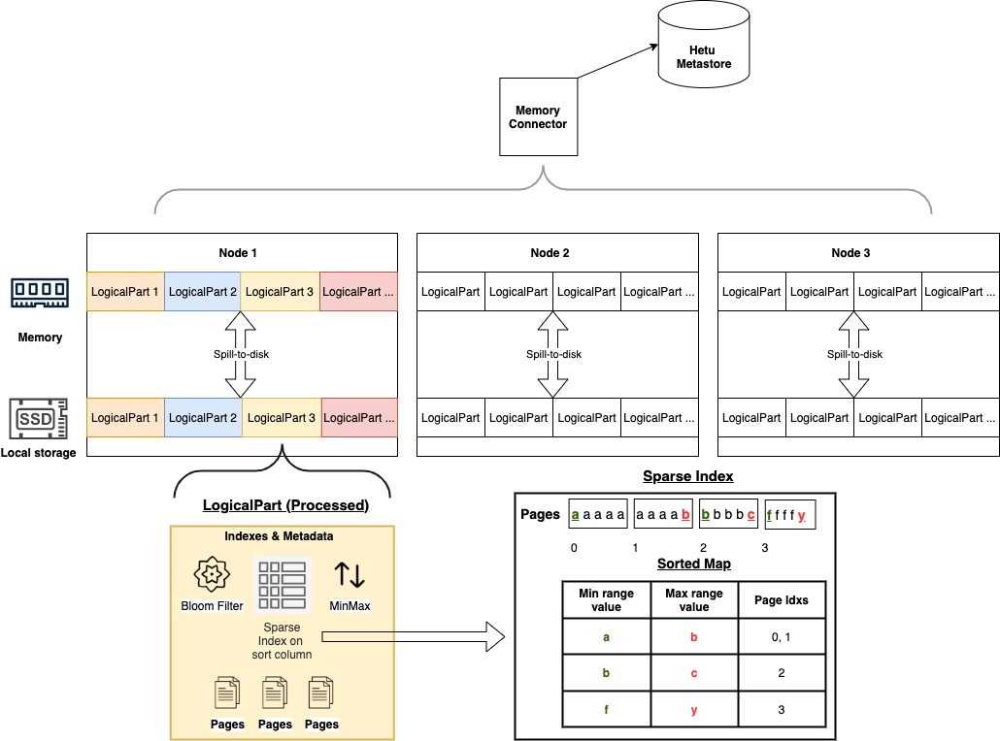

Memory Connector
================

The Memory Connector stores data and metadata in RAM on workers to allow for fast queries. 
Data and metadata are spilled to local disk and automatically reloaded if nodes are restarted.

Configuration
-------------

### Memory Connector Configuration

To configure the Memory Connector, create or modify the catalog properties file `etc/catalog/memory.properties` for the Memory Connector.
For example, you can write:

``` properties
connector.name=memory
memory.max-data-per-node=200GB
memory.spill-path=/opt/hetu/data/spill          
```
#### Other Required Configurations
- This section will cover other configurations required to use Memory Connector.
- Refer to the documentation of [Hetu Metastore](../admin/meta-store.md) and [State Store](../admin/state-store.md) for more information.

  ##### Single Node Setup
  - This section will give an example configuration for Memory Connector on a single node cluster.
  - Create a file `etc/catalog/memory.properties` with the following information:
  ``` properties
  connector.name=memory
  memory.max-data-per-node=200GB
  memory.spill-path=/opt/hetu/data/spill
  ```
  - Create the file `etc/hetu-metastore.properties` with these configurations:
  ```properties
  hetu.metastore.type=hetufilesystem
  hetu.metastore.hetufilesystem.profile-name=default
  hetu.metastore.hetufilesystem.path=/tmp/hetu/metastore
  hetu.metastore.cache.type=local
  ```
  ##### Multi-Node Setup
  - This section will give an example configuration for Memory Connector and a cluster with more than one node.
  - Create a file `etc/catalog/memory.properties` with the following information:
  ``` properties
  connector.name=memory
  memory.max-data-per-node=200GB
  memory.spill-path=/opt/hetu/data/spill
  ```
  - Add this line in `etc/config.properties` to enable State Store:
      - State Store allows Memory Connector to automatically clean up dropped tables, otherwise tables will only be cleaned up when another table is created.
  ```properties
  hetu.embedded-state-store.enabled=true
  ```
  - Create a file called `etc/state-store.properties` with the following contents:
  ```properties
  state-store.type=hazelcast
  state-store.name=test
  state-store.cluster=test-cluster
  hazelcast.discovery.mode=tcp-ip
  hazelcast.discovery.port=7980
  # The ip address and hazelcast discovery ports of each server should be included here
  # formatted like `hazelcast.discovery.tcp-ip.seeds=host1:port,host2:port` 
  hazelcast.discovery.tcp-ip.seeds=host1:7980, host2:7980
  ```
  - Create the file `etc/hetu-metastore.properties` with these configurations:
  ```properties
  hetu.metastore.type=hetufilesystem
  hetu.metastore.hetufilesystem.profile-name=hdfs
  hetu.metastore.hetufilesystem.path=/tmp/hetu/metastore
  # make sure to use global cache!
  hetu.metastore.cache.type=global
  ```
  - Create the file `etc/filesystem/hdfs.properties`  to direct openLooKeng to your hdfs file system:
  ```properties
  fs.client.type=hdfs
  # Path to hdfs resource files (e.g. core-site.xml, hdfs-site.xml)
  hdfs.config.resources=/tmp/hetu/hdfs-site.xml
  # hdfs authentication, accepted values: KERBEROS/NONE
  hdfs.authentication.type=NONE
  ```

**Note:**
- `spill-path` should be set to a directory with enough free space to hold
 the table data.
- See [**Configuration Properties**](#configuration-properties) section for additional properties and
 details.
- In `etc/config.properties` ensure that `task.writer-count` is set
 `>=` to number of nodes in the cluster running openLooKeng. This will help
  distribute the data uniformly between all the workers.

Examples
--------

Create a table using the Memory Connector:

    CREATE TABLE memory.default.nation AS
    SELECT * from tpch.tiny.nation;

Insert data into a table in the Memory Connector:

    INSERT INTO memory.default.nation
    SELECT * FROM tpch.tiny.nation;

Select from the Memory Connector:

    SELECT * FROM memory.default.nation;

Drop table:

    DROP TABLE memory.default.nation;

Create a table using the Memory Connector with sorting, indices and spill compression:

    CREATE TABLE memory.default.nation
    WITH (
        sorted_by=array['nationkey'],
        partitioned_by=array['regionkey'],
        index_columns=array['name'],
        spill_compression=true
    )
    AS SELECT * from tpch.tiny.nation;

After table creation completes, the Memory Connector will start building indices and sorting data in the background. Once the processing is complete any queries using the sort or index columns will be faster and more efficient.

For now, `sorted_by` and `partitioned_by` only accepts a single column.

Memory and Disk Usage via JMX
-----------------------------
JMX can be used to show memory and disk usage of memory connector tables
Please refer to [JMX Connector](./jmx.md) for setup

The `io.prestosql.plugin.memory.data:name=MemoryTableManager` table of `jmx.current` contains information on all the tables' memory and disk usage size in bytes

    SELECT * FROM jmx.current."io.prestosql.plugin.memory.data:name=MemoryTableManager";

```
 currentbytes | alltablesdiskbyteusage | alltablesmemorybyteusage |   node   |                       object_name                       
--------------+------------------------+--------------------------+----------+---------------------------------------------------------
           23 |                   3456 |                       23 | example1 | io.prestosql.plugin.memory.data:name=MemoryTableManager 
          253 |                   8713 |                      667 | example2 | io.prestosql.plugin.memory.data:name=MemoryTableManager 
```

Not all tables will be in memory since some may have been spilled to disk. `currentbytes` column will show the current memory occupied by tables which are in memory now.

The usage for each node is shown as a separate row, aggregation functions can be utilized to show total usage across the cluster. For example, to view total disk or memory usage on all nodes, run:

    SELECT sum(alltablesdiskbyteusage) as totaldiskbyteusage, sum(alltablesmemorybyteusage) as totalmemorybyteusage FROM jmx.current."io.prestosql.plugin.memory.data:name=MemoryTableManager";

```
totaldiskbyteusage | totalmemorybyteusage
-------------------+---------------------
             12169 |                  690
```

# Configuration Properties
------------------------

| Property Name                         | Default Value   | Required| Description               |
|---------------------------------------|-----------------|---------|---------------------------|
| `memory.spill-path                   `  | None          | Yes     | Directory where memory data will be spilled to. Must have enough free space to store the tables. SSD preferred.|
| `memory.max-data-per-node            `  | 256MB         | Yes     | Memory limit for total data stored on this node  |
| `memory.max-logical-part-size        `  | 256MB         | No      | Memory limit for each LogicalPart. Default value is recommended.|
| `memory.max-page-size                `  | 512KB         | No      | Memory limit for each page. Default value is recommended.|
| `memory.logical-part-processing-delay`  | 5s            | No      | The delay between when the table is created/updated and LogicalPart processing starts. Default value is recommended.|
| `memory.thread-pool-size             `  | Half of threads available to the JVM | No      | Maximum threads to allocate for background processing (e.g. sorting, index creation, cleanup, etc)|
| `memory.table-statistics-enabled`       | False         | No      | When enabled, user can run analyze to collect statistics and leverage that information for accelerating queries.|

Path whitelist:  `["/tmp", "/opt/hetu", "/opt/openlookeng", "/etc/hetu", "/etc/openlookeng", current workspace]`

Additional WITH properties
--------------------------
Use these properties when creating a table with the Memory Connector to make queries faster.

| Property Name            | Argument type             | Requirements                     | Description|
|--------------------------|---------------------------|----------------------------------|------------|
| sorted_by                | `array['col']`            | Maximum of one column. Column type must be comparable.  | Sort and create indexes on the given column|
| partitioned_by           | `array['col']`            | Maximum of one column. | Partition the table on the given column|
| index_columns            | `array['col1', 'col2']`   | None                             | Create indexes on the given column|
| spill_compression        | `boolean`           | None                             | Compress data when spilling to disk|


Index Types
--------------
These are the types of indices that are built on the columns you specify in `sorted_by` or `index_columns`.
If a query operator is not supported by a particular index, you can still use that operator, but the query will not benefit from the index.

| Index ID                          |Built for Columns In | Supported query operators             |
|-----------------------------------|----------------------------------------|---------------------------------------|
| Bloom   | `index_columns`                                 | `=` `IN`                             |                   
| MinMax  | `sorted_by,index_columns`                            | `=` `>` `>=` `<` `<=` `IN` `BETWEEN` |
| Sparse  | `sorted_by`                            | `=` `>` `>=` `<` `<=` `IN` `BETWEEN` |


Using statistics
-----------------
If the statistic configuration is enabled, you can refer to the example below to use it.

Create a table using the Memory Connector:

    CREATE TABLE memory.default.nation AS
    SELECT * from tpch.tiny.nation;

Run Analyze to collect the statistic information:

    ANALYZE memory.default.nation;

And then run the queries. Note that currently we do not support automatic statistic update, so you will need to run ANALYZE again if the table is updated.


Developer Information
----------------------------

This section outlines the overall design of the Memory Connector, as shown in the figure below.



### Scheduling Process
The data to be processed are stored in pages, which are distributed to different worker nodes in openLooKeng. In the Memory Connector, each worker has several LogicalParts. During table creation, LogicalParts in the workers are filled with the input pages in a round-robin fashion. Table data will be automatically spilled to disk as part of a background process as well.  If there is not enough memory to hold the entire data, the tables can be released from memory according to LRU rule. HetuMetastore is used to persist table metadata. At query time, when Tablescan operation is scheduled, the LogicalParts will be scheduled.

### LogicalPart
As shown in the lower part of the design figure, LogicalPart is the data structure that contains both indexes and data. The sorting and indexing are handled in a background process allowing faster querying,
but the table is still queriable during processing. LogicalParts have a maximum configurable size (default 256 MB).  New LogicalParts are created once the previous one is full.


### Indices
Bloom filter, sparse index and MinMax index are created in the LogicalPart.
Based on the pushed down predicate, entire LogicalParts can be filtered out using the Bloom Filter and MinMax indices.
Further Page filtering is done using the Sparse index.
Pages are first sorted, then optimized and finally a Sparse Index is created. 
This allows for smaller index sizes since not all unique values need to be stored. The Sparse index
helps reduce input rows but does not perform perfect filtering. 
Further filtering is done by openLooKeng’s Filter Operator.
Referring to the Sparse Index example above, this is how the Memory Connector would filter data for different queries:

```
For query: column=a.
Return Page 0 and 1 (note: contains extra b row).

For query: column=b.
Return Page 2 and Page 1.

For query: column=c.
Return floor entry of c (Page 2).

For query: column=d.
No pages need to be returned because last value of floor entry of c (Page 2) is less-than d.

For queries containing > >= < <= BETWEEN IN similar logic is applied.
```

Limitations and known Issues
---------------------------------------------

- Without State Store and Hetu Metastore with global cache, after `DROP TABLE`, memory is not released immediately on the workers. It is released on the next `CREATE TABLE` operation.
- Currently only a single column in ascending order is supported by `sorted_by`
- If a CTAS (CREATE TABLE AS) query fails or is cancelled, an invalid table will remain. This table must be dropped manually.
- And we support BOOLEAN, All INT Types, CHAR, VARCHAR, DOUBLE, REAL, DECIMAL, DATE, TIME, UUID types as partition keys.