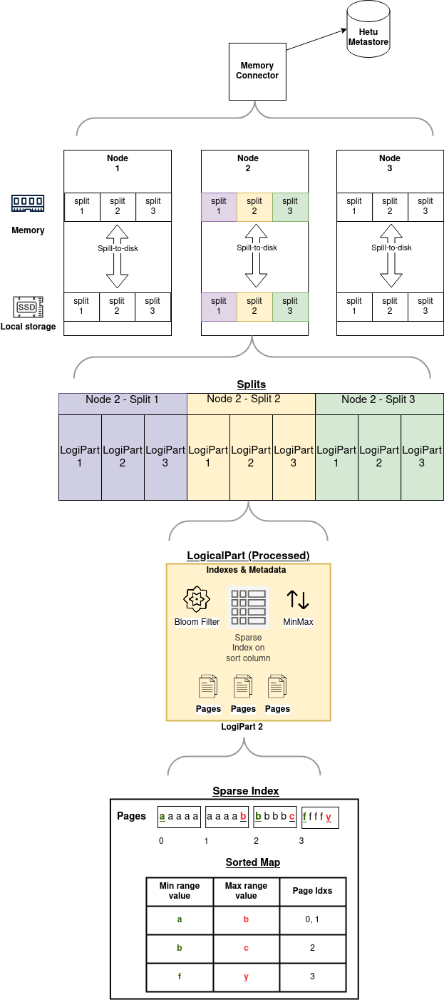

Memory Connector
================

The Memory Connector stores data and metadata in RAM on workers to allow for fast queries. Data and metadata are also spilled to local disk and automatically reloaded if nodes are restarted.

Configuration
-------------

### Memory Connector Configuration

To configure the Memory connector, create a catalog properties file `etc/catalog/memory.properties` with the following contents:

``` properties
connector.name=memory
memory.splits-per-node=10
memory.max-data-per-node=200GB
memory.spill-path=/opt/hetu/data/spill          
```   

**Note:**
- `spill-path` should be set to a directory with enough free space to hold
 the table data.
- See **Configuration Properties** section for additional properties and
 details.
- In `etc/config.properties` ensure that `task.writer-count` is set to
 `>=` number of nodes in the cluster running openLooKeng. This will help
  distribute the data uniformly between all the workers.
- Hetu Metastore must be configured. Check [Hetu Metastore](../admin/meta-store.md) for more information.

Examples
--------

Create a table using the memory connector:

    CREATE TABLE memory.default.nation AS
    SELECT * from tpch.tiny.nation;

Insert data into a table in the memory connector:

    INSERT INTO memory.default.nation
    SELECT * FROM tpch.tiny.nation;

Select from the memory connector:

    SELECT * FROM memory.default.nation;

Drop table:

    DROP TABLE memory.default.nation;

Create a table using the memory connector with sorting, indices and spill compression:

    CREATE TABLE memory.default.nation
    WITH (
        sorted_by=array['nationkey'],
        index_columns=array['name', 'regionkey'],
        spill_compression=true
    )
    AS SELECT * from tpch.tiny.nation;

After table creation completes, the memory connector will start building indices and sorting data in the background. Once the processing is complete any queries using the sort or index columns will be faster and more efficient.

For now, `sorted_by` only accepts a single column.


Configuration Properties
------------------------

| Property Name                         | Default Value   | Required| Description               |
|---------------------------------------|-----------------|---------|---------------------------|
| `memory.splits-per-node              `  | Available processors on the coordinator          | No     | Number of splits to create per node. Default value is number of available processors on the coordinator. Value is ignored on the workers. In high concurrency, setting this value to a lower number will improve performance.|
| `memory.spill-path                   `  | None          | Yes     | Directory where memory data will be spilled to. Must have enough free space to store the tables. SSD preferred.|
| `memory.max-data-per-node            `  | 256MB         | Yes     | Memory limit for total data stored on this node  |
| `memory.max-logical-part-size        `  | 256MB         | No      | Memory limit for each LogicalPart. Default value is recommended.|
| `memory.max-page-size                `  | 512KB         | No      | Memory limit for each page. Default value is recommended.|
| `memory.logical-part-processing-delay`  | 5s            | No      | The delay between when the table is created/updated and LogicalPart processing starts. Default value is recommended.|
| `memory.thread-pool-size             `  | Half of threads available to the JVM | No      | Maximum threads to allocate for background processing (e.g. sorting, index creation, cleanup, etc)|

Path whitelist：`["/tmp", "/opt/hetu", "/opt/openlookeng", "/etc/hetu", "/etc/openlookeng", current workspace]`

Additonal WITH properties
--------------
Use these properties when creating a table with the memory connector to make queries faster.

| Property Name            | Argument type             | Requirements                     | Description|
|--------------------------|---------------------------|----------------------------------|------------|
| sorted_by                | `array['col']`            | Maximum of one column. Column type must be comparable.  | Sort and create indexes on the given column|
| index_columns            | `array['col1', 'col2']`   | None                             | Create indexes on the given column|
| spill_compression        | `boolean`           | None                             | Compress data when spilling to disk|


Index Types
--------------
These are the types of indices that are built on the columns you specify in `sorted_by` or `index_columns`. If a query operator is not supported by a particular index you can still
use that operator, but the query will not benefit from the index.

| Index ID                          |Built for Columns In | Supported query operators             |
|-----------------------------------|----------------------------------------|---------------------------------------|
| Bloom   | `sorted_by,index_columns`                                 | `=` `IN`                             |                   
| MinMax  | `sorted_by,index_columns`                            | `=` `>` `>=` `<` `<=` `IN` `BETWEEN` |
| Sparse  | `sorted_by`                            | `=` `>` `>=` `<` `<=` `IN` `BETWEEN` |

Developer Information
----------------------------

This section outlines the overall design of the Memory Connector, as shown in the figure below.



The data is distributed to different workers as splits. Those Splits are further organized into LogicalParts. The LogicalParts contain indexes and data. Table data will be automatically spilled
to disk. If there is not enough memory to hold the entire data the tables can be released from memory. Data is sorted and indexed in a background process allowing faster table creation. The table is still queriable during
processing, queries are just not as efficient. HetuMetastore is used to persist table metadata.

### Splits

During table creation, pages are distributed to each of the workers. Each of the workers will have the same number of splits. Splits are filled with Pages in a round-robin fashion.
When Tablescan is scheduled, splits will be scheduled. Setting number of splits to a value less than number of cores on the node allows for maximum parallelism. Not all tables will fit into memory, so automatic spill-to-disk management
takes place. The maximum individual table size is the most that can fit into the configured memory connector limit. The table is automatically spilled to disk after creation as
part of a background process.

### LogicalPart

Each split will be further organized into LogicalParts. LogicalParts have a maximum configurable size (default 256 MB). New LogicalParts are created once the last one is filled. As
part of background processing after table creation, data is sorted and indexed.
Based on the pushed down predicate, entire LogicalParts can be filtered out using the Bloom Filter and MinMax indices. Further Page filtering is done using the Sparse index.

### Sparse Index

Pages are first sorted, then optimized and finally a Sparse Index is created. This allows for smaller index sizes since not all unique values need to be stored. The Sparse index
helps reduce input rows but does not perform perfect filtering. Further filtering is done by openLooKeng’s Filter Operator.

Referring to the Sparse Index example above, this is how the memory connector would filter data for different queries:

```
For query: column=a.
Return Page 0 and 1 (note: contains extra b row).

For query: column=b.
Return Page 2 and Page 1.

For query: column=c.
Return floor entry of c (Page 2).

For query: column=d.
No pages need to be returned because last value of floor entry of c (Page 2) is less-than d.

For queries containing > >= < <= BETWEEN IN similar logic is applied.
```

Memory Connector Limitations and known Issues
---------------------------------------------

- After `DROP TABLE`, memory is not released immediately. It is released on next `CREATE TABLE` operation.
    - A simple workaround is to create a small temporary table to trigger a cleanup `CREATE TABLE memory.default.tmp AS SELECT * FROM tpch.tiny.nation;`
- Currently only a single column in ascending order is supported by `sorted_by`
- If a CTAS (CREATE TABLE AS) query fails or is cancelled, an invalid table will remain. This table must be dropped manually.