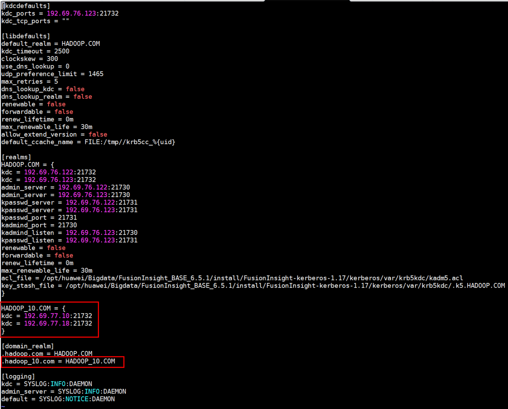

# openLooKeng FAQs

## Common Questions

1. What license is used by the openLooKeng?
   
   > The openLooKeng uses Apache License 2.0.

2. Does the openLooKeng support x86 and ARM? What OSs are supported?
   
   > The openLooKeng supports both x86 and ARM. Currently, openLooKeng can run on Linux OSs, such as openEuler, CentOS, and openSUSE.

3. What should I do if I find a vulnerability in the openLooKeng?
   
   > The community has a CVE handling process. If a suspected security issue is found, you can report it the community through secrets@openLooKeng.io. We will respond and handle the issue as soon as possible.

4. How do I report a bug?
   
   > You can go the **Issues** tab page (https://gitee.com/organizations/openLooKeng/issues) of the openLooKeng community, find the repository to which the bug belongs, add an issue, and set the issue type to **Bug**.

5. How do I submit a patch?
   
   > Any person can submit a patch in the form of pull request (PR) in the openLooKeng community. The PR will be reviewed, fed back, and integrated by the module maintainer. For details, visit https://gitee.com/help/articles/4122.

6. What are the version plan and roadmap of the openLooKeng community?
   
   > On June 30, 2020, the code was released to the community in the openLooKeng v0.1.0 version for sharing with global developers. It is planned that an iterative version is released every three months to continuously launch new features. The roadmap of the openLooKeng will be released as required. For details, visit the openLooKeng commuity bi-weekly PMC meeting (https://etherpad.openlookeng.io/p/PMC-weeklymeeting) or the openLooKeng Slack channel (https://openLooKeng.io/zh-cn/communication.html).

7. How can I obtain openLooKeng information and communicate with other developers about openLooKeng technologies?
   
   > Community issues: https://gitee.com/openlookeng
   >
   > Official website: https://openlookeng.io
   >
   > Slack channel: https://openlookeng.slack.com/
   >
   > openLooKeng WeChat Official Account: **openLooKeng**
   >
   > openLooKeng WeChat group: add the assistant's account **openLooKengoss**, and the assistant will invite you to join the group.
   >
   > openLooKeng Bilibili channel: Search **openLooKeng** on https://www.bilibili.com/**.**

## Functions

1. What connectors does the openLooKeng support?
   
   > Data source connectors supported by the openLooKeng
   > 
   > | Data Source| Performance Optimization|
   > ----------|----------
   >  CarbonData| No
   >  Elasticsearch| No
   >  Greenplum| Operator pushdown
   >  Hana| Operator pushdown
   >  HBase| Sharding rule optimization
   >  Hive| Dynamic filtering, table scan reuse, ORC pushdown, and DM optimization
   >  Apache Kafka| No
   >  MySQL| Operator pushdown
   >  PostgreSQL| No
   >  SQL Server| No
   >  Oracle| Operator pushdown
   >  MongoDB| No
   >  openGauss| No

   > Other connectors supported by the openLooKeng
   >
   > | Connector | Description |
   >  ------------ | ------------------------------------------------------- 
   >  Data center connector | The data center connector allows querying remote openLooKeng data centers. Converged analysis can be performed on data between different openLooKeng clusters in the local openLooKeng environment. 
   >  JMX connector | The JMX connector provides the capability of querying JMX information from all nodes in the openLooKeng cluster. This is useful for viewing or debugging. 
   >  Local file connector | The local file connector allows you to query data stored in the local file system of each worker node. 
   >  Memory connector | The memory connector stores all data and metadata in the RAM on the worker node. When the openLooKeng is restarted, the data and metadata are discarded. 
   >  System connector | The system connector provides information and metrics of the currently running openLooKeng cluster. The information and metrics are obtained through normal SQL queries. 
   >  TPCDS connector | The TPCDS connector provides a set of schemas to support TPC Benchmark™ DS (TPC-DS). TPC-DS is a database benchmark used to evaluate the performance of complex decision support databases. 
   >  TPCH connector | The TPCH connector provides a set of schemas to support TPC Benchmark™ H (TPC-H). TPC-H is a database benchmark used to evaluate the performance of highly complex decision support databases. 
   >  Virtual data market connector | In some scenarios, multiple data sources need to be managed or accessed in the same session or view, and users do not need to pay attention to data distribution and sources. The virtual data market (VDM) connector is designed to introduce this feature into the openLooKeng. 

2. What external interfaces does the openLooKeng provide?
   
   > openLooKeng provides the following external interfaces: JDBC, ODBC, and RESTful APIs. The SQL syntax complies with the SQL:2003 standard.

3. How do I develop UDFs for the openLooKeng?
   
   > The openLooKeng provides the user-defined function feature. For details, see https://openlookeng.io/docs/docs/develop/functions.html. The openLooKeng also supports user-defined functions in the Hive data source. For details, see https://openlookeng.io/docs/docs/migration/hetu-hive-functions.html.

4. Can I manage manually added data sources after the dynamic directory function is enabled?
   
   > If the dynamic directory is enabled, use the dynamic directory to add, delete, and update directories. Do not access the installation directory of the openLooKeng to manually modify the directories. Otherwise, the configuration may be faulty.

5. After the dynamic directory is configured, the error message "*XXX* path must be at user workspace" is displayed when the openLooKeng is started.
   
   > Check **catalog.config-dir** and **catalog.share.config-dir** in the **etc/node.properties** file, ensure that the two paths are in the allowlist: \["/tmp", "/opt/hetu", "/opt/openLooKeng", "/etc/hetu", "/etc/openLooKeng", *work directory*]. Note: Do not select the root directory. The path cannot contain **../**.
   > 
   > If **node.data\_dir** is configured, the current work directory is the parent directory of **node.data\_dir**. Otherwise, the current work directory is the directory of the openLooKeng server.

6. Are there any cURL command examples for adding or deleting dynamic directories?
   
   > cURL examples for performing operations on dynamic directories: Adding the dynamic data source MySQL
   > 
   > ```
   > curl -X POST http://127.0.0.1:8080/v1/catalog -H 'X-Presto-User: admin' -F 'catalogInformation={ "catalogName" : "mysql",  "connectorName" : "mysql",  "properties" : { "connection-url" : "jdbc:mysql://127.0.0.1:3306/", "connection-user" : "mysql", "connection-password" : "password"}}'
   > ```
   > 
   > Adding the dynamic data source memory
   > 
   > ```
   > curl -X POST http://127.0.0.1:8080/v1/catalog -H 'X-Presto-User: admin' -F 'catalogInformation={ "catalogName" : "memory",  "connectorName" : "memory",  "properties" : { } }'
   > ```
   > 
   > Adding the dynamic data source TPC-H
   > 
   > ```
   > `curl -X POST http://127.0.0.1:8080/v1/catalog -H 'X-Presto-User: admin' -F 'catalogInformation={ "catalogName" : "tpch",  "connectorName" : "tpch",  "properties" : { } }'`
   > ```
   > 
   > Adding the dynamic data source Hive
   > 
   > ```
   > curl -X POST http://127.0.0.1:8080/v1/catalog  -H 'X-Presto-User: admin' 
   > -F 'catalogInformation={ "catalogName" : "hive", "connectorName" : "hive-hadoop2", "properties" : {"hive.metastore.uri":"thrift://hadoop-master:9083","hive.allow-drop-table":"true","hive.max-partitions-per-writers":"1000","hive.config.resources":"core-site.xml,hdfs-site.xml"}}'
   > -F 'catalogConfigurationFiles=@/path-dir/core-site.xml'
   > -F 'catalogConfigurationFiles=@/path-dir/hdfs-site.xml'
   > ```
   > 
   > Updating the dynamic data source Hive
   > 
   > ```
   > curl -X UPDATE http://127.0.0.1:8080/v1/catalog  -H 'X-Presto-User: admin' 
   > -F 'catalogInformation={ "catalogName" : "hive", "connectorName" : "hive-hadoop2", "properties" : {"hive.metastore.uri":"thrift://hadoop-master:9083","hive.allow-drop-table":"true","hive.max-partitions-per-writers":"1000","hive.config.resources":"core-site.xml,hdfs-site.xml"}}'
   > -F 'catalogConfigurationFiles=@/path-dir/core-site.xml'
   > -F 'catalogConfigurationFiles=@/path-dir/hdfs-site.xml'
   > ```
   > 
   > Deleting the dynamic data source TPC-H
   > 
   > ```
   > curl -X DELETE -H "X-Presto-User: admin" "http://127.0.0.1:8080/v1/catalog/tpch"
   > ```

7. How many historical records are saved when SQL statements are executed on the WebUI?
   
   > In the current version 1.1.0, the SQL statement execution on the WebUI is not persisted. Therefore, the number of historical records that can be saved depends on the maximum size of the memory in the actual running environment. Historical records will be persisted to files in the future.

8. How do I print error stack information in openLooKeng logs during fault locating?
   
   > Set **stack-trace-visible** to **true** in the **config.properties** file and restart the openLooKeng.

9. Do data sources support heuristic indexes?
   
   > Currently, only the ORC data format of the Hive connector supports index creation.

## Data Sources

1. Are SQL statements of the openLooKeng case-sensitive? If SQL statements of the data source are case-sensitive, how does the openLooKeng process them?
   
   > SQL statements of the openLooKeng are case-insensitive. Uppercase letters in SQL statements are converted to lowercase letters. If SQL statements of the data source are case-sensitive, queries may fail. For example, SQL statements of the Elasticsearch is case-sensitive. If the column name in Elasticsearch is in uppercase, an error occurs when the column is queried in the openLooKeng.

2. What do I do If the error message "cannot change stats state for a transactional table" is displayed when an update operation fails after the openLooKeng connects to the Hive?
   
   > This problem occurs on the open-source Hive 4. To solve this problem in the current version, set **hive.txn.stats.enabled** to **false**.

3. What do I do if the error message "unpartitioned hive tables are immutable" is displayed when an update operation fails after the openLooKeng connects to the Hive?
   
   > Check whether **hive.immutable-partitions** in **hive.properties** is set to **true**. If yes, change it to **false**.

4. What can I do if tables whose names contain underscores (\_) cannot be queried when the openLooKeng connects to the Oracle Database 10g?
   
   > The Oracle Database 10g is an old version. If the ojdbc of a later version is used, incompatibility may occur. After multiple ojdbc versions have been used, it is found that the openLooKeng can use ojdbc6 to query data in the Oracle Database 10g.

5. When the openLooKeng connects to the Oracle database, why the data type queried in the Oracle database is NCLOB while the data type in the table created by the openLooKeng is varchar?
   
   > There is a mapping between openLooKeng and Oracle data types. For details, see "Mapping Data Types Between openLooKeng and Oracle" in the **Oracle Connector** section on the openLooKeng official website. You can use varchar(n) in openLooKeng, which is varchar2(n) in Oracle.

6. How do I configure the openLooKeng to connect to the Hive data source of Huawei FusionInsight 6.5.1?
   
   > The Hive of FusionInsight 6.5.1 is different from the open-source Apache Hive. Therefore, configure the connector based on the open-source Hive configuration and then perform the following modification:
   >
   > (1) Set the **dfs.client.failover.proxy.provider.hacluster** configuration item in the **hdfs-site.xml** file to **org.apache.hadoop.hdfs.server.namenode.ha.ConfiguredFailoverProxyProvider**.
   >
   > (2) If data in the Hive of FusionInsight 6.5.1 is in the .txt format, copy the **hadoop-plugins-1.0.jar** file in the FusionInsight 6.5.1 installation directory to the **plugin/hive-hadoop2** directory in the openLooKeng installation directory and restart the openLooKeng.

## Security

2. How do I add openLooKeng service components on the Ranger page?
   
   > You can use cURL commands to register the Ranger service type definition. An example is as follows:
   > 
   > ```
   > curl -u admin:password -X POST -H "Accept: application/json" -H "Content-Type: application/json" -d @service-defs/Ranger-servicedef-openlookeng.json http://Ranger-admin-host:port/service/plugins/definitions
   > ```
   > 
   > The openLooKeng service type can be viewed on the Ranger management page only after the openLooKeng service is registered. Then, you can add the openLooKeng service on the Ranger management page.

3. How do I set openLooKeng service parameters in the Ranger page?
   
   > An example is as follows:
   > 
   > 

4. Why is the warning message "WARN PolicyRefresher(serviceName=openlookengdev)-196 org.apache.Ranger.admin.client.RangerAdminRESTClient Error getting Roles. secureMode=false, user=root (auth:SIMPLE), response={"httpStatusCode":401,"statusCode":401,"msgDesc":"Authentication Failed"}, serviceName=openlookengdev" displayed in the openLooKeng log after the openLooKeng is connected to the Ranger?
   
   > This problem is caused by the low RangerAdmin version. The Ranger plugin provided by the openLooKeng is used to connect to Ranger 2.1. Update the Ranger plugin.

5. Is the internal communication security of the openLooKeng mandatory?
   
   > This configuration is not mandatory. Setting the openLooKeng to the non-security mode is acceptable. However, if LDAP authentication is required, SSL must be configured. For details, see the **LDAP Authentication** section on the openLooKeng website.

6. Does the openLooKeng support application log monitoring and audit? Is secondary development required?
   
   > Currently, the openLooKeng has the audit function for SQL creation and completion. If more user events need to be audited, for example, WebUI login events, you can perform secondary development to add the function.

7. What do I do if the field association function on the RangerAdmin is unavailable when the openLooKeng is connected to the Ranger after Kerberos authentication is enabled?
   
   > The association function of RangerAdmin needs to send SQL statements to query olk-related resources. Therefore, when adding the openLooKeng service on RangerAdmin, you need to add the Kerberos information to the **jdbc.url** parameter. An example is as follows:
   > 
   > ```
   > jdbc:lk://server1:10001/catalog?SSL=true&SSLKeyStorePath=/etc/openLooKeng_keystore.jks&SSLKeyStorePassword=keystore_password&KerberosRemoteServiceName=openLooKeng&KerberosConfigPath=/etc/krb5.conf&KerberosPrincipal=cpk@EXAMPLE.COM&KerberosKeytabPath=/etc/security/keytabs/cpk.keytab
   > ```

8. How do I connect the openLooKeng to two Hive data sources configured with Kerberos?
   
   > Ensure that the domain names of the two Hive data sources configured with Kerberos are different.
   > 
   > Combine the **krb5.conf** files of the two data sources, and add the realm information of one data source to the **krb5.conf** file of the other data source.
   > 
   > Save the combined **krb5.conf** file to the path configured in **jvm.config**. An example is as follows:
   > 
   > 

9. How do I connect the openLooKeng to a Hive data source configured with Kerberos and a Hive data source not configured with Kerberos at the same time?
   
   > Add the following configuration to the **core-site.xml** file of the Hive data source that is not configured with Kerberos:
   > 
   > ```
   > <property>
   > <name>ipc.client.fallback-to-simple-auth-allowed</name>
   > <value>true</value>
   > </property>
   > ```