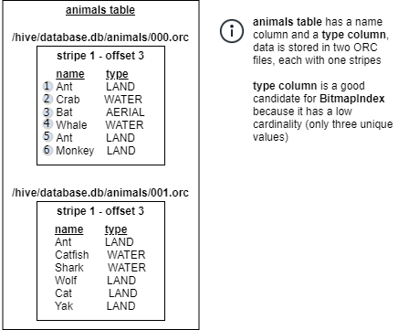
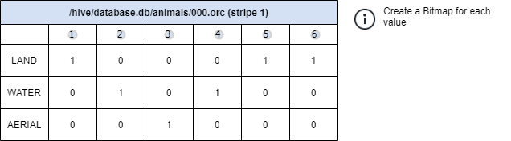
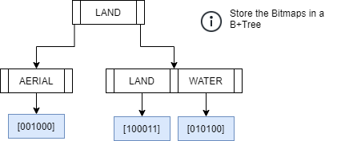

# BitmapIndex

BitmapIndex utilizes Bitmaps to allow for early row filtering which can help reduce CPU and memory usage.
This can be beneficial in high concurrency queries.

BitmapIndex works well for columns with low cardinality (i.e. not many unique values) because
the size of the index increases as the number
of unique values in the column increases. For example, a column like `gender`
will have a small size. Whereas a column like `id` will have an extremely 
large size (not recommended).

A Bitmap is constructed for each unique column value to record the row numbers where the value can be found.
A B+Tree is then used to store the mapping between the value and its Bitmap. 
By utilizing a B+Tree, BitmapIndex can support range queries with operators such as 
greater-than (`>`), less-than (`<`), `BETWEEN` and more.

**Note:** BitmapIndex can additionally benefit when ORC predicate pushdown is enabled.
This can be enabled by setting `hive.orc-predicate-pushdown-enabled=true`
in `hive.properties` or setting the session using `set session hive.orc_predicate_pushdown_enabled=true;`. 
Setting this to true will improve the performance of queries that utilize BitmapIndex.
See [Properties](../admin/properties.md) for details.

## Use case(s)

**Note: Currently, Heuristic Index only supports the Hive connector with 
tables using ORC storage format.**

BitmapIndex is used on workers for filtering rows when reading ORC files.

## Selecting column for BitmapIndex

Queries that are run in high concurrency and have a filter predicate on a column with
low cardinality (i.e. not many unique values) can benefit from BitmapIndex.

For example, a query like `SELECT * FROM employees WHERE gender='M' AND type='FULLTIME' AND salary>10000`
can benefit from having a BitmapIndex on both `gender` and `type` columns because 
data is being filtered on both columns and they both have low cardinality.  

## Supported operators

    =       Equality
    >       Greater than
    >=      Greater than or equal
    <       Less than
    <=      Less than or equal
    BETWEEN Between range
    IN      IN set

## Supported column types
    "integer", "smallint", "bigint", "tinyint", "varchar", "char", "boolean", "double", "real", "date", "decimal"

**Note:** Index cannot be created on unsupported data types.

## Examples

**Creating index:**
```sql
create index idx using bitmap on hive.hindex.users (gender);
create index idx using bitmap on hive.hindex.users (gender) where regionkey=1;
create index idx using bitmap on hive.hindex.users (gender) where regionkey in (3, 1);
```

* assuming users table is partitioned on `regionkey`

**Using index:**
```sql
select * from hive.hindex.users where gender="female"
select * from hive.hindex.users where age>20
select * from hive.hindex.users where age<25
select * from hive.hindex.users where age>=21
select * from hive.hindex.users where age<=24
select * from hive.hindex.users where age between 20 AND 25
select * from hive.hindex.users where age in (22, 23)
```

## How BitmapIndex is created

1. BitmapIndex is created for each Stripe in an ORC file and allows us to know which rows contain a value.
2. Data is inserted as an ordered list, the order in which the data appears in the Stripe.
   For the example below, data for `/hive/database.db/animals/000.orc stripe 1` would be inserted as follows:  
   `["Ant", "Crab", "Bat", "Whale", "Ant", "Monkey"]`  
   Additional information such as last modified time is stored as metadata to ensure a stale index is not used.
3. When data insertion is finished, a Bitmap is created for each unique value. This is a compact way of tracking which rows the value is present in. (see Table)
4. Once Bitmaps are created for the unique values. The value and the corresponding Bitmap is compressed and stored in a B+Tree to allow for quick lookup in `O(log(n))`.







## How BitmapIndex is used for Row Filtering

For filter queries like `SELECT * FROM animals WHERE type=LAND` normally all data needs to be read into memory and filtering will be applied to only return rows matching the predicate.

For example, for `/hive/database.db/animals/000.orc stripe 1` the following data will be read into memory:
```
Ant, LAND  
Crab, WATER  
Bat, AERIAL  
Whale, WATER  
Ant, LAND  
Monkey, LAND  
```
Then, filtering would be applied to remove rows not matching the predicate:
```
Ant, LAND  
Ant, LAND  
Monkey, LAND  
```
By using the BitmapIndex, we can improve this process.
Instead of reading all the rows in the Stripe.
BitmapIndex can return a list of matching rows which should be read.
This can reduce both memory consumption and improve query execution time.

If we create a BitmapIndex on the `type` column, before data is read from the Stripe,
the BitmapIndex for the Stripe will be queried for `"LAND"` and will return an iterator with values:
`[1, 5, 6]`

These correspond to the row numbers which match the value
(i.e. only these rows should be read into memory), the rest can be skipped.

For queries with multiple values like `SELECT * FROM animals WHERE type=LAND or type=AERIAL;`, BitmapIndex will perform two lookups. A union will be performed on the two Bitmaps to
get the final result
(i.e. `[001000] UNION [100011] = [101011]`), therefore the returned iterator will be `[1, 3, 5, 6]`.

## Disk usage

Bitmap index internally has a btree structure which uses disk to serialize. Therefore, sufficient space in the system's temporary directory is required for both creation and
filtering.

Check [hindex-statements](./hindex-statements.md) for how to change the temp folder path.