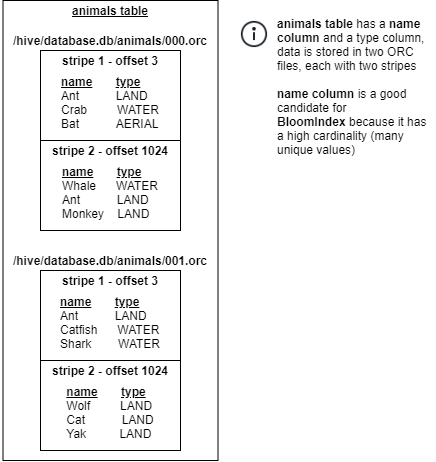

# BloomIndex

BloomIndex utilizes Bloom Filters to allow for filtering during scheduling and while reading data.

BloomIndex works well for columns with high cardinality and index size is fairly small.

A Bloom Filter is constructed using column values. Then during lookup, the Bloom Filter can tell us if a given value is not in the Bloom Filter.

BloomIndex can only support equality expression, e.g. `name='Monkey'`.

## Use case(s)

**Note: Currently, Heuristic Index is only supports the Hive connector with 
tables using ORC storage format.**

1. BloomIndex is used on coordinator for filtering splits during scheduling
2. BloomIndex is used on workers for filtering Stripes when reading ORC files

## Selecting column for BloomIndex

Queries that have a filter predicate on a column with
high cardinality (i.e. many unique values) can benefit from BloomIndex.

For example, a query like `SELECT name FROM users WHERE phone=123456789`
can benefit from having a BloomIndex on the `phone` column because 
data is being filtered on the column and `phone` column has a high cardinality.  

## Supported operators

    =       Equality

## Supported column types
    "integer", "smallint", "bigint", "tinyint", "varchar", "char", "boolean", "double", "real", "date", "decimal"

**Note:** Index cannot be created on unsupported data types.

## Configurations

### `bloom.fpp`
 
> -   **Type:** `Double`
> -   **Default value:** `0.001`
> 
> Changes the FPP (false positive probability) value of the Bloom filter.
> Making this value smaller will increase the effectiveness of the index but
> will also increase the index size. The default value should be sufficient
> in most usecases. If the index is too large, this value can be increased
> e.g. 0.05.

### `bloom.mmapEnabled`

> -   **Type:** `Boolean`
> -   **Default value:** `true`
>
> Control if Memory-Mapped File (mmap) should be used while reading the Bloom Index.
> Enabling this value will cache the Bloom Index to local disk instead of in-memory during reading. 
> This will reduce memory consumption but will result in slightly lower performance.


## Examples

**Creating index:**
```sql
create index idx using bloom on hive.hindex.users (id);
create index idx using bloom on hive.hindex.users (id) where regionkey=1;
create index idx using bloom on hive.hindex.users (id) where regionkey in (3, 1);
create index idx using bloom on hive.hindex.users (id) WITH ("bloom.fpp" = '0.001');
create index idx using bloom on hive.hindex.users (id) WITH ("bloom.mmapEnabled" = false);
```

* assuming users table is partitioned on `regionkey`

**Using index:**
```sql
select name from hive.hindex.users where id=123
```

## How BloomIndex is created

1. BloomIndex is created for each Stripe and allows us to know if the Stripe does not contain a given value.
2. Data is inserted as a list, the order is not important and duplicates are acceptable.
   For the example below, data for `/hive/database.db/animals/000.orc stripe 1` would be inserted as follows:  
   `["Ant", "Crab", "Bat", "Whale", "Ant", "Monkey"]`  
   Additional information such as last modified time is stored as metadata to ensure a stale index is not used.
3. When data insertion is finished, the BloomIndex can be serialized into the index store.




## How BloomIndex is used for Split Filtering

When OLK engine needs to read data it schedules Splits.
Each Split is responsible for reading a portion of the data.
For example, when reading a Hive table with ORC data format,
each Split will be responsible for reading a portion of the ORC file between the specified offsets.

E.g. `/hive/database.db/animals/000.orc`, starting offset `0`, ending offset `2000`.

For simplicity, we can assume each Split corresponds to a Stripe.

For a point query like `SELECT * FROM animals WHERE name='Monkey';`
all data would normally need to be read and filtering will be applied to only return rows matching the predicate.
In the example, all four Stripes will be read although only one of them contains the value.

By using the BloomIndex, only Stripes matching the predicate can be scheduled, therefore reducing the data that is read. This can significantly reduce the query execution time.

In this example, a lookup operation is performed on the BloomIndex for `Monkey`, which returns true for only the first Stripe.

Additionally, the last modified time is stored as part of the metadata and can be used to ensure that the index is still valid. If the original ORC file had been modified since the
index was created, then the index is invalid and should not be used for filtering.

## Disk Usage

This formula gives a rough estimate on how much disk will be used by Bloom index. A smaller fpp and a larger table will result in a bigger index:

size of index = -log(fpp) * size of table * C

The factor C approximately 0.04, but varies depending on the column's weight in the table. Therefore, the index for a 100GB dataset will be around 12GB when fpp is set to 0.001,
and 16Gb when fpp is set to 0.0001.

Check [hindex-statements](./hindex-statements.md) for how to change the temp folder path.