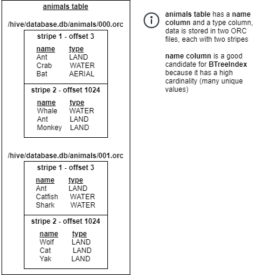
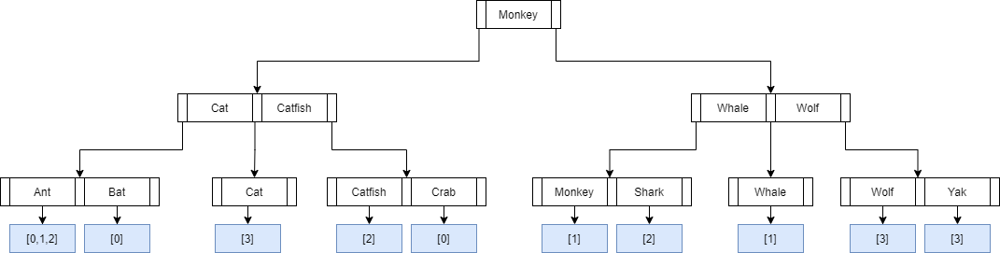

# BTreeIndex

BTreeIndex utilizes the B+Tree data structure to allow for filtering during scheduling.

BTreeIndex is similar to BloomIndex and works well for columns with high cardinality.
However, index size is can be large because the size of the index increases as the number
of unique values in the column increases.

A B+Tree is constructed using the unique column values as keys and the values are where the column value can be found.
In order to reduce the index size, a dictionary is created for the values so large duplicate entries do not need to be stored multiple times.

Unlike BloomIndex, BTreeIndex can also support range queries with operators such as 
greater-than (`>`), less-than (`<`), `BETWEEN` and more.

## Use case(s)

**Note: Currently, Heuristic Index is only supports the Hive connector with 
tables using ORC storage format.**

BTreeIndex is used on a coordinator for filtering splits during scheduling.

## Selecting column for BTreeIndex

Queries that have a filter predicate on a column with
high cardinality (i.e. many unique values) can benefit from BTreeIndex.

For example, a query like `SELECT name FROM users WHERE phone>123456789`
can benefit from having a BTreeIndex on the `phone` column because 
data is being filtered on the column and `phone` column has a high cardinality.  

When selecting between BTreeIndex and BloomIndex, the following should be considered:
- BloomIndex only supports `=`, whereas BTreeIndex supports range queries
- BloomIndex is probabilistic, whereas BTreeIndex is deterministic. This means BTreeIndex will perform better filtering.
- BTreeIndex size will be much larger than BloomIndex

## Supported operators

    =       Equality
    >       Greater than
    >=      Greater than or equal
    <       Less than
    <=      Less than or equal
    BETWEEN Between range
    IN      IN set

## Supported column types
    "integer", "smallint", "bigint", "tinyint", "varchar", "double", "real", "date", "decimal"

**Note:** Index cannot be created on unsupported data types.

## Examples

**Creating index:**

```sql
create index idx using btree on hive.hindex.orders (orderid);
create index idx using btree on hive.hindex.orders (orderid) where orderDate='01-10-2020';
create index idx using btree on hive.hindex.orders (orderid) where orderDate in ('01-10-2020', '01-10-2020');
```

* assuming orders table is partitioned on `orderDate`

**Using index:**
```sql
select * from hive.hindex.orders where orderid=12345
select * from hive.hindex.orders where orderid>12345
select * from hive.hindex.orders where orderid<12345
select * from hive.hindex.orders where orderid>=12345
select * from hive.hindex.orders where orderid<=12345
select * from hive.hindex.orders where orderid between 10000 AND 20000
select * from hive.hindex.orders where orderid in (12345, 7890)
```

## How BTreeIndex is created

1. BTreeIndex is created at the Table level (or Partition level if table is partitioned).
2. Data is inserted as `<Key,Value>` pairs. The `Keys` are the column values and the `Values` are the Stripes containing the column value.
   For the example below, data would be inserted as follows:  
   ```
   <"Ant", "/hive/database.db/animals/000.orc+3+1023+12345">  
   <"Ant", "/hive/database.db/animals/000.orc+1024+2044+12345">  
   <"Ant", "/hive/database.db/animals/001.orc+3+1023+12348">  
   <"Crab", "/hive/database.db/animals/000.orc+3+1023+12345">
   ...
   ```
   Additional information about the stripe is included in the Value to help with filtering and to ensure a stale index is not used.
3. Since storing the long value `"/hive/database.db/animals/000.orc+3+1023+12345"` multiple times would take up too much space, a dictionary is used. This dictionary maps the values to an integer. Instead of storing the long string value, the integer is stored in the B+Tree.
4. As more data is inserted, the B+Tree is reblanced to ensure the height of the tree doesn't grow too much and lookup remains `O(log(n))`.





## How BTreeIndex is used for Split Filtering

When OLK engine needs to read data it schedules Splits. Each Split is responsible for reading a portion of the data.
For example, when reading a Hive table with ORC data format, each Split will be responsible for reading a portion of the ORC file between the specified offsets.  

E.g. `/hive/database.db/animals/000.orc`, starting offset `0`, ending offset `2000`.

For a point query like `SELECT * FROM animals WHERE name=Ant;`
all data would normally need to be read and filtering will be applied to only return rows matching the predicate.

By using the BTreeIndex, only Splits matching the predicate can be scheduled, therefore reducing the data that is read.
This can significantly reduce the query execution time.

In this example, a lookup operation is performed on the BTreeIndex for `Ant`, which returns an iterator with values:
```
"/hive/database.db/animals/000.orc+3+1023+12345"
"/hive/database.db/animals/000.orc+1024+2044+12345"
"/hive/database.db/animals/001.orc+3+1023+12348"
```

The file name and offsets can be used to filter out Splits which do not match the predicate.

Additionally, the last modified time can be used to ensure that the index is still valid. If the original ORC file had been modified since the index was created, then the index is
invalid and should not be used for filtering.

## Disk usage

BTree index uses disk to serialize its internal tree structure. Therefore, sufficient space in the system's temporary directory is required for both creation and filtering.

For a big table/column, the size of BTree index could be very big (up to the same size as the column in the dataset).

Check [hindex-statements](./hindex-statements.md) for how to change the temp folder path.
