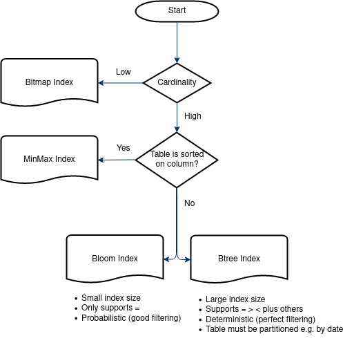

# openLooKeng Heuristic Index

## Introduction

Indexes can be created using one or more columns of a database table, providing faster random lookups. Most Big Data formats such as ORC, Parquet and CarbonData already have indices embedded in them.

The Heuristic Indexer allows creating indexes on existing data but stores the index external to the original data source. This provides several benefits:

  - The index is agnostic to the underlying data source and can be used by any query engine
  - Existing data can be indexed without having to rewrite the existing data files
  - New index types not supported by the underlying data source can be created
  - Index data does not use the storage space of the data source

## Use case(s)

**Note: Currently, Heuristic Index only supports the Hive connector with 
tables using ORC storage format.**

1. BloomIndex, MinMaxIndex and BtreeIndex can be used on a coordinator for filtering splits during scheduling
2. When reading ORC files, to filter Stripes, MinMaxIndex and BloomIndex can be used on workers
2. BitmapIndex can used on workers for filtering rows when reading ORC files

### 1. Filtering scheduled Splits during query execution

*Index types supported: BloomIndex, BtreeIndex, MinMaxIndex*

When the engine needs to read data from a data source it schedules Splits. 
However, not all Splits will return data if a predicate is applied.

For example: `select * from test_base where j1='070299439'`

By keeping an external index for the predicate column, the Heuristic Indexer can determine whether each split contains the values being searched for and only schedule the read operation for the splits which possibly contain the value.


### 2. Filtering Stripes when reading ORC files

*Index types supported: BloomIndex, MinMaxIndex*

Similar to Split filtering above, when using the Hive connector to read ORC tables,
Stripes can be filtered out based on the specified predicate. This reduces the amount
of data read and improves query performance.

### 3. Filtering rows when reading ORC files

*Index types supported: BitmapIndex*

Going one level lower, once the rows are read, they must be filtered if a predicate is present. 
This involves reading rows and then using the Filter operator to discard
rows that do not match the predicate.

By creating a BitmapIndex for the predicate column, the Heuristic Indexer will only read 
rows which match the predicate, before the Filter operator is even applied. This can reduce
memory and cpu usage and result in improved query performance, especially at higher concurrency.


## Getting started

This section gives a short tutorial which introduces the basic usage of Heuristic Index through a sample query.

### 1. Configurations

Heuristic Index requires several components to be configured before it can work.
Ensure all nodes in the cluster are configured the same way, i.e. using the same
Hetu Filesystem, Metastore, etc. 

#### a. Hetu Metastore

Heuristic Index uses Hetu Metastore to manage its metadata. Hetu Metastore is a shared metadata management
utility used by multiple openLooKeng features. For more information about how to configure it,
please check [Hetu Metastore](../admin/meta-store.md).

**Note**: Global cache must be enabled! Heuristic Index won't work if Hetu Metastore is not properly configured.

Here is a reference `etc/hetu-metastore.properties`:

  ```properties
  hetu.metastore.type=hetufilesystem
  hetu.metastore.hetufilesystem.profile-name=hdfs
  # this path is inside hdfs
  hetu.metastore.hetufilesystem.path=/tmp/hetu/metastore
  # make sure to use global cache!
  hetu.metastore.cache.type=global
  ```

  *Path whitelist：`["/tmp", "/opt/hetu", "/opt/openlookeng", "/etc/hetu", "/etc/openlookeng", current workspace]`*

#### b. Hetu Statestore

As mentioned in the Hetu Metastore setup, the global cache must be enabled, this requires the Hetu Statestore
to be configured. For more information about how to configure it, please check [Hetu Statestore](../admin/state-store.md).

In `etc/config.propertes`:

  ```properties
  hetu.embedded-state-store.enabled=true
  ```

Here is a reference `etc/state-store.properties`:

  ```properties
  state-store.type=hazelcast
  state-store.name=test
  state-store.cluster=test-cluster
  hazelcast.discovery.mode=tcp-ip
  hazelcast.discovery.port=7980
  # The ip address and hazelcast discovery ports of each server must be included here
  hazelcast.discovery.tcp-ip.seeds=host1:7980,host2:7980
  ```

#### c. Hetu Filesystem

Hetu Filesystem is used for storing the index, and in the above example, it was also used
for the the Hetu Metastore. `HDFS` filesystem type must be used in order for
the index to be accessible by all nodes in the cluster. 
For more information about how to configure it, please check [Hetu Filesystem](../develop/filesystem.md).

Here is a reference `etc/filesystem/hdfs.properties`:

  ```properties
  fs.client.type=hdfs
  # Path to hdfs resource files (e.g. core-site.xml, hdfs-site.xml) on your local machine
  hdfs.config.resources=/tmp/hetu/hdfs-site.xml,/tmp/hetu/core-site.xml
  hdfs.authentication.type=NONE
  fs.hdfs.impl.disable.cache=true
  ```

  *Path whitelist：`["/tmp", "/opt/hetu", "/opt/openlookeng", "/etc/hetu", "/etc/openlookeng", current workspace]`*

#### d. Heuristic Index

Finally, once all the prerequisites are configured, the Heuristic Index can be enabled.

In `etc/config.properties`, add these lines:

  ```properties
  hetu.heuristicindex.filter.enabled=true
  hetu.heuristicindex.indexstore.filesystem.profile=hdfs
  # this path is inside hdfs
  hetu.heuristicindex.indexstore.uri=/tmp/hetu/indexstore
  ```

  *Path whitelist：`["/tmp", "/opt/hetu", "/opt/openlookeng", "/etc/hetu", "/etc/openlookeng", current workspace]`*

For a complete list of Heuristic Index configurations see [Configuration Properties](#configuration-properties) below
and [Properties](../admin/properties.md).

Heuristic Index can be disabled while the engine is running by setting: `set session heuristicindex_filter_enabled=false;`.

With Heuristic Index configured, start the engine.

### 2. Identify a column to create index on

For a query like:

    SELECT * FROM hive.schema.table1 WHERE id="abcd1234";

Where `id` is unique, a Bloom Index on can significantly decrease the splits to read 
when scanning table1. 

### 3. Create index

To create index run the following statement:

    CREATE INDEX index_name USING bloom ON table1 (id);

### 4. Run query

After index is created, it will autoload into coordinator cache.
Future queries will utilize the index to reduce the amount of data read
and query performance will be improved.

    # running the same query again should now result in fewer splits and improved performance
    SELECT * FROM hive.schema.table1 WHERE id="abcd1234";

## Configuration Properties

| Property Name                                      | Default Value       | Required| Description|
|----------------------------------------------------|---------------------|---------|--------------|
| hetu.heuristicindex.filter.enabled                 | false               | No      | Enables heuristic index|
| hetu.heuristicindex.filter.cache.max-memory        | 10GB                | No      | Caching size of index files|
| hetu.heuristicindex.filter.cache.soft-reference    | true                | No      | Enabling this property allows the GC to remove entries from the cache if memory is running low|
| hetu.heuristicindex.filter.cache.ttl               | 24h                 | No      | The time period after which index cache expires|
| hetu.heuristicindex.filter.cache.load-threads      | 10                  | No      | The number of threads used to load indices in parallel|
| hetu.heuristicindex.filter.cache.loading-delay     | 10s                 | No      | The delay to wait before async loading task starts to load index cache from indexstore|
| hetu.heuristicindex.indexstore.uri                 | /opt/hetu/indices/  | No      | Directory under which all index files are stored|
| hetu.heuristicindex.indexstore.filesystem.profile  | local-config-default| No      | This property defines the filesystem profile used to read and write index|
| hetu.heuristicindex.filter.cache.autoload-default  | true                | No      | The default value for autoloading indices on the coordinator. To change the value for a specific index, set by WITH ("autoload" = true/false) in the create index statement|

**More details on `hetu.heuristicindex.filter.cache.autoload-default`:**

Autoloading only effects indexes used on the coordinator, e.g. MinMax, Bloom and BTree Index.
Indexes used on the workers, e.g. Bitmap Index, will be loaded on-demand as queries
are executed. 

It is recommended to keep autoload enabled.

When the autoload setting is enabled, the index will be loaded into the coordinator
cache after creation (with a delay of ~5 seconds).
As the index is loaded into the coordinator cache, it will be utilized when user 
runs queries that can benefit from the index.

For example:

    CREATE INDEX idx USING bloom ON table1 (id);
    # after creation, index will autoload into coordinator cache

    # running this query will utilize the index
    SELECT * FROM hive.schema.table1 WHERE id="abcd1234";

When the autoload setting is disabled, the index will not be loaded into the coordinator
cache automatically after creation.
Instead, it will be loaded on-demand as the user runs queries that can benefit from the index.
Future queries will then utilize the index.

For example:

    CREATE INDEX idx USING bloom ON table1 (id) WITH ("autoload" = false);
    # after creation, index will NOT autoload into coordinator cache
    
    # running the query once will trigger the index loading
    SELECT * FROM hive.schema.table1 WHERE id="abcd1234";
    # index will now begin to load in the background
    
    # running the same query will now utilize the index
    SELECT * FROM hive.schema.table1 WHERE id="abcd1234";

## Index Statements

See [Heuristic Index Statements](./hindex-statements.md).

-----

## Supported Index Types

| Index ID | Filtering type  | Best Column type                           | Supported query operators             | Example                                                                                                                                                                                                           |
|----------|-----------------|--------------------------------------------|---------------------------------------|-------------------------------------------------------------------------------------------------------------------------------------------------------------------------------------------------------------------|
| [Bloom](./bloom.md)    | Split<br>Stripe | High cardinality<br>(such as an ID column) | `=` `IN`                                  | `create index idx using bloom on hive.hindex.users (id);`<br>`select name from hive.hindex.users where id=123`                                                                                                    |
| [Btree](./btree.md)    | Split           | High cardinality<br>(such as an ID column) | `=` `>` `>=` `<` `<=` `IN` `BETWEEN` | `create index idx using btree on hive.hindex.users (id) where regionkey IN (1,4)`<br>`select name from hive.hindex.users where id>123` |
| [MinMax](./minmax.md)   | Split<br>Stripe | Column which table is sorted on            | `=` `>` `>=` `<` `<=` | `create index idx using bloom on hive.hindex.users (age);`<br>(assuming users is sorted by age)<br>`select name from hive.hindex.users where age>25`                                                              |
| [Bitmap](./bitmap.md)   | Row             | Low cardinality<br>(such as Gender column) | `=` `>` `>=` `<` `<=` `IN` `BETWEEN` | `create index idx using bitmap on hive.hindex.users (gender);`<br>`select name from hive.hindex.users where gender='female'`                                                                                      |

**Notes:**  
· Unsupported operators will still function correctly but will not benefit from the index.  
· Additional data types are not supported if not listed by the individual index types.

## Choosing Index Type

The Heuristic Indexer helps with queries where data is being filtered by a predicate.
Identify the column on which data is being filtered and use the decision flowchart to
help decide what type of index will work best.

Cardinality means the number of distinct values in the column relative to
number of total rows. For example, an `ID` column has a high cardinality
because IDs are unique. Whereas `employeeType` will have low cardinality
because there are likely only a few different types (e.g. Manager, Developer,
Tester).

Disk usage and creation speed might also be the factors to be taken into consideration when choosing the best index.
BTree index uses significantly more space and more time when creating, compared to other split filtering indices, such
as Bloom and Minmax.



Example queries:

1. `SELECT id FROM employees WHERE site = 'lab';`

    In this query `site` has a low cardinality (i.e. not many sites) so **BitmapIndex** will help.

2. `SELECT * FROM visited WHERE id = '34857' AND date < '2020-01-01';`

    In this query `id` has a high cardinality (i.e. IDs are likely unique).
    **BloomIndex** or **BtreeIndex** will help.
    
3. `SELECT * FROM salaries WHERE salary > 50251.40;`

    In this query `salary` has a high cardinality (i.e. salary of employees
    will slightly vary) and assuming `salaries` table is sorted on `salary`, 
    **MinMaxIndex** will help.

4. `SELECT * FROM assets WHERE id = 50;`

    In this query `id` has a high cardinality (i.e. IDs are likely unique).
   **BloomIndex** or **BtreeIndex** will help.

5. `SELECT * FROM phoneRecords WHERE phone='1234567890' and type = 'outgoing' and date > '2020-01-01';`

    In this query `phone` has a high cardinality (i.e. there are many phone numbers, even if they
    made multiple calls), `type` has low cardinality (only outgoing or incoming),
    and the data is partitioned on date. Creating a **BloomIndex** or **BtreeIndex** on `phone`
    and a **BitmapIndex** on `type` will help.

## Adding your own Index Type

See [Adding your own Index Type](./new-index.md).

## Access Control

See [Built-in System Access Control](../security/built-in-system-access-control.md).

## Troubleshooting

### When index creation gets stuck and lasts too long (Usually happens on low-performance machines, e.g. dev laptop, k8s env with few cores)

The machine might not have enough threads to complete the task. Try reducing the task concurrency by setting 
the session property: `set session task_concurrency=X;`, where X is recommended to be less than or equal to the CPU
cores/threads. For example, if the CPU has 8 threads, 8 can be set.
