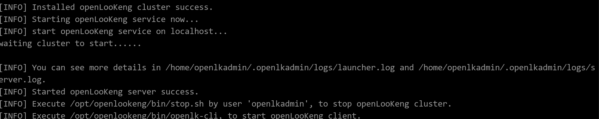
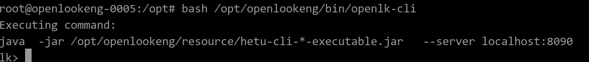
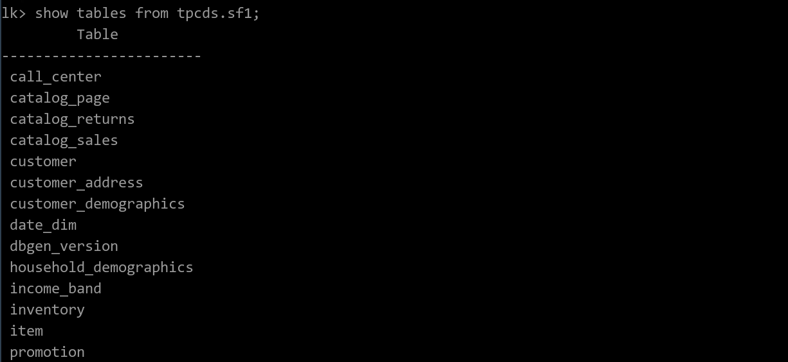

# Get Started

This document provides guidance for users to quickly deploy and start the openLooKeng service on the local host. For details about the installation requirements and deployment mode, see [Installation](../installation/_index.md).

A demo environment is also available. <a href = "https://tryme.openlookeng.io/" target = "_blank"><font size = 5><strong>Try now</strong></font></a>.

## Preparing the Environment

* Select Linux as the operating system.
* Memory > 4 GB
* Machines are connected to the Internet
* The port number 8090 is not occupied.


## One-Click Deployment

Run the following command to start the installation and deployment:

```shell
wget -O - https://download.openlookeng.io/install.sh|bash
```

This command is used to download the installation script from the openLooKeng official website and start the script. During the script running, the latest installation package and dependent components are automatically downloaded from the openLooKeng official website. After the download is complete, the deployment automatically starts. No extra operation is required.

If the following log is displayed, openLooKeng is successfully deployed.




After successful deployment, you can learn the following information to better use the openLooKeng service.

- By default, the following built-in data sources are configured for openLooKeng for one-click deployment:

  - [tpcds](../connector/tpcds.md)
  - [tpch](../connector/tpch.md)
  - [memory](../connector/memory.md)

- The installation path of openLooKeng is `/opt/openlookeng`. You can find the configuration file of openLooKeng here. For more information about configuration files and configuration items, see [Here](../installation/deployment.md).

- The new user `openlkadmin` will be created to perform operations related to openLooKeng, including starting/stopping the openLooKeng service and expanding/reducing the cluster scale.

- One-click deployment also provides scripts for common management commands. You can find `/opt/openlookeng/bin` here.

- openLooKeng run logs are stored in `/home/openlkadmin/.openlkadmin/logs`.

- One-click deployment also provides [CLI](../installation/cli.md) for connecting to the openLooKeng service.


## Using openLooKeng

Users can use the command line tool (cli) to connect to the openLooKeng service for data search and analysis. Run the following command to start the CLI:

```shell
bash /opt/openlookeng/bin/openlk-cli
```




Users can enter standard SQL in the CLI to interact with the openLooKeng server.

For example, to view the configured [catalog](../overview/concepts.md#catalog), run the following command:

```sql
show catalogs;
```


Run the following command to check the [schema](../overview/concepts.md#schema) contained in the tpcds:

```sql
show schemas from tpcds;
Schema
--------------------
information_schema
sf1
sf10
sf100
sf1000
sf10000
sf100000
sf300
sf3000
sf30000
tiny
(11 rows)
```

tpcds divides schemas based on the data size. A larger value of sf indicates a larger data volume. Each schema contains the same table.

Check the data tables in sf1.

```sql
show tables from tpcds.sf1;
```




You can select a table to search for data.

```sql
select c_customer_id, c_first_name, c_last_name from tpcds.sf1.customer limit 10;
```


Or run more complex multi-table joint query:

```sql
SELECT
"sr_customer_sk" "ctr_customer_sk"
, "sr_store_sk" "ctr_store_sk"
, "sum"("sr_return_amt") "ctr_total_return"
FROM
store_returns
, date_dim
WHERE ("sr_returned_date_sk" = "d_date_sk")
AND ("d_year" = 2000)
GROUP BY "sr_customer_sk", "sr_store_sk"
```


You can read the [openLooKeng syntax document](../sql/_index.md) to learn more syntax rules.

For more features and features of openLooKeng, please refer to the [User Guide](../overview/_index.md).


