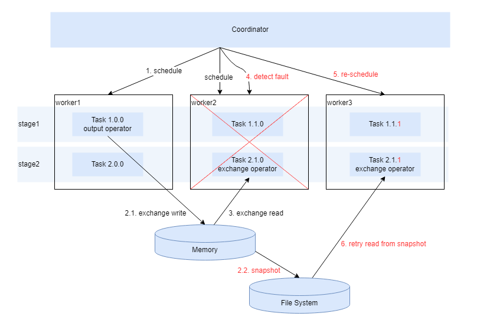

# Task级别快照

## 概要

Task快照是另一种可靠查询机制，它是query重试查询和Operator快照重试的折中机制。与query重试查询相比，在发生故障后，通过Task快照进行Task粒度重试恢复，而不是整个query重新执行，效率更高。与Operator快照相比，Task粒度的快照空间占用更小，性能也更好。

默认情况下，查询失败后需要手动重试查询。openLooKeng中通过Task级别快照进行自动恢复来确保可靠的查询执行。Task级别快照启用后，查询过程中task之间的交换数据通过快照进行物化，当查询过程中Coordinator检测到worker发生故障或者task失败时，Coordinator调度空闲Worker读取故障worker最近保存的Task快照，然后自动恢复查询执行，这样可以保证查询的可靠性。对于耗时长的查询，将给用户更加确切的执行结果，更适合批处理场景。

## 启用Task级别快照

Task级别快照自动恢复机制，对于需要长时间运行的复杂查询最有效果。默认情况下处于禁用状态，可通过配置文件`etc/config.properties`中的配置属性`retry-policy`进行启用。
- **启动**：`retry-policy=TASK`
- **停用**：`retry-policy=NONE`

## 运行要求

为了确保查询执行通过Task快照能够自动恢复，保证查询执行的可靠性，集群需要满足以下要求：
- 启用Task级别快照特性
- 集群至少包含2个工作节点
- 除故障节点外，其他工作节点处于健康状态

## 限制

- **支持的语句**：仅支持`SELECT`，`INSERT`和`CREATE TABLE AS SELECT（CTAS）`类型的语句，不包括类似`INSERT INTO CUBE`的语句。
- **数据源**：只能从`Hive`目录中的数据表读取。
- **目标表**：只能写入`Hive`目标中的表，格式为`ORC`。
- **特性互斥说明**：Task快照功能和Operator快照功能不支持同时启用。

## 重试策略

当Coordinator和Worker之间的通信失败或超时，以及task执行失败时，将触发重试查询。相关故障重试的配置如下：
- 属性：`task-retry-attempts-per-task`
  - 默认值：4
  - 描述：重试返回失败前，单个Task允许的最大重试次数。
- 属性：`task-initial-delay`
  - 默认值：10s
  - 描述：Task在重试之前必须等待的最短时间。
- 属性：`task-max-delay`
  - 默认值：1m
  - 描述：Task在重试之前必须等待的最长时间。

## Task快照的存储方式

查询过程中Task间的交换数据和状态，以Task快照的形式物化到文件系统中，其中文件系统支持两种类型：`local`和`hdfs`。当发生故障时，查询过程中Coordinator调度其他空闲的Worker节点从文件系统中的指定目录读取Task快照，进行数据再次加载和重试。因此，所有Worker节点都必须能够共享访问存储Task快照的文件系统，这样才可以进行正常的恢复。交换管理器通过配置文件`etc/exchange-manager.properties`进行共享文件系统的配置。相关属性如下：
- 属性：`exchange-manager.name`
  - 描述：配置交换管理器的名称。
- 属性：`exchange-filesystem-type`
  - 描述：存储Task快照的文件系统客户端名称。如果`exchange-filesystem-type=exchange`，名称为exchange客户端将用于存储查询执行产生的Task快照。文件系统客户端的配置文件路径`etc/filesystem/exchange.properties`（properties文件名需要和exchange-filesystem-type保持一致），参见[交换文件系统客户端配置](<../properties.md#交换文件系统客户端配置>)。
- 属性：`exchange.base-directories`
  - 描述：文件系统的根目录，存储Task快照的起始文件路径。所有Worker节点都必须具备共享访问的权限。
- 属性：`exchange.compression-enabled`
  - 描述：该属性启停Task快照的压缩功能。

请注意，Task快照用于保存Worker节点查询执行过程中，各Task之间的交换数据和状态。查询执行前确保集群有足够的空闲空间存储这些Task快照，查询完成后会自动清理来释放存储空间。

## 性能开销

从错误和Task快照中恢复需要成本。捕获快照需要时间，时间长短取决于复杂性。因此，需要在性能和可靠性之间进行权衡。

建议在必要时打开Task快照机制，例如对于长时间运行的查询。对于这些类型的工作负载，拍摄快照的开销可以忽略不计。

## 配置
Task快照可靠查询机制的详细配置，请参见[属性参考](<../properties.md#查询故障容错配置>)。
