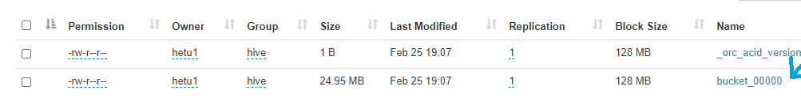

# Hive连接器

## 概述

Hive连接器支持查询存储在Hive数据仓库中的数据。Hive由三个部分组成：

- 存储在HDFS或Amazon S3中的不同格式的数据文件。
- 有关数据文件如何映射到模式和表的元数据。该元数据存储在MySQL等数据库中，通过Hive元存储服务访问。
- 一种称为HiveQL的查询语言。这种查询语言在分布式计算框架（如MapReduce或Tez）上执行。

openLooKeng只使用前两个部分：数据和元数据。不使用HiveQL或Hive的任何部分执行环境。

## 支持的文件类型

Hive连接器支持以下文件类型：

- ORC
- Parquet
- Avro
- RCFile
- SequenceFile
- JSON
- 文本

为了在使用Hive 3.x时能够对Avro表和CSV文件实现一级支持，需要在Hive元存储配置文件`hive-site.xml`中添加如下属性定义：

```xml
<property>
     <!-- https://community.hortonworks.com/content/supportkb/247055/errorjavalangunsupportedoperationexception-storage.html -->
     <name>metastore.storage.schema.reader.impl</name>
     <value>org.apache.hadoop.hive.metastore.SerDeStorageSchemaReader</value>
 </property>
```

## 配置

Hive连接器支持Apache Hadoop 2.x及其衍生发行版，包括Cloudera CDH 5和Hortonworks Data Platform (HDP)。

用以下内容创建`etc/catalog/hive.properties`，以将`hive-hadoop2`连接器挂载为`hive`目录，将`example.net:9083`替换为Hive元存储Thrift服务的正确主机和端口：

```properties
connector.name=hive-hadoop2
hive.metastore.uri=thrift://example.net:9083
```

### 多Hive集群

可以根据需要创建任意多的目录，因此，如果有额外的Hive集群，只需添加另一个不同的名称的属性文件到`etc/catalog`中（确保它以`.properties`结尾）。例如，如果将属性文件命名为`sales.properties`，openLooKeng将使用配置的连接器创建一个名为`sales`的目录。

### HDFS配置

对于基本设置，openLooKeng自动配置HDFS客户端，不需要任何配置文件。在某些情况下，例如使用联邦HDFS或NameNode高可用性时，需要指定额外的HDFS客户端选项，以便访问HDFS集群。要指定选项，添加`hive.config.resources`属性来引用HDFS配置文件：

```properties
hive.config.resources=/etc/hadoop/conf/core-site.xml,/etc/hadoop/conf/hdfs-site.xml
```

如果设置需要，只指定附加的配置文件。同时建议减少配置文件，使其具有所需的最小属性集，因为附加属性可能导致问题。

所有openLooKeng节点上必须存在配置文件。如果你正在引用现有的Hadoop配置文件，请确保将其复制到任何没有运行Hadoop的openLooKeng节点。

### HDFS用户名和权限

在openLooKeng中对Hive表执行任何`CREATE TABLE`或`CREATE TABLE AS`语句之前，需要确保openLooKeng访问HDFS的用户能够访问Hive的仓库目录。Hive的仓库目录由`hive-site.xml`中的配置变量`hive.metastore.warehouse.dir`指定，默认值为`/user/hive/warehouse`。

在不使用带HDFS的Kerberos时，openLooKeng会使用openLooKeng进程的操作系统用户来访问HDFS。例如，如果openLooKeng作为`nobody`运行，则openLooKeng将作为`nobody`访问HDFS。可以通过在openLooKeng [JVM配置](../installation/deployment.md#jvm配置)中设置`HADOOP_USER_NAME`系统属性来覆盖此用户名，用适当的用户名替换`hdfs_user`：

```properties
-DHADOOP_USER_NAME=hdfs_user
```

`hive`用户通常可行，因为Hive通常随`hive`用户启动，并且该用户可以访问Hive仓库。

无论何时修改openLooKeng访问HDFS的用户时，请移除HDFS上的`/tmp/openlookeng-*`，`/tmp/presto-*`，`/tmp/hetu-*`，因为新用户可能无法访问现有的临时目录。

### 访问Kerberos身份验证保护的Hadoop集群

HDFS和Hive元存储都支持Kerberos认证。但是，目前还不支持通过票据缓存进行Kerberos身份验证。

Hive连接器安全需要的属性在[Hive配置属性](./hive.md#hive配置属性)表中列出。有关Hive连接器中安全选项的更详细讨论，请参阅[Hive安全配置](./hive-security.md)部分。

## Hive配置属性

| 属性名称| 说明| 默认值|
|----------|----------|----------|
| hive.metastore| Hive元存储类型| `thrift`|
| hive.config.resources| 以逗号分隔的可选HDFS配置文件列表。这些文件必须存在于运行openLooKeng的机器上。该属性仅在访问HDFS绝对必要的情况下指定。示例：`/etc/hdfs-site.xml`| |
| hive.recursive-directories| 允许从表或分区位置的子目录读取数据。如果禁用，子目录将被忽略。这相当于Hive中的`hive.mapred.supports.subdirectories`属性。| |
| `hive.storage-format`| 创建新表时使用的默认文件格式。| `ORC`|
| `hive.compression-codec`| 写入文件时使用的压缩编解码器。| `GZIP`|
| `hive.force-local-scheduling`| 强制将分片调度到与分片数据的Hadoop DataNode进程同一节点。  这对于openLooKeng与每个DataNode并置的安装非常有用。| `false`|
| `hive.respect-table-format`| 应该使用现有的表格式还是默认的openLooKeng格式写入新的分区？| `true`|
| `hive.immutable-partitions`| 新数据是否可以插入到现有分区中？| `false`|
| `hive.create-empty-bucket-files`| 对于没有数据的桶，是否应该创建空文件？| `false`|
| `hive.max-partitions-per-writers`| 每个写入进程最大分区数。| 100|
| `hive.max-partitions-per-scan`| 单表扫描最大分区数。| 100000|
| `hive.hdfs.authentication.type`| HDFS身份验证类型。取值为`NONE`或`KERBEROS`。| `NONE`|
| `hive.hdfs.impersonation.enabled`| 启用HDFS端用户模拟。| `false`|
| `hive.hdfs.presto.principal`| openLooKeng在连接到HDFS时将使用的Kerberos主体。| |
| `hive.hdfs.presto.keytab`| HDFS客户端keytab位置。| |
| `hive.security`| 参见[Hive安全配置](./hive-security.md)。| |
| `security.config-file`| `hive.security=file`时使用的配置文件的路径。有关详细信息，请参阅[基于文件的授权](./hive-security.md#基于文件的授权)。| |
| `hive.non-managed-table-writes-enabled`| 允许对非托管（外部）Hive表的写入。| `false`|
| `hive.non-managed-table-creates-enabled`| 允许创建非托管（外部）Hive表。| `true`|
| `hive.collect-column-statistics-on-write`| 启用写入时自动收集列级统计信息。详见[表统计信息](./hive.md#表统计信息)。| `true`|
| `hive.s3select-pushdown.enabled`| 允许向AWS S3 Select服务的查询下推。| `false`|
| `hive.s3select-pushdown.max-connections`| [S3 Select下推](#s3-select下推)同时打开到S3的最大连接数。| 500|
| `hive.orc.use-column-names`| 为了支持alter表drop列，建议在Hive属性中添加`hive.orc.use-column-names=true`，否则drop列可能无法正常工作。| false|
| `hive.orc-predicate-pushdown-enabled`| 在读取ORC文件时启用算子下推（predicates pushdown）处理。| `false`|
| `hive.orc.time-zone`                      | 为未声明时区的旧ORC文件设置默认时区。 | JVM默认值 |
| `hive.parquet.time-zone`                  | 将时间戳值调整到特定的时区。对于Hive 3.1+，该值应设置为UTC。 | JVM默认值 |
| `hive.rcfile.time-zone`                   | 将二进制编码的时间戳值调整到特定的时区。对于Hive 3.1+，该值应设置为UTC。| JVM默认值 |
| `hive.vacuum-service-threads`| 清空服务中运行的线程数。| 2|
| `hive.auto-vacuum-enabled`| 对Hive表启用自动清空功能。要在引擎侧启用自动清空，请在协调节点的config.properties中添加`auto-vacuum.enabled=true`。| `false`|
| `hive.vacuum-delta-num-threshold`| 允许不压缩的增量目录的最大数量。最小值为2。| 10|
| `hive.vacuum-delta-percent-threshold`| 允许不压缩的增量目录的最大百分比。值应在0.1到1.0之间。| 0.1|
| `hive.vacuum-cleanup-recheck-interval`| 清空清理任务重新提交的间隔。最小值为5分钟| `5 Minutes`|
| `hive.vacuum-collector-interval`| 清空回收器任务重新提交的间隔。| `5 Minutes`|
| `hive.max-splits-to-group`    | 可分组的最大拆分数。如果值为1，则不分组。最小值为1。小的拆分越多，创建的驱动越多，因此需要更多内存、调度、上下文切换，这会影响读取性能。将小拆分分组在一起可以减少拆分和创建驱动的数量，因此需要的资源较少，从而提高性能。 | 1   |
| `hive.metastore-client-service-threads` | 元存储客户端与Hive元存储通信的并行线程数。 | 4 |
| `hive.worker-metastore-cache-enabled` | 在工作节点上也开启对Hive元存储的缓存。 | `false` |
| `hive.metastore-write-batch-size` | 每个请求中发送到元存储的分区数。 | 8 |
| `hive.metastore-cache-ttl` | 表和分区元数据的元存储缓存淘汰时间。| `0s` |
| `hive.metastore-refresh-interval` | 从Hive元存储刷新表和分区元数据的元存储缓存条目的时间。 | `1s` |
| `hive.metastore-db-cache-ttl` | 数据库、角色、配置、表和视图列表对象的元存储缓存淘汰时间。 | `0s` |
| `hive.metastore-db-refresh-interval` | 从Hive元存储中刷新数据库、表列表、视图列表、角色对象的元存储缓存条目的时间。| `1s` |

## Hive Thrift 元存储配置属性说明

| 属性名称| 说明|
|:----------|:----------|
| `hive.metastore.uri`| 使用Thrift协议连接Hive元存储的URI。如果提供了多个URI，则默认使用第一个URI，其余URI为回退元存储。该属性必选。示例：`thrift://192.0.2.3:9083`或`thrift://192.0.2.3:9083,thrift://192.0.2.4:9083`|
| `hive.metastore.username`| openLooKeng用于访问Hive metastore的用户名。|
| `hive.metastore.authentication.type`| Hive元存储身份验证类型。取值为`NONE`或`KERBEROS`（默认为`NONE`）。|
| `hive.metastore.thrift.impersonation.enabled` |  启用Hive元存储用户模拟。|
| `hive.metastore.thrift.client.ssl.enabled`| 连接元存储时使用SSL。默认为`false`。当为true时，表示需要keystore或truststore其中一个。keystore/truststore的路径和密码需要在`jvm.config`中设置。密钥列表如下：`-Djavax.net.ssl.keystoreType= e.g. jks` `-Djavax.net.ssl.keyStore=` `-Djavax.net.ssl.keyStorePassword=` `-Djavax.net.ssl.trustStore=` `-Djavax.net.ssl.trustStorePassword=`|
| `hive.metastore.service.principal`| Hive元存储服务的Kerberos主体。|
| `hive.metastore.client.principal`| openLooKeng在连接到Hive元存储服务时将使用的Kerberos主体。|
| `hive.metastore.client.keytab`| Hive元存储客户端keytab位置。|
| `hive.metastore.thrift.is-role-name-case-sensitive`| 角色名是否区分大小写，默认值为false。|
| `hive.metastore.krb5.conf.path`| Kerberos配置文件位置。|

## AWS Glue目录配置属性

| 属性名称| 说明|
|:----------|:----------|
| `hive.metastore.glue.region`| Glue目录的AWS区域名称。当不在EC2中运行时，或者当目录位于不同区域时，这都是必需的。示例：`us-east-1`|
| `hive.metastore.glue.pin-client-to-current-region`| Pin Glue请求与openLooKeng运行所在的EC2实例具有相同的区域（默认为`false`）。|
| `hive.metastore.glue.max-connections`| Glue最大并发连接数（默认为`5`）。|
| `hive.metastore.glue.default-warehouse-dir`| Hive Glue元存储默认仓库目录|
| `hive.metastore.glue.aws-access-key`| 要用于连接到Glue目录的AWS访问密钥。如果同时指定`hive.metastore.glue.aws-secret-key`，则该参数优先于`hive.metastore.glue.iam-role`生效。|
| `hive.metastore.glue.aws-secret-key`| 要用于连接到Glue目录的AWS密钥。如果同时指定`hive.metastore.glue.aws-access-key`，则该参数优先于`hive.metastore.glue.iam-role`生效。|
| `hive.metastore.glue.iam-role`| 连接Glue目录时，IAM角色的ARN。|

## Amazon S3配置

Hive连接器支持读写存储在S3中的表。这可以通过使用S3前缀而不是HDFS前缀的表或数据库位置来实现。

openLooKeng对URI前缀`s3://`、`s3n://`和`s3a://`使用自己的S3文件系统。

### S3配置属性

| 属性名称| 说明|
|:----------|:----------|
| `hive.s3.use-instance-credentials`| 使用EC2元数据服务检索API凭证（默认为`true`）。这与EC2中的IAM角色一起使用。|
| `hive.s3.aws-access-key`| 默认使用的AWS访问密钥。|
| `hive.s3.aws-secret-key`| 默认使用的AWS密钥。|
| `hive.s3.iam-role`| 使用的IAM角色。|
| `hive.s3.endpoint`| S3存储端点服务器。可用于对接兼容S3的存储系统而不是AWS。当使用v4签名时，建议将该属性设置为AWS区域特定端点（例如`http[s]://.s3-.amazonaws.com`）。|
| `hive.s3.signer-type`| 为S3兼容存储指定不同的签名者类型。示例：对于v2签名者类型为`S3SignerType`|
| `hive.s3.path-style-access`| 对S3兼容存储的所有请求使用路径式访问。此属性针对不支持虚拟主机式访问的S3兼容存储。（默认为`false`）|
| `hive.s3.staging-directory`| 写入S3的本地暂存目录。默认为JVM系统属性`java.io.tmpdir`指定的Java临时目录。|
| `hive.s3.pin-client-to-current-region`| Pin S3请求与openLooKeng运行所在的EC2实例具有相同的区域（默认为`false`）。|
| `hive.s3.ssl.enabled`| 使用https协议与S3 API通信（默认为`true`）。|
| `hive.s3.sse.enabled`| 使用S3服务端加密（默认为`false`）。|
| `hive.s3.sse.type`| S3服务端加密的密钥管理类型。S3托管密钥使用`S3`或对于KMS托管密钥使用`KMS`（默认为`S3`）。|
| `hive.s3.sse.kms-key-id`| 用于使用KMS托管密钥进行S3服务器端加密的KMS密钥ID。如果不设置，则使用默认密钥。|
| `hive.s3.kms-key-id`| 如果设置了，则使用S3客户端加密，并使用AWS KMS存储加密密钥，并使用此属性的值作为新创建的对象的KMS密钥 ID。|
| `hive.s3.encryption-materials-provider`| 如果设置了，则使用S3客户机端加密，并使用此属性的值作为实现AWS SDK的`EncryptionMaterialsProvider`接口的Java类的完全限定名。   如果类也从Hadoop API实现`Configurable`，那么在创建对象之后，Hadoop配置将被传入。|
| `hive.s3.upload-acl-type`| 上传文件到S3时可以使用的Canned ACL（默认为`Private`）。|
| `hive.s3.skip-glacier-objects`| 忽略Glacier对象，而不是使查询失败。这将跳过可能属于表或分区的数据。默认为`false`。|

### S3凭据

如果使用EMR或其他工具在Amazon EC2上运行openLooKeng，强烈建议将`hive.s3.use-instance-credentials`设置为`true`并使用IAM Rolesfor EC2来控制对S3的访问。如果是这种情况，则需要为EC2实例分配一个IAM角色，以授予对存储在希望使用的S3桶中的数据的适当访问权限。还可以通过`hive.s3.iam-role`配置一个IAM角色，访问任何S3桶时都使用该角色。这比在`hive.s3.aws-access-key`和`hive.s3.aws-secret-key`设置中设置AWS访问和密钥要明确得多，而且还允许EC2定期自动轮换凭据，而无需进行任何额外工作。

### 自定义S3凭据提供程序

可以通过将Hadoop配置属性`presto.s3.credentials-provider`设置为自定义AWS凭据提供程序实现的完全限定类名，来配置自定义S3凭据提供程序。此类必须实现[AWSCredentialsProvider](http://docs.aws.amazon.com/AWSJavaSDK/latest/javadoc/com/amazonaws/auth/AWSCredentialsProvider.html)接口，并提供将`java.net.URI`和Hadoop `org.apache.hadoop.conf.Configuration`作为参数的双参数构造函数。自定义凭据提供程序可用于提供来自STS的临时凭据（使用`STSSessionCredentialsProvider`）、基于IAM角色的凭据（使用`STSAssumeRoleSessionCredentialsProvider`）或特定用例的凭据（例如，桶/用户特定凭据）。此Hadoop配置属性必须在`hive.config.resources` Hive连接器属性引用的Hadoop配置文件中进行设置。

### 调优属性

当与S3通信时，以下调优属性会影响openLooKeng S3文件系统所使用客户端的行为。这些参数中的大多数会影响与`AmazonS3Client`关联的`ClientConfiguration`对象上的设置。

| 属性名称| 说明| 默认值|
|:----------|:----------|:----------|
| `hive.s3.max-error-retries`| S3客户端上设置的最大错误重试次数。| `10`|
| `hive.s3.max-client-retries`| 最大读重试次数。| `5`|
| `hive.s3.max-backoff-time`| 在与S3通信时，使用从1秒开始到此最大值的指数退避。| `10 minutes`|
| `hive.s3.max-retry-time`| 重试与S3通信的最大时间。| `10 minutes`|
| `hive.s3.connect-timeout`| TCP连接超时。| `5 seconds`|
| `hive.s3.socket-timeout`| TCP套接字读取超时。| `5 seconds`|
| `hive.s3.max-connections`| 同时连接到S3的最大开放连接数。| `500`|
| `hive.s3.multipart.min-file-size`| 使用分段上传到S3之前的最小文件大小。| `16 MB`|
| `hive.s3.multipart.min-part-size`| 分段上传任务的最小段大小。| `5 MB`|

### S3数据加密

openLooKeng支持使用S3托管密钥的服务器端加密和使用Amazon KMS或软件插件管理AES加密密钥的客户端加密在S3中读取和写入加密数据。

使用[S3服务器端加密](http://docs.aws.amazon.com/AmazonS3/latest/dev/serv-side-encryption.html)（在Amazon文档中称为*SSE-S3*）,S3基础架构负责所有加密和解密工作（客户端SSL除外，假设已将`hive.s3.ssl.enabled`设置为`true`）.S3还管理所有的加密密钥。将`hive.s3.sse.enabled`设置为`true`来开启此功能。

使用[S3客户端加密](http://docs.aws.amazon.com/AmazonS3/latest/dev/UsingClientSideEncryption.html)，S3存储加密数据，加密密钥在S3基础架构之外进行管理。数据加解密由openLooKeng完成，不在S3基础架构中。在这种情况下，可以通过使用AWS KMS或自己的密钥管理系统来管理加密密钥。使用AWS KMS进行密钥管理时，将`hive.s3.kms-key-id`设置为KMS密钥的UUID。还需要授予AWS凭据或EC2 IAM角色使用给定密钥的权限。

若要使用自定义的加密密钥管理系统，将`hive.s3.encryption-materials-provider`设置为实现来自AWS Java SDK的[EncryptionMaterialsProvider](http://docs.aws.amazon.com/AWSJavaSDK/latest/javadoc/com/amazonaws/services/s3/model/EncryptionMaterialsProvider.html)接口的类的完全限定名。该类必须通过类路径对Hive连接器进行访问，并且必须能够与自定义密钥管理系统进行通信。如果该类也实现了来自Hadoop Java API的`org.apache.hadoop.conf.Configurable`接口，那么Hadoop配置将在对象实例创建之后，请求提供或检索任何加密密钥之前传入。

### S3 Select下推

S3 Select下推功能，可以将下推投影（SELECT）和谓词（WHERE）处理下推到[S3 Select](https://docs.aws.amazon.com/AmazonS3/latest/API/RESTObjectSELECTContent.html)。使用S3 Select下推，openLooKeng只从S3中而不是从所有S3对象检索所需的数据，从而降低了延迟和网络利用率。

#### S3 Select是否适合我的工作负载？

S3 Select下推的性能取决于查询过滤的数据量。筛选大量行应能获得更好的性能。如果查询没有过滤任何数据，则下推可能不会增加任何附价值，并且用户将因S3 Select请求而被收费。因此，建议对使用S3 Select和不使用S3 Select的工作负载进行基准测试以查看使用S3 Select是否适合工作负载。默认情况下，S3 Select下推是禁用的。应在适当的基准测试和成本分析之后在生产中启用。有关S3 Select请求成本的更多信息，请参阅[Amazon S3云存储定价](https://aws.amazon.com/s3/pricing/)。

使用以下准则来确定S3 Select是否适合工作负载：

- 查询过滤掉了超过一半的原始数据集。
- 查询过滤谓词使用的列具有openLooKeng和S3 Select支持的数据类型。S3 Select下推不支持`TIMESTAMP`、`REAL`和`DOUBLE`数据类型。建议使用十进制数据类型来表示数值数据。有关S3选择所支持的数据类型的详细信息，见[数据类型文档](https://docs.aws.amazon.com/AmazonS3/latest/dev/s3-glacier-select-sql-reference-data-types.html)。
- Amazon S3和Amazon EMR集群之间的网络连接具有良好的传输速度和可用带宽。Amazon S3 Select不压缩HTTP响应，因此对于压缩的输入文件，响应大小可能会增加。

#### 注意事项和限制

- 只支持CSV格式存储的对象。对象可以是未压缩的，也可以是用gzip或bzip2压缩的。
- 不支持“AllowQuotedRecordDelimiters”属性。如果指定了此属性，则查询失败。
- 不支持使用客户提供的加密密钥（SSE-C）进行Amazon S3服务器端加密和客户端加密。
- S3 Select下推不能替代ORC、Parquet等列存或压缩文件格式。

#### 开启S3 Select下推

可以通过`s3_select_pushdown_enabled` Hive会话属性或`hive.s3select-pushdown.enabled`配置属性启用S3 Select下推。会话属性将重写配置属性，允许按查询启用或禁用。

#### 了解和调优最大连接数

openLooKeng可以使用其原生的S3文件系统或EMRFS。使用原生FS时，最大连接是通过`hive.s3.max-connections`配置属性配置的。当使用EMRFS时，最大连接是通过`fs.s3.maxConnections` Hadoop配置属性配置的。

S3 Select下推在访问Amazon S3进行谓词操作时绕过文件系统。在这种情况下，`hive.s3select-pushdown.max-connections`的值决定了工作节点允许这些操作的最大客户端连接数。

如果工作负载遇到错误“*等待池中连接超时*”，增加`hive.s3select-pushdown.max-connections`以及正在使用的文件系统的最大连接配置的值。

## Google云存储配置

Hive连接器可以通过`gs://` URI前缀访问存储在GCS中的数据。请参阅`hive-gcs-tutorial`以获取详细说明。

### GCS配置属性

| 属性名称| 说明|
|:----------|:----------|
| `hive.gcs.json-key-file-path`| 用来与Google云存储进行身份验证的JSON密钥文件。|
| `hive.gcs.use-access-token`| 使用客户端提供的OAuth令牌访问Google云存储。这与全局JSON密钥文件互斥。|

## ORC缓存配置

Hive连接器缓存ORC文件数据，以提供更好的性能并减少查询时延。工作节点将数据缓存在本地内存中。当启用ORC缓存时,工作节点会缓存ORC文件的尾部信息,stripe的页脚(stripe-footer)信息, 行索引(row-index), 布隆过滤(bloom-filter)信息。然而, 工作节点只会缓存特定的数据行,这些行应该与`cache table`语句中谓语词相匹配。

### ORC缓存属性

| 属性名称| 说明| 默认值|
|:----------|:----------|:----------|
| `hive.orc.file-tail.cache.enabled`| 启用ORC文件尾缓存| `false`|
| `hive.orc.file-tail.cache.ttl`| ORC文件尾缓存TTL| `4 hours`|
| `hive.orc.file-tail.cache.limit`| ORC文件尾缓存最大条目数| `50,000`|
| `hive.orc.stripe-footer.cache.enabled`| 启用ORC分条页脚缓存| `false`|
| `hive.orc.stripe-footer.cache.ttl`| ORC分条页脚缓存的TTL| `4 hours`|
| `hive.orc.stripe-footer.cache.limit`| ORC分条页脚缓存最大条目数| `250,000`|
| `hive.orc.row-index.cache.enabled`| 启用ORC行索引缓存| `false`|
| `hive.orc.row-index.cache.ttl`| ORC行索引缓存TTL| `4 hours`|
| `hive.orc.row-index.cache.limit`| ORC行索引缓存最大条目数| `250,000`|
| `hive.orc.bloom-filters.cache.enabled`| 启用ORC布隆过滤器缓存| `false`|
| `hive.orc.bloom-filters.cache.ttl`| ORC布隆过滤器缓存TTL| `4 hours`|
| `hive.orc.bloom-filters.cache.limit`| ORC布隆过滤器缓存最大条目数| `250,000`|
| `hive.orc.row-data.block.cache.enabled`| 启用ORC行组块缓存| `false`|
| `hive.orc.row-data.block.cache.ttl`| ORC行组缓存TTL| `4 hours`|
| `hive.orc.row-data.block.cache.max.weight`| ORC行组缓存最大权重。| `20 GB`|

TTL: 是指自最后一次读写cache到现在的时间间隔。如后文所讲, 在写cache阶段会周期性执行时间过期验证,在读cache的时也会触发过期验证。

## 表统计信息

Hive连接器在写入数据时，总是收集基本的统计信息（`numFiles`、`numRows`、`rawDataSize`、`totalSize`），默认还会收集列级统计信息：

| 列类型| 可收集的统计数据|
|:----------|:----------|
| `TINYINT`| Null值个数，非重复值个数，最小值/最大值|
| `SMALLINT`| Null值个数，非重复值个数，最小值/最大值|
| `INTEGER`| Null值个数，非重复值个数，最小值/最大值|
| `BIGINT`| Null值个数，非重复值个数，最小值/最大值|
| `DOUBLE`| Null值个数，非重复值个数，最小值/最大值|
| `REAL`| Null值个数，非重复值个数，最小值/最大值|
| `DECIMAL`| Null值个数，非重复值个数，最小值/最大值|
| `DATE`| Null值个数，非重复值个数，最小值/最大值|
| `TIMESTAMP`| Null值个数，非重复值个数，最小值/最大值|
| `VARCHAR`| Null值数，非重复值数|
| `CHAR`| Null值数，非重复值数|
| `VARBINARY`| Null值数|
| `BOOLEAN`| Null值个数，true/false值数|

### 更新表和分区统计信息

如果查询较复杂且包括联接大型数据集，那么在表/分区上运行`/sql/analyze`可能会通过收集有关数据的统计信息来提高查询性能。

在分析分区表时，可以通过可选`partitions`属性指定要分析的分区，该属性是一个数组，包含分区键的值，其顺序与在表模式中所声明的顺序一致：

    ANALYZE table_name WITH (
        partitions = ARRAY[
            ARRAY['p1_value1', 'p1_value2'],
            ARRAY['p2_value1', 'p2_value2']])

此查询将收集具有键`p1_value1, p1_value2`和`p2_value1, p2_value2`的两个分区的统计信息。

## Hive ACID支持

openLooKeng支持Hive事务表上的ACID事务（INSERT，UPDATE，DELETE）。

### 使用Hive连接器创建事务表

要支持ACID事务，必须满足以下前提条件：

1. 创建表应启用了“事务性”属性。
2. 格式为ORC。参见[限制](#hive连接器限制)

示例：

```sql
CREATE TABLE hive_acid_table (
    id int,
    name string )
  WITH (format='ORC', transactional=true);
```

### 对事务表执行INSERT

对于事务和非事务表，插入操作在最终用户的角度来看保持不变。

示例：

```sql
INSERT INTO hive_acid_table
  VALUES
     (1, 'foo'),
     (2, 'bar');
```

### 对事务表执行UPDATE

对事务表的UPDATE操作允许用户更新与WHERE子句匹配的特定行的列。

示例：

```sql
UPDATE hive_acid_table
  SET name='john'
  WHERE id=2;
```

上述示例将值为`2`的列`id`的行的列`name`的值更新为`john`。

UPDATE前的SELECT结果：

```sql
lk:default> SELECT * FROM hive_acid_table;
id | name
----+------
  2 | bar
  1 | foo
(2 rows)
```

UPDATE后的SELECT结果

```sql
lk:default> SELECT * FROM hive_acid_table;
 id | name
----+------
  2 | john
  1 | foo
(2 rows)
```

### 对事务表执行DELETE

事务表的DELETE操作允许用户更新与WHERE子句匹配的特定行的列。

示例：

```sql
DELETE FROM hive_acid_table
  WHERE id=2;
```

以上示例删除了值为`2`的列`id`的行。

DELETE前的SELECT结果：

```sql
lk:default> SELECT * FROM hive_acid_table;
 id | name
----+------
  2 | john
  1 | foo
(2 rows)
```

DELETE后的SELECT结果：

```sql
lk:default> SELECT * FROM hive_acid_table;
 id | name
----+------
  1 | foo
(1 row)
```

### 对事务表执行VACUUM

Hive将所有事务（INSERT/UPDATE/DELETE）保存在单独的delta目录中，以进行簿记。DELETE事务并不物理删除存储数据中的旧行，而是在新文件中将其标记为已删除。UPDATE使用分片更新机制更新数据。由于这些原因，对表的读操作需要读取许多文件，这增加了额外的开销。所有这些增量文件都需要合并，以获得合并后的数据，从而加快处理速度。openLooKeng中的VACUUM操作负责合并这些增量文件。

VACUUM操作在Hive中转换为`compaction`。在Hive中有两种类型的压缩，`Major`和`Minor`。

VACUUM和Hive compaction的映射关系如下：

* `VACUUM FULL`转换为Major compaction。

* `VACUUM`转换为Minor compaction。

#### VACUUM

```sql
VACUUM TABLE hive_acid_table;

```

上述操作触发对`hive_acid_table`的VACUUM操作，将合并所有delta目录到单个delta目录。一旦操作达到RUNNING状态，它将继续异步运行，解除客户机的阻塞。

-----


**说明：** 目前没有命令来获取异步VACUUM的结果，但是可以从UI监视。

-----


##### VACUUM FULL

Full Vacuum合并delta目录中的所有事务，并创建只包含最终结果的`base`目录。  该操作将永久删除已删除的行。因此，在读取期间，总的数据读取将非常少，因此提高了性能。

```sql
VACUUM TABLE hive_acid_table
  FULL;
  
```

上述操作触发对`hive_acid_table`的VACUUM FULL，一旦操作到达RUNNING状态，将继续异步运行，解除客户机的阻塞。

##### 对分区表的VACUUM操作

如果表已分区，那么VACUUM操作可以单独对特定的分区进行操作，而不是对表的所有分区一起操作。

示例：创建分区表并INSERT数据：

```sql
CREATE TABLE hive_acid_table_partitioned (
    id int,
    name string,
    class int) 
WITH (format='ORC', transactional=true, partitioned_by=ARRAY['class']);

INSERT INTO hive_acid_table_partitioned
  VALUES
    (1, 'foo', 5),
    (2, 'bar', 10);
	
```

对特定分区`class=5`的VACUUM操作运行如下：

```sql
VACUUM TABLE hive_acid_table_partitioned
   FULL
   PARTITION 'class=5';
```

如果未指定`PARTITION 'class=5'`，则VACUUM操作对所有分区进行，如果任何一个分区中的任何故障都会导致整个操作失败。

##### AND WAIT选项

默认情况下，VACUUM操作以异步方式运行，即一旦查询达到RUNNING状态，客户端将不再等待操作完成。

为VACUUM操作添加`AND WAIT`选项，使客户端同步等待VACUUM操作完成。

以上带`AND WAIT`选项的示例如下：

```sql
VACUUM TABLE hive_acid_table
  FULL
  AND WAIT;
```

```sql
VACUUM TABLE hive_acid_table
  AND WAIT;
```

```sql
VACUUM TABLE hive_acid_table_partitioned
  FULL
  PARTITION 'class=5'
  AND WAIT;
```

## 模式演进

Hive允许表中的分区与表具有不同的模式。当分区已经存在（使用原始列类型）后，更改表的列类型时会发生这种情况。Hive连接器通过允许与Hive相同的转换来支持此特性：

- 从`varchar`转换到`tinyint`、`smallint`、`integer`和`bigint`以及相反
- 从`real`转换到`double`
- 对整数范围进行扩大转换，如从`tinyint`转换到`smallint`

任何转换失败都会产生null，这与Hive的情况相同。例如，将字符串`'foo'`转换为数字，或将字符串`'1234'`转换为`tinyint`（其最大值为`127`）。

## Avro模式演进

openLooKeng支持对Avro存储格式的Hive表进行查询和操作，Avro存储格式的模式是基于Avro模式文件/原文设置。也可以在openLooKeng中创建表，从本地或远程的HDFS/Web服务器中的有效Avro模式文件中推断模式。

要指定Avro模式应该用于解释表数据，必须使用`avro_schema_url`表属性。模式可以远程放置在HDFS、（例如`avro_schema_url = 'hdfs://user/avro/schema/avro_data.avsc'`）、S3（例如`avro_schema_url = 's3n:///schema_bucket/schema/avro_data.avsc'`）、web服务器（例如`avro_schema_url = 'http://example.org/schema/avro_data.avsc'`）以及本地文件系统中。模式所在的URL必须可以从Hive元存储和openLooKeng协调节点/工作节点访问。

在openLooKeng中使用`avro_schema_url`创建的表的行为与设置了`avro.schema.url`或`avro.schema.literal`的Hive表的行为相同。

示例：

    CREATE TABLE hive.avro.avro_data (
       id bigint
     )
    WITH (
       format = 'AVRO',
       avro_schema_url = '/usr/local/avro_data.avsc'
    )

如果指定了`avro_schema_url`，则DDL中列出的列（上述示例中的`id`）将被忽略。表模式将与Avro模式文件中的模式匹配。在进行任何读取操作之前，都会访问Avro模式，因此查询结果将反映模式中的任何变化。因此，openLooKeng利用了Avro的向后兼容性能力。

如果Avro模式文件中的表的模式发生变化，仍然可以使用新模式读取旧数据。Avro模式中新增/重命名的字段*必须*有默认值。

Schema的演进行为如下：

- 新模式中增加的列：当表使用新模式时，使用旧模式创建的数据将产生默认值。
- 新模式中移除的列：使用旧模式创建的数据将不再输出已移除列的数据。
- 列在新的模式中被重命名：这等价于移除列并添加新列，当表使用新模式时，使用旧模式创建的数据将产生默认值。
- 更改新模式中的列类型：如果Avro或Hive连接器支持类型强制，则发生转换。不兼容的类型将引发错误。

### 限制

设置了`avro_schema_url`时，不支持以下操作：

- 不支持`CREATE TABLE AS`。
- 不支持在`CREATE TABLE`中使用分区（`partitioned_by`）列和分桶（`bucketed_by`）列。
- 不支持修改列的`ALTER TABLE`命令。

## 操作步骤

- `system.create_empty_partition(schema_name, table_name, partition_columns, partition_values)`
  
  > 在指定表中创建一个空分区。

- `system.sync_partition_metadata(schema_name, table_name, mode)`
  
  > 检查并更新元存储中的分区列表。有三种方式：
  > 
  > - `ADD`：添加文件系统中存在而元存储中不存在的分区。
  > - `DROP`：删除元存储中存在而文件系统中不存在的分区。
  > - `FULL`：同时执行`ADD`和`DROP`。

## 示例

Hive连接器支持查询和操作Hive表和模式（数据库）。虽然有些不常用的操作需要直接通过Hive来执行，但是大多数操作都可以通过openLooKeng来执行。

创建一个名为`web`的新的Hive模式，用于存放名为`my-bucket`的S3桶中的表：

```sql
CREATE SCHEMA hive.web
WITH (location = 's3://my-bucket/')
```

在`web`模式中创建一个名为`page_views`的新的Hive表，以ORC文件格式存储，按日期和国家分区，按用户分为到`50`个桶。（注意Hive要求分区列是表的最后一列）：

从`page_views`表中删除分区：

```sql
DELETE FROM hive.web.page_views
WHERE ds = DATE '2016-08-09'
  AND country = 'US'
```

给`page_views`表添加空分区：

```sql
CALL system.create_empty_partition(
    schema_name => 'web',
    table_name => 'page_views',
    partition_columns => ARRAY['ds', 'country'],
    partition_values => ARRAY['2016-08-09', 'US']);
```

查询`page_views`表：

```sql
SELECT * FROM hive.web.page_views
```

列出`page_views`表的分区：

```sql
SELECT * FROM hive.web."page_views$partitions"
```

创建名为`request_logs`的Hive外部表，表名指向S3中已存在的数据：

```sql
CREATE TABLE hive.web.request_logs (
  request_time timestamp,
  url varchar,
  ip varchar,
  user_agent varchar
)
WITH (
  format = 'TEXTFILE',
  external_location = 's3://my-bucket/data/logs/'
)
```

对`request_logs`表进行统计：

```sql
ANALYZE hive.web.request_logs;
```

将`s3://`替换为`gs://`后，此处展示的示例应该适用于Google云存储。

### 清理

删除外部表`request_logs`。这只会删除表的元数据。引用的数据目录未删除：

```sql
DROP TABLE hive.web.request_logs
```

删除模式：

```sql
DROP SCHEMA hive.web
```

## 元存储缓存：

Hive连接器维护一个元存储缓存，以便更快地提供对各种操作的元存储请求。可在`hive.properties`中配置缓存条目的加载、重新加载和保留时间。

  ```properties
  # Table & Partition Cache specific configurations
  hive.metastore-cache-ttl=24h
  hive.metastore-refresh-interval=23h

  # DB, Table & View list, Roles, configurations related cache configuration
  hive.metastore-db-cache-ttl=4m
  hive.metastore-db-refresh-interval=3m
  ```

**说明：**如果用户直接对数据进行操作，并且Hive元存储被外部修改（例如，直接由Hive、Spark修改），则缓存可能包含较旧的数据。对于同一用户，应相应地配置缓存刷新和淘汰时间。

为了减少不一致，Hive连接器还根据表和分区名称缓存（刷新频率更高）验证分区及其统计缓存条目`on read`，避免表刷新时间高于`5mins`。

```sql
REFRESH META CACHE
```
此外，用户可使用元数据缓存刷新命令重新加载元存储缓存。


## 性能调优说明：

#### INSERT

* 可以通过配置更多数量的[写入器任务](../admin/properties.md#task.writer-count)配置来调整大量加载插入操作，如**CREATE TABLE AS**或**INSERT INTO TABLE SELECT COL1, COL2 FROM QUERY**。

  ```properties
  SET SESSION task_writer_count=<num>;
  
  #Note: `num' is default number of local parallel table writer jobs per worker, must be a power of 2.
  #Recommended value: 50% of the total cpu cores available in the worker node can be given here
  ```

  每个工作节点有多个写入器会确保更高的数据消耗，但会导致每个分区生成多个文件；大量小文件对于读取操作来说是不理想的。

  推荐管理员/开发人员可以使用以下方式来确保生成较少文件：\-

  * **对于AArch64：**

    - 使用[vacuum操作unify](../sql/vacuum.md)合并每个分区中由多个文件写入创建的多个文件，这样在读取期间调度拆分会更快。

      ```sql
      VACUUM TABLE catalog_sales FULL UNIFY;
      ```

      **<u>Vacuum unify之前</u>**：Insert通过每个写入器为给定分区生成多个文件：

      

      **<u>Vacuum unify之后</u>**：**VACUUM FULL UNIFY**命令，一个给定分区的所有文件小文件统一为一个文件。

      

  * **对于Intel x86：**

    * 以下会话参数可以通过添加一个计划节点来在工作节点间重排记录，确保每个分区只创建一个文件；这样，只有指定的工作节点才写入特定的分区。

      ```properties
      SET SESSION hive.write_partition_distribution=true
      #Default: false
      ```

  * ##### Hive元存储超时

    大分区表包含过多分区，导致任务超时。大量分区可能需要更多时间来加载和与元存储缓存同步，因此，为了在更大规模存储中获得更好的性能，建议相应地调整'hive.metastore-timeout’参数。

    应在Hive配置文件中设置以下属性。

    ```properties
    hive.metastore-timeout=<TimeWithUnit>;

    #说明：'TimeWithUnit'为时间，单位为秒或分钟。 
    #默认值：10s（其中's'表示秒）
    #推荐值：对于大分区表中的操作，值可为60s或更大，需要根据数据量进行配置。此处显示的值仅供参考，建议根据实际情况进行调整。
    ```


* ##### 并行元存储操作

  应对用户会话设置以下参数。

  ```properties
  SET SESSION hive.metastore-client-service-threads = 4
  #Default: 4
  #Recommended: The number of running hive metastore service instances * 4.
  ```

  根据许多并行HMS操作可以调用的线程池的数量，这将减少获取分区的总时间。

  **说明**：另外，集群中可以添加多个Hive元存储服务，这些服务将以轮询的方式访问，从而保证更佳的Hive元存储负载。

  ```properties
  hive.metastore-write-batch-size = 64
  #Default: 8
  #Recommended: 64 or higher writes to batch together per request to hive metastore service.
  ```

  这减少了HMS与openLooKeng协调节点服务器之间的往返时间。

  **说明**：该属性也可以使用Hive会话属性`hive.metastore_write_batch_size`进行配置。

* ##### 直接删除整个分区

  如果删除请求是针对分区列，那么该列将被直接删除，因此将使用元数据调用删除分区。删除增量文件将不会在该分区上创建，因为该分区的整个数据将被删除。

  应在应用会话级别上设置以下参数：

  ```properties
  delete_transactional_table_direct=true
  #Default: false
  ```

  **使用:**

  ```sql
  DELETE FROM table_test WHERE partition_column >= (SELECT max(done_paritions) FROM tracking_table);
  ```

  > 说明：
  >
  > a）直接删除只支持`>,>=,<,<=`运算符。
  >
  > b）删除整个分区时，**delete**命令的输出不能打印删除的记录数。

## 已知问题

- 在运行并发查询（包括选择、更新、删除、清空）或清空清理时，部分查询可能会由于冲突而失败。读查询也可能失败并报错“FileNotFoundException”。这些场景都是Hive ACID utils的bug导致，但不会造成数据丢失。此外，重新运行读取/选择查询也会成功。

## Hive连接器限制

- 只有当表是非事务性，`WHERE`子句匹配整个分区时，才支持[DELETE](../sql/delete.md)。对于事务型表，`WHERE`子句可以是任何条件。

- Hive元数据库不支持schema重命名，导致[ALTER SCHEMA](../sql/alter-schema.md)使用失败。

- openLooKeng只支持Hive 3.x版本的Hive表的ACID事务。

- openLooKeng目前仅支持`ORC`格式的事务表。