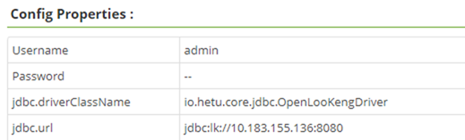

# openLooKeng FAQ 

## 通用问题 

1. openLooKeng开源使用的是什么许可证?

   > openLooKeng使用Apache License 2.0。

2. openLooKeng是否支持X86和ARM？可以运行在哪些操作系统上?

   > openLooKeng对于X86/ARM均可以支持；对于操作系统，目前openLooKeng支持openEuler、CentOS、openSUSE等Linux操作系统。

3. 如果发现openLooKeng存在漏洞，将如何处理？

   > 社区有CVE处理流程，如果发现疑似安全问题，可通过 securities@openlookeng.io 通知社区，我们将在第一时间响应并处理。

4. 如何上报一个Bug？

   > 可以访问openLooKeng社区Issue板块（ https://gitee.com/organizations/openLooKeng/issues ），找到Bug所属的仓库新建Issue并将问题类型选择为缺陷。

5. 如何提交补丁？

   > 任何人员都可以在openLooKeng社区以Pull Request（简称PR）的形式提交补丁，PR将会由模块Maintainer检视、反馈、合入。具体操作请参考：https://gitee.com/help/articles/4122

6. openLooKeng的社区版本计划和roadmap？

   > 2020年6月30日 正式将代码开放到社区，发布openLooKeng v0.1.0版本，与全球开发者一起共建社区。后续规划每3个月发布一个迭代release版本，持续上线新特性。openLooKeng的roadmap会按需发布，请关注openLooKeng社区双周PMC Meeting：https://etherpad.openlookeng.io/p/PMC-weeklymeeting ，或到openLooKeng Slack频道查看。openLooKeng Slack入口连接在： https://openlookeng.io/zh-cn/communication.html 。

7. 哪些渠道可以获取openLooKeng的相关资讯和进行技术交流？

   > 社区issue： https://gitee.com/openlookeng  
   > 官网主页： https://openlookeng.io/zh-cn/    
   > Slack频道: https://openlookeng.slack.com/  
   > openLooKeng公众号：公众号搜索openLooKeng  
   > openLooKeng微信群：请添加openLooKeng小助手微信号：openLooKengoss，小助手会拉您入群  
   > openLooKeng B站： https://space.bilibili.com/627629884 

## 功能

1. openLooKeng目前支持哪些连接器?

   >openLooKeng目前支持的数据源连接器：
   >
   >| 数据源        | 是否有性能优化                                           |
   > ------------- | -------------------------------------------------------- 
   > CarbonData    | 否                                                       
   > Elasticsearch | 否                                                       
   > Greenplum     | 有，算子下推                                             
   > Hana          | 有，算子下推                                             
   > HBase         | 有，优化分片规则                                         
   > Hive          | 有， 动态过滤、table scan reuse， ORC pushdown，DM优化等 
   > Apache Kafka  | 否                                                       
   > MySQL         | 有，算子下推                                             
   > PostgreSQL    | 否                                                       
   > SQL Server    | 否                                                       
   > Oracle        | 有，算子下推                                             
   > MongoDB       | 否                                                       
   > openGauss     | 否                                                       
   >
   >openLooKeng支持的其他连接器：
   >
   >| 其他连接器         | 说明 |
   > ------------ | ------------------------------------------------------- 
   > 数据中心连接器 | 数据中心连接器允许查询远程openLooKeng数据中心。可实现来自本地openLooKeng环境的不同openLooKeng集群之间的数据融合分析。 
   > JMX连接器 | JMX连接器提供从openLooKeng集群中的所有节点查询JMX信息的能力。这对于检视或调试非常有用。 
   > 本地文件连接器 | 本地文件连接器允许查询每个工作节点的本地文件系统上存储的数据。 
   > 内存连接器 | 内存连接器将所有数据和元数据存储在工作节点上的RAM中，当openLooKeng重新启动时，数据和元数据都将被丢弃。 
   > 系统连接器 | 系统连接器提供当前运行的openLooKeng集群的信息和指标。这通过正常SQL查询实现。 
   > TPCDS连接器 | TPCDS连接器提供一组模式来支持TPC Benchmark™ DS (TPC-DS)。TPC-DS是一个数据库基准，用于衡量复杂决策支持数据库的性能。 
   > TPCH连接器 | TPCH连接器提供一组模式来支持TPC Benchmark™ H (TPC-H)。TPC-H是一个数据库基准，用于衡量高度复杂决策支持数据库的性能。 
   > 虚拟数据市场连接器 | 在一些场景中，需要在同一个会话或视图中管理或访问多个数据源，同时，用户不需要关心数据的分布和来源。虚拟数据市场（VDM）连接器旨在将该特性引入openLooKeng。
   >

2. openLooKeng对外提供哪些接口？

   > openLooKeng提供以下对外接口：JDBC、ODBC、Rest-API。SQL语法遵守SQL2003标准。

3. openLooKeng的UDF如何开发？

   > openLooKeng提供User Defined Function能力，详情参考： https://openlookeng.io/zh-cn/docs/docs/develop/functions.html   
   > openLooKeng也支持hive数据源中用户自定义函数，详细参考： https://openlookeng.io/zh-cn/docs/docs/migration/hetu-hive-functions.html   

4. 动态目录功能打开后，是否还能管理手动添加的数据源？

   > 如果启用了动态目录，那么请完全使用动态目录来添加、删除和更新目录，而不要再人为进入openLooKeng的安装目录手动修改，以免引起配置混乱的问题。

5. 配置动态目录后，启动openLooKeng报错：XXX path must be at user workspace

   > 检查etc/node.properties文件中的catalog.config-dir和catalog.share.config-dir，请确保这两个路径配置在白名单中：["/tmp”, “/opt/hetu”, “/opt/openLooKeng”, “/etc/hetu”, “/etc/openLooKeng”, 工作目录]。 
   > 注意：避免选择根目录；路径不能包含../；
   >
   > 工作目录是指：如果配置了node.data_dir,那么当前工作目录为node.data_dir的父目录； 如果没有配置，那么当前工作目录为openLooKeng server的目录。

6. 动态目录的添加删除是否有curl命令样例？

   > 动态目录操作的curl样例参考： 
   > 添加动态数据源mysql
   >
   > ```
   > curl -X POST http://127.0.0.1:8080/v1/catalog -H 'X-Presto-User: admin' -F 'catalogInformation={ "catalogName" : "mysql",  "connectorName" : "mysql",  "properties" : { "connection-url" : "jdbc:mysql://127.0.0.1:3306/", "connection-user" : "mysql", "connection-password" : "password"}}'
   > ```
   >
   > 添加动态数据源memory
   >
   > ```
   > curl -X POST http://127.0.0.1:8080/v1/catalog -H 'X-Presto-User: admin' -F 'catalogInformation={ "catalogName" : "memory",  "connectorName" : "memory",  "properties" : { } }'
   > ```
   >
   >  添加动态数据源tpch
   >
   > ```
   > `curl -X POST http://127.0.0.1:8080/v1/catalog -H 'X-Presto-User: admin' -F 'catalogInformation={ "catalogName" : "tpch",  "connectorName" : "tpch",  "properties" : { } }'`
   > ```
   >
   > 添加动态数据源hive
   >
   > ```
   > curl -X POST http://127.0.0.1:8080/v1/catalog  -H 'X-Presto-User: admin' 
   > -F 'catalogInformation={ "catalogName" : "hive", "connectorName" : "hive-hadoop2", "properties" : {"hive.metastore.uri":"thrift://hadoop-master:9083","hive.allow-drop-table":"true","hive.max-partitions-per-writers":"1000","hive.config.resources":"core-site.xml,hdfs-site.xml"}}'
   > -F 'catalogConfigurationFiles=@/path-dir/core-site.xml'
   > -F 'catalogConfigurationFiles=@/path-dir/hdfs-site.xml'
   > ```
   >
   > 更新动态数据源hive
   >
   > ```
   > curl -X UPDATE http://127.0.0.1:8080/v1/catalog  -H 'X-Presto-User: admin' 
   > -F 'catalogInformation={ "catalogName" : "hive", "connectorName" : "hive-hadoop2", "properties" : {"hive.metastore.uri":"thrift://hadoop-master:9083","hive.allow-drop-table":"true","hive.max-partitions-per-writers":"1000","hive.config.resources":"core-site.xml,hdfs-site.xml"}}'
   > -F 'catalogConfigurationFiles=@/path-dir/core-site.xml'
   > -F 'catalogConfigurationFiles=@/path-dir/hdfs-site.xml'
   > ```
   >
   > 删除动态数据源tpch
   >
   > ```
   > curl -X DELETE -H "X-Presto-User: admin" "http://127.0.0.1:8080/v1/catalog/tpch"
   > ```

8. webUI中执行sql，历史记录保存多少条记录？

   > 目前版本1.1.0中，WebUI上的sql执行没有持久化，所以实际运行环境的内存能放多少是多少，后续会考虑将历史记录持久化到文件。

9. 问题定位时openLooKeng日志中缺少错误栈信息，如何才能打印出来？

   > 请在config.properties文件中配置stack-trace-visible=true，然后重启openLooKeng。

10. 数据源都支持使用启发式索引吗？

    > 当前只有hive connector的orc数据格式，才支持创建索引。

11. 使用JDBC发送SQL时，遇到问题Request header fields too large 或 Response header too large，怎么解决？
    > 在config.properties 配置文件中增加如下参数，并配置为较大的值，例如：  
    > http-server.max-request-header-size=64KB  
    > http-server.max-response-header-size=64KB

## 数据源

1. openLooKeng的SQL是否是大小写敏感的？如果数据源是大小写敏感的，openLooKeng如何处理？

   > openLooKeng对大小写不敏感，对于sql中的大写，openLooKeng都会转换成小写处理。如果数据源本身是大小写敏感的，那么就可能查询失败。比如ES是大小写敏感的，所以如果ES中的列名使用大写，那么openLooKeng查询该列就会出错。

2. 对接hive使用update失败，报错：cannot change stats state for a transactional table，是什么原因？

   > 此问题在开源的hive4上面会发生，当前版本的解决方法是设置参数hive.txn.stats.enabled=false

3. 对接hive使用update失败，报错：unpartitioned hive tables are immutable

   > 检查hive.properties中的配置是否将hive.immutable-partitions设置成了true，如果是，需要修改为false

4. openLooKeng对接oracle10g，无法查询表名含下划线的表，如何解决？

   > oracle10g是一个比较旧的oracle版本了，使用高版本的ojdbc存在不兼容的问题。尝试使用过多个ojdbc版本，发现openLooKeng使用ojdbc6可以正常查询oracle10g。

5. 对接oracle时，openLooKeng创建的表中的数据类型varchar，为什么在oracle中查询到的却是NCLOB？

   > openLooKeng和oracle的数据类型存在一个映射关系，请查看openLooKeng官网上oracle连接器章节里的“openLooKeng到Oracle类型映射”。可以在openLooKeng中使用varchar(n)，这样在oracle中就是varchar2(n)

6. openLooKeng对接华为FusionInsight6.5.1的hive数据源，要如何配置？

   >FusionInsight6.5.1的hive和开源apache hive有些差别，所以配置connector的时候，首先按照开源hive的配置方案配置，然后再做如下修改：  
   >(1).  hdfs-site.xml文件中的dfs.client.failover.proxy.provider.hacluster配置项设置为：org.apache.hadoop.hdfs.server.namenode.ha.ConfiguredFailoverProxyProvider。  
   >(2). 如果FusionInsight6.5.1的hive中数据采用的是txt格式，那么请将FusionInsight6.5.1安装目录下的hadoop-plugins-1.0.jar文件拷贝到openLooKeng安装目录的plugin/hive-hadoop2目录中，再重启openLooKeng。  

## 安全

1. Ranger界面如何添加openLooKeng的服务组件？

   > 可以通过curl命令进行Ranger服务类型定义的注册，举例：
   >
   > ```
   > curl -u admin:password -X POST -H "Accept: application/json" -H "Content-Type: application/json" -d @service-defs/Ranger-servicedef-openlookeng.json http://Ranger-admin-host:port/service/plugins/definitions
   > ```
   >
   > 服务注册后，才能在Ranger的管理界面看到openLooKeng服务类型，然后就可以在管理界面添加openLooKeng服务了。
   >

2. Ranger中如何配置openLooKeng服务的参数？

   > 参考如下：
   >
   > 

3. 对接Ranger后，openLooKeng日志告警：WARN PolicyRefresher(serviceName=openlookengdev)-196 org.apache.Ranger.admin.client.RangerAdminRESTClient Error getting Roles. secureMode=false, user=root (auth:SIMPLE), response={"httpStatusCode":401,"statusCode":401,"msgDesc":"Authentication Failed"}, serviceName=openlookengdev，这是什么原因？

   > 这是RangerAdmin端版本过低的问题，openLooKeng提供的Ranger插件是对接Ranger2.1版本的，请升级Ranger版本。

4. openLooKeng的内部通信安全是必须配置的吗？

   > 这个不是必须配置，最简单地将openLooKeng配置为非安全模式也是可以的。但是如果需要用到LDAP认证，这个ssl就是必须配置的，详情参考openLooKeng网站的LDAP配置一节。

5. openLooKeng有没有实现应用日志监控审计功能，需要二次开发吗？

   > openLooKeng目前对sql的创建和完成是有审计功能的，如果需要审计更多的用户事件，例如webUI登录，可以二次开发来增加。

6. openLooKeng开启kerberos认证后再对接Ranger，RangerAdmin上的字段联想功能不可用怎么办？

   > RangerAdmin的联想功能需要发送sql查询olk的相关资源，所以在RangerAdmin上添加openLooKeng服务时，jdbc.url参数需要配置kerberos信息，举例如下：
   >
   > ```
   > jdbc:lk://server1:10001/catalog?SSL=true&SSLKeyStorePath=/etc/openLooKeng_keystore.jks&SSLKeyStorePassword=keystore_password&KerberosRemoteServiceName=openLooKeng&KerberosConfigPath=/etc/krb5.conf&KerberosPrincipal=cpk@EXAMPLE.COM&KerberosKeytabPath=/etc/security/keytabs/cpk.keytab
   > ```

7. openLooKeng如何连接两个配置了kerberos的hive数据源？

   > 首先保证两个配置了kerberos的hive数据源域名不相同；
   >
   > 然后合并两个数据源的krb5.conf文件，将其中一个的realm信息加入另一个krb5.conf文件即可；
   >
   > 将合并后的krb5.conf文件放在jvm.config中配置的路径下。举例如下：
   >
   > 

8. openLooKeng如何同时连接一个配置了kerberos的hive和一个没有配置kerberos的hive数据源？

   > 在没有配置kerberos的hive数据源的core-site.xml文件中增加如下配置即可：
   >
   > ```
   > <property>
   > <name>ipc.client.fallback-to-simple-auth-allowed</name>
   > <value>true</value>
   > </property>
   > ```


