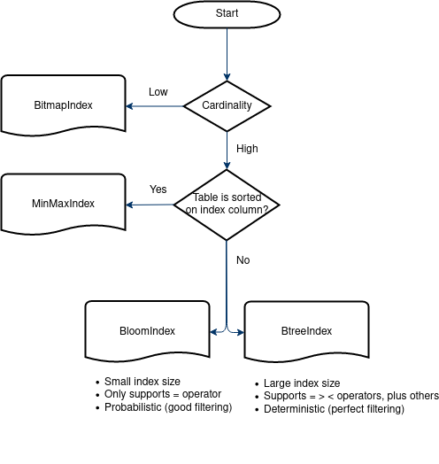

# openLooKeng启发式索引

## 简介

可以在数据库表的一个或多个列创建索引，从而提供更快的随机查找。大多数大数据格式，如ORC、Parquet和CarbonData，都已经内置了索引。

启发式索引允许在现有数据上创建索引，但将索引存储在外部的的原始数据源中。这样做好处如下：

  - 索引对底层数据源不可知，并且可由任何查询引擎使用
  - 无需重写现有数据文件即可对现有数据进行索引
  - 可以创建底层数据源不支持的新索引类型
  - 索引数据不占用数据源存储空间

## 使用场景

**注意：当前，启发式索引仅支持ORC存储格式的Hive数据源。**

1. BloomIndex，MinMaxIndex和BtreeIndex可以在Coordinator上使用，以在调度期间过滤Splits
2. 在读取ORC文件时，可以在worker上使用MinMaxIndex或者BloomIndex过滤stripe
3. 在读取ORC文件时，可以在worker上使用BitmapIndex过滤数据行

### 1.查询过程中过滤预定分片

*支持的索引：BloomIndex, BTreeIndex, MinMaxIndex*

当引擎需要调度一个TableScan操作时，它可以调度worker节点上的Split。这些Split负责读取部分源数据。但是如果应用了predicates，则并非所有Split都会返回数据。

例如，`select * from test_base where j1='070299439'`

通过为predicate列保留外部索引，启发式索引可以确定每个Split是否包含正在搜索的值，并且只对可能包含该值的Split安排读操作。


### 2.读取ORC文件时提前筛选Stripes

*支持的索引：BloomIndex, MinMaxIndex*

与分片过滤类似，当使用Hive Connector读取ORC文件时，Stripe可以被提前过滤来减少读取的数据量，从而提升查询性能。

### 3.读取ORC文件时筛选行

*支持的索引：BitmapIndex*

当需要从ORC文件中读取数据时，如果有一个predicate存在，那么就不需要批量读取中的所有行。

通过为predicate列保留外部位图索引，将实现只读取匹配当行，来提升内存和处理器表现。在服务器高并发时提升尤其明显。

## 示例教程

这一教程将通过一个示例查询语句来展示索引的用法。

### 1. 配置索引

启发式索引需要配置几个组件才能工作。
确保集群中的所有节点都以相同的方式配置,使用相同的hetu文件系统和Metastore等.

#### a. Hetu Metastore

Heuristic Index 使用 Hetu Metastore 来管理其元数据。 
Hetu Metastore 是一个共享元数据管理实用程序，多个 openLooKeng 功能使用它。 
有关如何配置它的更多信息， 请参考 [Hetu Metastore](../admin/meta-store.md).

**注意**: 必须启用全局缓存！ 如果Hetu Metastore 配置不正确，启发式索引将不起作用。

以下是参考`etc/hetu-metastore.properties`:

```properties
  hetu.metastore.type=hetufilesystem
  hetu.metastore.hetufilesystem.profile-name=hdfs
  # 此路径在 hdfs 内 
  hetu.metastore.hetufilesystem.path=/tmp/hetu/metastore
  # 使用全局缓存！ 
  hetu.metastore.cache.type=global
```

*路径白名单：`["/tmp", "/opt/hetu", "/opt/openlookeng", "/etc/hetu", "/etc/openlookeng", current workspace]`*

避免选择根目录；路径不能包含../；如果配置了node.data_dir,那么当前工作目录为node.data_dir的父目录；如果没有配置，那么当前工作目录为openlookeng server的目录

**注意**：
- `LOCAL` 本地文件系统是*不*被支持的。同时在Hetu Metastore中也不应该选择本地文件系统。
- `HDFS` 应用于生产环境来在集群中共享数据。
- 所有节点必须有相同的文件系统配置。
- 在服务器运行中可以通过`set session heuristicindex_filter_enabled=false;`关闭启发式索引。

#### b. Hetu Statestore

如Hetu Metastore 设置中提到的，必须启用全局缓存，这需要配置Hetu Statestore。 
更多配置方法请查看[Hetu Statestore](../admin/state-store.md).

在`etc/config.propertes`中配置:

```properties
  hetu.embedded-state-store.enabled=true
```

以下是参考`etc/state-store.properties`：

```properties
  state-store.type=hazelcast
  state-store.name=test
  state-store.cluster=test-cluster
  hazelcast.discovery.mode=tcp-ip
  hazelcast.discovery.port=7980
  # 这里必须包含每台服务器的ip地址和hazelcast发现端口 
  hazelcast.discovery.tcp-ip.seeds=host1:7980,host2:7980
```

#### c. Hetu Filesystem

Hetu Filesystem 用于存储索引，在上面的例子Hetu Metastore中也使用了Hetu Filesystem。 
必须使用 `HDFS` 文件系统类型以便集群中所有节点都可以访问索引。
更多配置方法请查看 [Hetu Filesystem](../develop/filesystem.md).

以下是参考`etc/filesystem/hdfs.properties`：

```properties
  fs.client.type=hdfs
  # 本地计算机上的 hdfs 资源文件（例如 core-site.xml、hdfs-site.xml）的路径 
  hdfs.config.resources=/tmp/hetu/hdfs-site.xml,/tmp/hetu/core-site.xml
  hdfs.authentication.type=NONE
  fs.hdfs.impl.disable.cache=true
```

*路径白名单：`["/tmp", "/opt/hetu", "/opt/openlookeng", "/etc/hetu", "/etc/openlookeng", current workspace]`*

#### d. Heuristic Index

最后，一旦配置了所有先决条件，就可以启用Heuristic Index。

在 `etc/config.properties` 中，添加以下几行：

  ```properties
  hetu.heuristicindex.filter.enabled=true
  hetu.heuristicindex.indexstore.filesystem.profile=hdfs
  # 此路径在 hdfs 内 
  hetu.heuristicindex.indexstore.uri=/tmp/hetu/indexstore
  ```

*路径白名单：`["/tmp", "/opt/hetu", "/opt/openlookeng", "/etc/hetu", "/etc/openlookeng", current workspace]`*

有关Heuristic Index的完整配置列表，请参阅 [Configuration Properties](#索引配置属性) below
and [Properties](../admin/properties.md).

可以通过设置`set session heuristicindex_filter_enabled=false;`在引擎运行时禁用启发式索引。

配置启发式索引后，启动引擎。

### 2. 确定索引建立的列

对于这样的语句：

    SELECT * FROM table1 WHERE id="abcd1234";
   
如果id比较独特，bloom索引可以大大减少读取的分段数量。

在本教程中我们将以这个语句为例。

### 3. 创建索引

要创建索引, 在命令行中输入：

      CREATE INDEX index_name USING bloom ON table1 (id);

### 4. 运行语句

创建索引后，它将自动加载到Coordinator缓存中。
未来的查询将利用索引来减少读取的数据量并且查询性能将得到提高。

      # 再次运行相同的查询现在应该会导致更少的拆分和改进的性能
      SELECT * FROM hive.schema.table1 WHERE id="abcd1234";

## 索引配置属性

| 属性名称                                             | 默认值               | 是否必填| 说明|
|-----------------------------------------------------|---------------------|-------|----------|
| hetu.heuristicindex.filter.enabled                  | false               | 否    | 启用启发式索引|
| hetu.heuristicindex.filter.cache.max-memory         | 10GB                | 否    | 索引缓存大小|
| hetu.heuristicindex.filter.cache.soft-reference     | true                | 否    | 允许GC在内存不足时从缓存中清除内容来释放内存|
| hetu.heuristicindex.filter.cache.ttl                | 24h                 | 否    | 索引缓存的有效时间|
| hetu.heuristicindex.filter.cache.load-threads       | 10                  | 否    | 从存储文件系统并行加载索引文件使用的线程数|
| hetu.heuristicindex.filter.cache.loading-delay      | 10s                 | 否    | 在异步加载索引到缓存前等待的时长|
| hetu.heuristicindex.indexstore.uri                  | /opt/hetu/indices/  | 否    | 所有索引文件存储的目录|
| hetu.heuristicindex.indexstore.filesystem.profile   | local-config-default| 否    | 用于存储索引文件的文件系统属性描述文件名称|
| hetu.heuristicindex.filter.cache.autoload-default   | true                | 否    | Coordinator上自动加载索引的默认值。要更改特定索引的值，请通过在 create index 语句 WITH ("autoload" = true/false) 设置|

**关于`hetu.heuristicindex.filter.cache.autoload-default`的更多细节：**

自动加载仅影响Coordinator上使用的索引，例如 MinMax、Bloom 和 BTree 索引。
Worker上使用的索引，例如 Bitmap索引，将在查询被执行时按需加载。

建议保持启用自动加载。

启用自动加载设置后，索引将在创建后（延迟约 5 秒）加载到Coordinator缓存中 。
当索引加载到Coordinator缓存中时，它将在用户运行查询时被使用。

例如：

      CREATE INDEX idx USING bloom ON table1 (id);
      # 创建后，索引将自动加载到coordinator缓存中 

      # 运行此查询将利用索引
      SELECT * FROM hive.schema.table1 WHERE id="abcd1234";

禁用自动加载设置时，索引创建后不会自动加载到Coordinator缓存中。
相反，它将在用户运行查询时按需加载。
以后的查询将使用该索引。

例如：

      CREATE INDEX idx USING bloom ON table1 (id) WITH ("autoload" = false);
      # 创建后，索引不会自动加载到coordinator缓存中
    
      # 运行一次查询将触发索引加载 
      SELECT * FROM hive.schema.table1 WHERE id="abcd1234";
      # 索引将开始在后台加载 
    
      # 现在运行相同的查询将使用索引
      SELECT * FROM hive.schema.table1 WHERE id="abcd1234";

## 索引语句

参见 [Heuristic Index Statements](./hindex-statements.md).

-----

## 支持的索引类型

| 索引 ID | 过滤类型  | 最适用的列                           | 支持的运算符           | 用例                                                                                                                                                                                                          |
|----------|-----------------|--------------------------------------------|---------------------------|-------------------------------------------------------------------------------------------------------------------------------------------------------------------------------------------------------------------|
| [Bloom](./bloom.md)    | Split<br>Stripe | 大量不同数据值<br>(如ID) | `=` `IN`                                  | `create index idx using bloom on hive.hindex.users (id);`<br>`select name from hive.hindex.users where id=123`                                                                                                    |
| [Btree](./btree.md)    | Split           | 大量不同数据值<br>(如ID) | `=` `>` `>=` `<` `<=` `IN` `BETWEEN` | `create index idx using btree on hive.hindex.users (id) where regionkey IN (1,4)`<br>`select name from hive.hindex.users where id>123` |
| [MinMax](./minmax.md)   | Split<br>Stripe | 列数据被排序            | `=` `>` `>=` `<` `<=` | `create index idx using bloom on hive.hindex.users (age);`<br>(假设数据根据年龄已排序)<br>`select name from hive.hindex.users where age>25`                                                              |
| [Bitmap](./bitmap.md)   | Row             | 少量不同数据值<br>(如性别) | `=` `>` `>=` `<` `<=` `IN` `BETWEEN` | `create index idx using bitmap on hive.hindex.users (gender);`<br>`select name from hive.hindex.users where gender='female'`                                                                                      |

**注意:**  
· 包含不支持的运算符的语句依然会正常运行，但是不会从启发式索引中获得性能提升。  
· 对应每个index type，不支持其它除了列出以外的数据类。

## 选择索引类型

启发式索引用于根据predicate表达式过滤数据。请根据下面的决策流程图选择适用于数据列的最佳索引。

Cardinality 是指数据集中值域的大小。例如，`ID`列通常有很大的cardinality，
而`employeeType`列通常cardinality很小(如 Manager, Developer, Tester)。

在有些使用场景中，创建索引的速度和索引占用的磁盘空间也可能是需要考虑的因素。与其他主要用于分片过滤的索引，如
Bloom和Minmax索引相比，创建BTree索引需要的时间和索引使用的空间明显更大。



用例:

1. `SELECT id FROM employees WHERE site = 'lab';`

    在这个语句中`site`的cardinality很小（没有很多不同的地点取值)。 因此，**BitmapIndex**比较适合。

2. `SELECT * FROM visited WHERE id = '34857' AND date < '2020-01-01';`

    在这个语句中`id`有很高的cardinality （每一个ID是唯一的)。**BloomIndex**或者**BtreeIndex**都比较适合。
    
3. `SELECT * FROM salaries WHERE salary > 50251.40;`

    在这个语句中`salary`有很高的cardinality（每个员工的收入总有些许不同)。假设表已经根据`salary`排序, 则**MinMaxIndex**最为适合。

4. `SELECT * FROM assets WHERE id = 50;`

    在这个语句中`id`有很高的cardinality （每一个ID是唯一的)。**BloomIndex**或者**BtreeIndex**都比较适合。

5. `SELECT * FROM phoneRecords WHERE phone='1234567890' and type = 'outgoing' and date > '2020-01-01';`

    在这个语句中`phone`有很高的cardinality (即使有重复的电话，绝大部分号码总是不同的), `type`的cardinality较低 (只有两种：呼出/呼入)。
    在`phone`上创建**BloomIndex**或者**BtreeIndex**并在`type`上创建**BitmapIndex**比较适合。

## 添加自定义的索引类型

参见 [Adding your own Index Type](./new-index.md).

## 权限控制

参见 [Built-in System Access Control](../security/built-in-system-access-control.md).

## 常见问题

### 如果索引创建卡住，并且长时间都没有变化（常发生在性能较差的环境中，例如开发人员的笔记本，核分配不多的k8s环境）

当前机器可能没有足够的线程资源来完成任务。请尝试通过设置会话属性降低任务并发度：`set session task_concurrency=X;`，
其中X建议小于等于机器CPU的线程数。例如，如果处理器可用线程数为8，则X可设置为8。