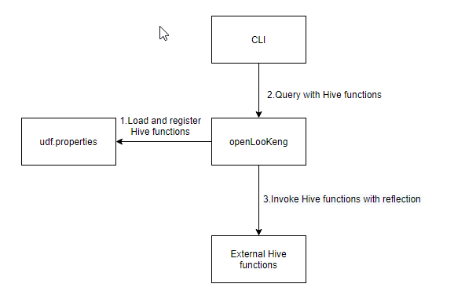

### 总体设计

在openLooKeng中，我们支持加载并运行用户自定义的Hive scalar functions。基本原理是openLooKeng将加载Hive function的元数据，对Hive function在openLooKeng中注册，将`evaluate`方法的参数从Hive function内部数据类型转换为openLooKeng内部数据类型，然后利用Java reflection动态调用Hive function。



### 配置

1. 为了加载Hive function，用户应该将Hive function元数据添加到`udf.properties`，格式为：`function_name class_path`。一个典型的`udf.properties`示例，如下所示：
 ```
 booleanudf io.hetu.core.hive.dynamicfunctions.examples.udf.BooleanUDF
 shortudf io.hetu.core.hive.dynamicfunctions.examples.udf.ShortUDF
 byteudf io.hetu.core.hive.dynamicfunctions.examples.udf.ByteUDF
 intudf io.hetu.core.hive.dynamicfunctions.examples.udf.IntUDF
 ```
2. 用户应将Hive function函数的jar包和依赖项上传到`${node.data-dir}`，这个配置在`node.properties`中。用户可以通过在`config.properties`中设置`external-functions.dir`来自定义上传的路径，默认路径是“externalFunctions”。一个示例配置如下：
```
external-functions.dir=externalFunctions
``` 
因此，默认情况下，用户应该将其Hive function上传到`${node.data-dir}`的`externalFunctions`文件夹。

3. 用户应将Hive function的配置文件`udf.properties`上传到`${node.data-dir}`目录下。


### 异步执行

考虑到系统的安全性，我们提供了一种异步执行hive function的机制。
1. 用户定义的Hive function函数可以通过设置`max-function-running-time-enable`在另一个线程中执行。默认值为`false`
2. 用户可以通过设置`max-function-running-time-in-second`来限制Hive function的最大运行时间。默认值为`600s`。
3. 用户还可以通过设置`function-running-thread-pool-size`来限制运行Hive function的线程池大小。默认值为`100`

上述配置在`config.properties`的示例配置如下：
```
max-function-running-time-enable=true
max-function-running-time-in-second=300
function-running-thread-pool-size=10
```

**注意：由于待查询表的每一行数据可能都会使用Hive function函数，因此如果启用Hive function的异步执行机制可能会导致性能严重下降。 请根据实际场景在安全和性能上进行平衡选择**

### 使用需知

1. 在openLooKeng中，我们目前只支持以下常见的数据类型的Hive function：
```
boolean, byte, short, int, long, float, double
Boolean, Byte, Short, Int, Long, Float, Double
List<T>, Map<T,V>
```
2. 目前只支持小于或等于五个参数的Hive函数。如果用户添加了超过五个参数的函数，openLooKeng将忽略该函数并打印错误日志。

3. 如果用户的`udf.properties`存在诸如格式或类路径不存在等错误，openLooKeng将忽略元数据并打印错误日志。

4. 如果用户在`udf.properties`中添加重复的函数元数据，openLooKeng将识别并丢弃重复的函数元数据。

5. 如果用户自定义的Hive function与openLooKeng内部函数具有相同的签名（指函数名和入参），openLooKeng将忽略自定义函数并打印错误日志。

1. 用户可以在hive functionz中重载evaluate方法并添加函数。openLooKeng将识别所有签名并为每个签名创建函数。

1. 如果用户执行参数为null的函数，系统将直接返回null，而不是将空值传递到函数体内并运行函数逻辑。因此请不要将null参与自定义函数的逻辑操作。


**关于UDAF**

目前本特性暂不支持用户自定义的Hive UDAF的加载与使用。但是用户根据openLooKeng的 [UDF框架](https://openlookeng.io/zh-cn/docs/docs/develop/functions.html) 编写的UDAF也可以使用本特性进行加载，以便使用本特性的异步执行机制。用户可以将UDAF函数和依赖项作为插件上传，并将文件复制到一个单独的目录下 ：`${node.data-dir}`。用户可以通过设置 `external-functions-plugin.dir`来配置插件目录，默认值为“externalFunctionsPlugin”。`config.properties`中的示例配置如下：

```
external-functions-plugin.dir=externalFunctionsPlugin
```