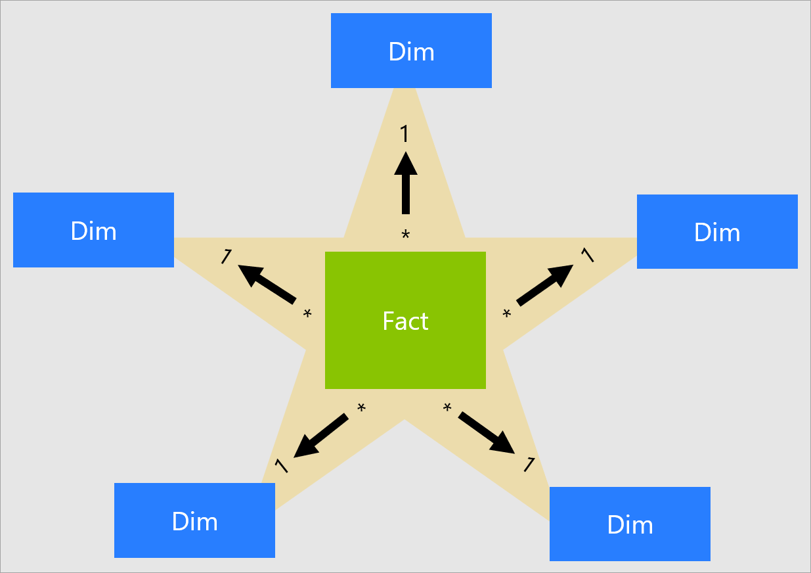

## Join查询的支持
StarTree Cube也可以帮助优化对join查询的聚合。优化器在逻辑计划中寻找聚合子树结构，通常如下所示。
```
  AggregationNode
  |- ProjectNode[Optional]
  .  |- ProjectNode[Optional]
  .  .  |- FilterNode[Optional]
  .  .  .  |- JoinNode
  .  .  .  .  [More Joins]
  .  .  .  .  .
  .  .  .  .  |- ProjectNode[Optional] - Left
  .  .  .  .  .  |- TableScanNode [Fact Table]
  .  .  .  .  |- ProjectNode[Optional] - Right
  .  .  .  .  .  |- TableScanNode [Dim Table]
```

如果确认查询与结构匹配，优化器会通过将Fact TableScanNode替换为Cube TableScanNode来重写逻辑计划。这类似于单表重写。

### Star架构的支持
Join查询优化器仅支持Star架构。Star架构是一种数据仓库架构模型，其中一个事实表引用多个维度表，从图表上看，它看起来像一个星形，事实表位于中心，维度表从它向外辐射。支持各种连接。



### Cube管理
`Create Cube`仍可用于定义Cubes以优化Join查询。困难的部分是在构建多维数据集时识别GROUP构造。对于单表查询，GROUP BY子句将只包含来自同一个表的列。但是对于连接查询，尤其是Star架构查询，GROUP BY包含来自Dimension表而不是Fact表的列。
让我们通过以下查询进行更多分析。
```sql
SELECT SUM(lo_revenue) AS lo_revenue, d_year, p_brand
FROM lineorder
LEFT JOIN dates ON lo_orderdate = d_datekey
LEFT JOIN part on lo_partkey = p_partkey
LEFT JOIN supplier on lo_suppkey = s_suppkey
WHERE p_category = 'MFGR#12' AND s_region = 'AMERICA'
GROUP BY d_year, p_brand
ORDER BY d_year, p_brand;
```

再这里，`lineorder`是Fact表，`dates`、`part`、`supplier`是维度表。Cubes将在 `lineorder` 表上定义。 随着顺序，GROUP BY列，`d_year`和 `p_brand`，是Dimension表`dates`和`part`的一部分。它们不能直接在`CREATE CUBE`语句中使用。正确的解决方案是使用`lineorder`表的外键列在构建Cubes时使用 GROUP 构造。
```sql
CREATE CUBE lineorder_cube ON lineorder WITH(
AGGREGATIONS = (sum(lo_revenue)),
GROUP = (lo_orderdate, lo_partkey, lo_suppkey));
```
优化器解析join条件并使用这些列来识别匹配的Cubes。如果Cube大小小于事实表，则可以实现性能提升。

### 限制
* 仅支持Star架构。
* 不支持count distinct，因为Cube不存储实际的维度值。
* 如果在Fact和Dimension上都定义了Cube，则不会优化查询，因为优化器无法区分两者。
* 如果多维数据集定义在一个以上的Join查询表上，那么优化器不起作用。假设Cubes只定义了Fact表。
* 仅支持简单的聚合，如SUM、COUNT、AVG、MIN、MAX，在单列上定义。 Cube不支持SUM(revenue - supplycost)聚合。无法使用Cube优化以下查询。
```
   SELECT sum(lo_extendedprice * lo_discount) AS revenue
   FROM lineorder
   WHERE toYear(lo_orderdate) = 1993 AND lo_discount BETWEEN 1 AND 3 AND lo_quantity < 25;
```

### 未来
* 支持Snowflake架构
* 在多个表上构建单个Cube