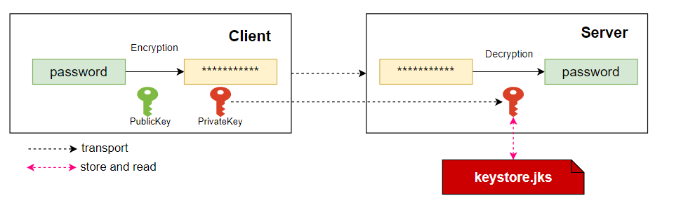

密码加密
===================

概要
-------------------------
openLooKeng 管理一些catalog相关的配置文件，这些配置文件可能包含一些用户名、密码等信息，其中，密码信息一般情况下要求保密，不能以明文的方式存储。
这是一个典型的MySQL connector的配置文件：
```
connector.name=mysql
connection-url=jdbc:mysql://localhost:3306
connection-user=root
connection-password=123456
```
openLooKeng 可以开启密码加密功能，这些密码就可以被加密存储。

建议RSA Key的长度为3072 bit，最低2048 bit。

原理
-------------------------
我们采用非对称加密算法 (RSA)，原理如下：



* 公钥： 用于加密，客户端使用公钥对明文进行加密。
* 私钥： 用户解密，服务端将私钥存储在[文件系统](../develop/filesystem.md )的keystore中，并使用私钥对密文进行解密。

用户自己保存公钥，将私钥给openLooKeng用于加密后的密文解密。

配置
-------------------------

为了开启密码加密特性，你需要在 `etc/config.properties`增加以下属性：
```
security.password.decryption-type=RSA
security.key.manager-type=keystore
security.key.keystore-password=my-keystore-pwd
security.key.store-file-path=/openlookeng/keystore/keystore.jks
```

| 属性                          | 描述                                                  |
| :-------------------------------- | :----------------------------------------------------------- |
| `security.password.decryption-type` | 密码加解密使用的加密算法. 必须是 `NONE` 或 `RSA`. |
| `security.key.manager-type=keystore`       | 加密秘钥的存储方式. 必须是 `keystore`. |
| `security.key.keystore-password`          | keystore的密码.                                         |
| `security.key.cipher-transformations`          | Cipher.getInstance(transformations), the default value is 'RSA/ECB/OAEPWITHSHA256AndMGF1Padding'             |
| `security.key.store-file-path`          | [文件系统](../develop/filesystem.md) 中keystore文件的路径.                                          |

用例
-------------------------
### 用例 1. 公私钥

采用keytool工具生产一个keystore文件，从keystore文件中提取公钥，通过openssl工具使用提取的公钥加密需要加密的明文。
同时，从keystore中提取私钥，并通过restful api发送给openLooKeng服务。

以下是使用样例:
```
1. 采用pkcs12格式创建keystore:
keytool -genkeypair -alias alias -dname cn=openlookeng -validity 365 -keyalg RSA -keysize 2048 -keypass openlookeng -storetype jks -keystore keystore.jks -storepass openlookeng -deststoretype pkcs12

2. 从keystore中提取公钥，并将公钥复制到pub.key文件中:
keytool -list -rfc -keystore keystore.jks -storepass openlookeng | openssl x509 -inform pem -pubkey

3. openssl工具加密，data.txt为需要加密的内容，result.en为加密结果，pub.key为公钥:
openssl pkeyutl -encrypt -in data.txt -out result.en -pubin -inkey pub.key -pkeyopt rsa_padding_mode:oaep -pkeyopt rsa_oaep_md:SHA256 -pkeyopt rsa_mgf1_md:SHA256

4. result.en需要采用base64转换为可读字符串:
cat result.en | base64

注意： 获取到可读密文字符串后，需要手动删除每行的换行符'\n' 。

5. 提取私钥 
keytool -v -importkeystore -srckeystore keystore.jks -srcstoretype jks -srcstorepass openlookeng -destkeystore server.pfx -deststoretype pkcs12 -deststorepass openlookeng -destkeypass openlookeng
openssl pkcs12 -in server.pfx -nocerts -nodes -out private.key

private.key的文件内容就是提取的私钥. 

6. 添加静态数据源的私钥到keystore.jks (keystore.jks为security.key.store-file-path指定路径的文件)
假设静态数据源的名字是mysql001，静态数据源加密用的公钥是从keystore001.jks文件中提取的，需要主要的keystore.jks文件的alias必须跟静态数据源的名称一致，即为mysql001。因此，需要将keystore001.jks文件中alias为mysql001的私钥存储到keystore.jks文件中。
可以参照以下命令实现：
keytool -v -importkeystore -srckeystore keystore001.jks -srcstoretype jks -srcstorepass openlookeng -destkeystore server.p12 -deststoretype pkcs12 -deststorepass openlookeng -destkeypass openlookeng
keytool -importkeystore -deststorepass openlookeng -destkeystore keystore.jks -srckeystore server.p12 -srcstoretype pkcs12 -srcstorepass openlookeng -alias mysql001 

```


### 用例 2. 动态目录
一个http请求的模板如下 (以MySQL connector为例):
```
request: POST/PUT
header: 'X-Presto-User: admin'
form: '
    catalogInformation={
        "catalogName":"mysql",
        "connectorName":"mysql",
        "securityKey":"MIGfMA0GCSqGSIb3DQEBAQUAA4GNADCBiQKBgQC1Z4yap2cI1u6zg/R8vTcltOy8xxeOt/VG0xEArud+c5rI9h2kWy8Uo7hTFN/JapVDENT17fEzd+SqrlvcmD8ceDH07+OW2RRGcQjR0GKpKGSmubEHdH01xzpuQ1+m83B84Ir5eqcWx6QIwBPQsqqjeNpHhYdJLMpSrX1V+c7UUQIDAQAB",
        "properties":{
            "connection-url":"jdbc:mysql://localhost:3306",
            "connection-user":"root",
            "connection-password":"iRSxl1KNY06d34JGLooey0re4akzr+iJlTz1eCK1hEq8aYaX1SlzANCF7KTq6o2cF71OjINGvNjR0DXRed6gu3QYODw1Src0wiY0OvO9xfcffVt2rFvM/o238MJz1yhIcPn1BrrEgW5qVjzbbvzkS/fX+pTDqKNGAd3qefDLCuc=",
            "encrypted-properties":"connection-password",
        }
    }
'
```
* `securityKey`: 私钥.
* `connection-password`: 使用私钥加密后的密码密文.
* `encrypted-properties`: 加密的属性名称.

可以从 [动态目录](../admin/dynamic-catalog.md) 查看更多信息.